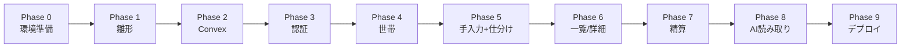

# warikapp 実装計画書

同棲カップル向けレシート割り勘精算アプリの実装計画。**バックエンドは Convex + Clerk 構成**(Convexは有料プラン契約済み)。

> **正本の要件定義書**: [requirements.md](./requirements.md) — 仕様の真実はそちらを参照。本書は「どの順番で・何を・どう作るか」を初心者向けに具体化したもの。
>
> **視覚補助**: [implementation-plan.html](./implementation-plan.html) — 本書のチェックリストをブラウザで進捗管理できるトラッカー(本書が正本。MD更新時はHTMLを再生成する)。

## この計画書の使い方

1. **Phase 0 から順番に進める**。フェーズを飛ばさない。
2. 各フェーズの最後にある **「✅ 動作確認」をすべてパスしてから次へ進む**。
3. **mainに直接コミットしない**。フェーズ(またはひとまとまりの修正)ごとにブランチを切り、終わったらPRを作ってレビュー後にmainへマージする。例: `git checkout -b feature/phase-3-auth` → 作業・コミット → push → PR作成。
4. 分からないエラーが出たら、エラーメッセージ全文をそのままAI(Claude Code等)に貼って相談する。Convexは日本語情報が少ないため、**公式ドキュメント(docs.convex.dev)+AIへの質問**を基本の調べ方にする。

## 目次

1. [全体方針とフェーズ一覧](#1-全体方針とフェーズ一覧)
2. [Phase 0: 開発環境とアカウント準備](#2-phase-0-開発環境とアカウント準備)
3. [Phase 1: Next.jsプロジェクト作成](#3-phase-1-nextjsプロジェクト作成)
4. [Phase 2: Convexセットアップ(スキーマ・認可ヘルパー)](#4-phase-2-convexセットアップ)
5. [Phase 3: 認証(F-001 / Clerk)](#5-phase-3-認証f-001--clerk)
6. [Phase 4: 世帯作成・招待(F-002)](#6-phase-4-世帯作成招待f-002)
7. [Phase 5: 手入力支出登録+品目仕分け(F-005, F-004)](#7-phase-5-手入力支出登録品目仕分けf-005-f-004)
8. [Phase 6: 支出一覧・詳細・編集・削除(F-006)](#8-phase-6-支出一覧詳細編集削除f-006)
9. [Phase 7: 精算(F-007)](#9-phase-7-精算f-007)
10. [Phase 8: AIレシート読み取り(F-003)](#10-phase-8-aiレシート読み取りf-003)
11. [Phase 9: 仕上げ・本番デプロイ](#11-phase-9-仕上げ本番デプロイ)
12. [初心者がハマりやすいポイント集](#12-初心者がハマりやすいポイント集)
13. [要件との対応表](#13-要件との対応表)

---

## 1. 全体方針とフェーズ一覧

### 1.1 実装順序の考え方

**AIレシート読み取り(F-003)は最後に実装する。**

理由:
- 外部API連携(Claude/Gemini)はエラー要因が多く、最初に着手すると詰まりやすい
- 手入力支出(F-005)だけでも「登録 → 仕分け → 精算」というアプリの縦の流れが完成する
- データ構造は共通(レシート由来も手入力も同じ `expenses`)なので、後からAIを足しても作り直しにならない

つまり **「手入力だけで動く割り勘アプリ」をまず完成させ、そこにAI読み取りを追加する** 進め方をとる。

### 1.2 Convex構成の要点(初心者向けまとめ)

- **クライアントはDBに直接触れない**。データの読み書きはすべて `convex/` ディレクトリに書くサーバー関数(query / mutation / action)経由。**この関数の冒頭で毎回メンバー確認をする**のがセキュリティの要(要件5.2)
- **query** = 読み取り(画面が自動でリアルタイム更新される)/ **mutation** = 書き込み(**自動でトランザクション**になる)/ **action** = 外部API呼び出し(Claude APIはここ)
- 認証はClerkに任せ、ConvexがClerkの発行するJWTを検証する(Convex公式推奨の定番構成)

### 1.3 フェーズ一覧

| Phase | 内容 | 対応機能 | 目安時間 |
|---|---|---|---|
| 0 | 開発環境・アカウント準備 | — | 1〜2時間 |
| 1 | Next.jsプロジェクト作成 | — | 1時間 |
| 2 | Convex(スキーマ・認可ヘルパー) | 全機能の土台 | 2〜3時間 |
| 3 | 認証(Clerk) | F-001 | 2〜4時間 |
| 4 | 世帯作成・招待 | F-002 | 3〜4時間 |
| 5 | 手入力支出+品目仕分け | F-005, F-004 | 5〜8時間 |
| 6 | 支出一覧・詳細・編集・削除 | F-006 | 4〜6時間 |
| 7 | 精算 | F-007 | 3〜5時間 |
| 8 | AIレシート読み取り | F-003 | 5〜8時間 |
| 9 | 仕上げ・本番デプロイ | 非機能要件 | 3〜5時間 |



### 1.4 スコープ外(作らないもの)

要件定義書 1.3 の通り: 固定費の自動計上 / 月次サマリー・グラフ / プッシュ通知 / 送金連携 / iOSネイティブアプリ。F-008(仕分けAI提案)・F-009・F-010 もMVPでは実装しない。

---

## 2. Phase 0: 開発環境とアカウント準備

### タスク

- [ ] **Node.js LTS** をインストール(`node -v` で v20 以上を確認)
- [ ] **Git** の動作確認(`git -v`)
- [ ] **GitHubアカウント** — リポジトリ `warikapp` を作成(privateでよい)
- [ ] **Convexアカウント** — 契約済みのアカウントに https://dashboard.convex.dev でログインできることを確認(プロジェクト作成はPhase 2の `npx convex dev` が自動で行う)
- [ ] **Clerkアカウント** — https://clerk.com で無料サインアップ。アプリケーション `warikapp` を作成し、Sign-in方法で **Google** を有効化(開発環境ではClerk共有のGoogle認証がそのまま使えるため、Google Cloud Consoleの設定は本番デプロイのPhase 9まで不要)
- [ ] **Vercelアカウント** — https://vercel.com でGitHub連携サインアップ(Phase 9まで使わない)
- [ ] **Anthropicアカウント** — https://platform.claude.com でAPIキーを発行(Phase 8まで使わない)。課金上限アラートをコンソールで設定しておく

### ✅ 動作確認

- `node -v` / `npm -v` / `git -v` がすべてバージョンを表示する
- ConvexとClerkのダッシュボードにログインできる

---

## 3. Phase 1: Next.jsプロジェクト作成

### タスク

- [ ] プロジェクト作成(既存リポジトリの直下に作る。`docs/` は許容されるのでそのままでよい):

```bash
npx create-next-app@latest . --typescript --tailwind --app --eslint --no-src-dir --yes
```

質問には基本すべてデフォルト(Enter)でよい。**App Router: Yes / Tailwind: Yes / TypeScript: Yes** になっていることだけ確認。

- [ ] 必要パッケージをインストール:

```bash
npm install convex @clerk/nextjs
npm install @anthropic-ai/sdk zod
```

- [ ] ディレクトリ構成の骨組みを作る:

```text
warikapp/
├── app/
│   ├── login/[[...rest]]/page.tsx  # S-001 ログイン(Clerkの<SignIn/>を置くcatch-allルート)
│   ├── setup/page.tsx              # S-002 世帯セットアップ
│   ├── page.tsx                    # S-003 ホーム
│   ├── expenses/
│   │   ├── new/
│   │   │   ├── receipt/page.tsx    # S-004 レシート登録
│   │   │   └── manual/page.tsx     # S-006 手入力登録
│   │   └── [id]/page.tsx           # S-005 支出詳細・編集
│   ├── settlement/page.tsx         # S-007 精算確認・実行
│   ├── settlements/page.tsx        # S-008 精算履歴
│   └── settings/page.tsx           # S-009 設定
├── convex/                         # ★バックエンド本体(Phase 2で npx convex dev が生成)
│   ├── schema.ts                   # テーブル定義
│   ├── auth.config.ts              # Clerk連携設定
│   ├── couples.ts                  # 世帯作成・参加・招待
│   ├── expenses.ts                 # 支出のCRUD
│   ├── settlements.ts              # 精算
│   ├── receipts.ts                 # 画像アップロードURL発行・AI読み取りaction
│   ├── ai/
│   │   ├── types.ts               # ReceiptParser インターフェース
│   │   ├── claude.ts              # Claude実装
│   │   ├── gemini.ts              # Gemini実装(後回し可)
│   │   └── index.ts               # env切り替え
│   └── lib/
│       └── auth.ts                # requireMember 認可ヘルパー
├── lib/
│   ├── settlement.ts               # 差額計算(UI表示とConvex関数の両方から使う純粋関数)
│   └── types.ts                    # 共通型定義
├── components/
│   ├── ConvexClientProvider.tsx    # Clerk+Convexのプロバイダ
│   └── ExpenseEditor.tsx           # 仕分けUI(3画面で共用)
├── proxy.ts                         # Clerkの認証Proxy(Next.js 16。旧middlewareファイル相当)
└── docs/
```

最初はページの中身が空(`export default function Page() { return <div>TODO</div> }` 程度)でよい。

### ✅ 動作確認

- `npm run dev` → http://localhost:3000 が表示される
- `/setup` `/settings` など各URLで「TODO」ページが出る(404にならない)
- ここで最初のコミット: `git add -A && git commit -m "Next.js雛形"`

---

## 4. Phase 2: Convexセットアップ

DBスキーマと「全関数で世帯メンバーか確認する」認可ヘルパーというアプリ全体の土台を作る。**このフェーズが品質の要**(要件5.2: テナント分離の強制)。

### 4.1 Convexプロジェクト初期化

- [ ] 開発サーバーを起動(初回はブラウザでログイン→プロジェクト作成まで自動で進む):

```bash
npx convex dev
```

- 成功すると `convex/` ディレクトリと `.env.local`(`CONVEX_DEPLOYMENT` / `NEXT_PUBLIC_CONVEX_URL`)が自動生成される
- **以後、開発中は `npm run dev`(Next.js)と `npx convex dev`(Convex)の2つを常に起動しておく**。`convex dev` が `convex/` 配下の変更を検知して即デプロイしてくれる

### 4.2 スキーマ定義(`convex/schema.ts`)

- [ ] 以下を作成。品目と負担割合は**支出ドキュメントに内包**する(常に支出単位で読み書きするため。Convexではこれが自然な設計):

```ts
import { defineSchema, defineTable } from "convex/server";
import { v } from "convex/values";

// 負担割合: 2名で合計100%(検証はアプリ層で行う)
const shareValidator = v.object({
  memberId: v.id("members"),
  ratioPercent: v.number(), // 0〜100の整数
});

// 品目
const itemValidator = v.object({
  name: v.string(),        // 1〜50文字
  price: v.number(),       // 税込・円・整数(1〜9,999,999)
  quantity: v.number(),    // 1以上の整数
  shares: v.array(shareValidator),
});

export default defineSchema({
  couples: defineTable({
    name: v.string(), // 省略時「わたしたち」
  }),

  members: defineTable({
    coupleId: v.id("couples"),
    // 認証プロバイダ発行の安定ID(identity.tokenIdentifier)。
    // Convex公式ガイドラインに従い subject ではなくこちらを使う
    tokenIdentifier: v.string(),
    displayName: v.string(), // 1〜20文字
  })
    .index("by_tokenIdentifier", ["tokenIdentifier"])
    .index("by_coupleId", ["coupleId"]),

  invitations: defineTable({
    coupleId: v.id("couples"),
    code: v.string(),               // 8文字英数字
    expiresAt: v.number(),          // 発行から72時間(エポックms)
    usedAt: v.optional(v.number()),
  }).index("by_code", ["code"]),

  expenses: defineTable({
    coupleId: v.id("couples"),
    paidBy: v.id("members"),
    storeName: v.optional(v.string()),
    purchasedAt: v.string(),        // "YYYY-MM-DD"
    totalAmount: v.number(),        // 品目合計から算出して保存
    items: v.array(itemValidator),  // 1件以上
    imageStorageId: v.optional(v.id("_storage")), // レシート画像。手入力はundefined
    source: v.union(v.literal("receipt"), v.literal("manual")),
    status: v.union(v.literal("draft"), v.literal("confirmed")),
    settlementId: v.optional(v.id("settlements")), // undefinedなら未精算
    deletedAt: v.optional(v.number()),             // 論理削除
  })
    // 「すべて」表示用: 世帯内を購入日順に読む
    .index("by_coupleId_and_purchasedAt", ["coupleId", "purchasedAt"])
    // 「未精算のみ」(デフォルト表示)用: settlementId 未設定をインデックス範囲で絞り込む
    .index("by_coupleId_and_settlementId_and_purchasedAt", [
      "coupleId",
      "settlementId",
      "purchasedAt",
    ]),

  settlements: defineTable({
    coupleId: v.id("couples"),
    fromMemberId: v.id("members"), // 支払う側
    toMemberId: v.id("members"),   // 受け取る側
    amount: v.number(),
    memo: v.optional(v.string()),  // 100文字以内
    settledBy: v.id("members"),
  }).index("by_coupleId", ["coupleId"]),

  // AI読み取りのレート制限用(要件: 30回/時/世帯)
  parseLogs: defineTable({
    coupleId: v.id("couples"),
  }).index("by_coupleId", ["coupleId"]),
});
```

> 💡 作成日時はConvexが自動で付ける `_creationTime` を使う(自分でcreatedAtカラムを作らない)。精算日時・レート制限の集計もこれで足りる。

### 4.3 認可ヘルパー(`convex/lib/auth.ts`)

- [ ] **全公開関数の冒頭で必ず呼ぶ**共通関数を作る。これがSupabaseでいうRLSの代わり。ポイントは3つ:
  1. `requireUser` は `ctx.auth` さえあれば呼べる型(`{ auth: Auth }`)にして、query/mutationだけでなくactionからも使えるようにする
  2. `requireMember` で世帯所属を確認し、自分のmemberレコードを返す
  3. `assertCoupleMemberIds` で、クライアントから来た `paidBy` や `shares[].memberId` が**自世帯のメンバーか**を必ず検証する(他世帯のIDを混ぜて送られても弾く)

```ts
import { Auth } from "convex/server";
import { internalQuery, QueryCtx, MutationCtx } from "../_generated/server";
import { Id } from "../_generated/dataModel";

// ログイン済みか確認。auth さえあれば良いので query/mutation/action どれからも呼べる
export async function requireUser(ctx: { auth: Auth }) {
  const identity = await ctx.auth.getUserIdentity();
  if (identity === null) throw new Error("ログインしてください");
  return identity;
}

// ログイン済み+世帯所属を確認し、自分のmemberレコードを返す。
// これを呼ばずにDBを触る公開関数を書いてはいけない(セキュリティの要)。
export async function requireMember(ctx: QueryCtx | MutationCtx) {
  const identity = await requireUser(ctx);
  const member = await ctx.db
    .query("members")
    .withIndex("by_tokenIdentifier", (q) =>
      q.eq("tokenIdentifier", identity.tokenIdentifier),
    )
    .unique();
  if (member === null) throw new Error("世帯に参加してください");
  return member;
}

// paidBy / shares[].memberId など、クライアント由来の member ID が
// すべて自世帯のメンバーであることを検証する(他世帯IDの混入を防ぐ)
export async function assertCoupleMemberIds(
  ctx: QueryCtx | MutationCtx,
  coupleId: Id<"couples">,
  memberIds: Id<"members">[],
) {
  for (const memberId of new Set(memberIds)) {
    const member = await ctx.db.get("members", memberId);
    if (member === null || member.coupleId !== coupleId) {
      throw new Error("権限がありません");
    }
  }
}

// actionはDBに直接触れないので、認証+所属確認は internal query 経由で行う
// 使い方: await ctx.runQuery(internal.lib.auth.getCurrentMember, {})
export const getCurrentMember = internalQuery({
  args: {},
  handler: async (ctx) => requireMember(ctx),
});
```

さらに、取得した支出などが**自分の世帯のものか**を確認するチェックも徹底する:

```ts
// 使用例(支出取得時): 世帯が違えば見せない
if (expense.coupleId !== member.coupleId) throw new Error("権限がありません");
```

### ✅ 動作確認

- `npx convex dev` がエラーなく起動し、Convexダッシュボード → Data に6テーブル(couples, members, invitations, expenses, settlements, parseLogs)が表示される
- ダッシュボードのDataタブから `couples` にテスト行を手動追加→削除できる

---

## 5. Phase 3: 認証(F-001 / Clerk)

### 5.1 ClerkとConvexの接続

- [ ] Clerkダッシュボード → JWT Templates → **New template → Convex** を選択して作成(名前は `convex` のまま)。表示される **Issuer URL**(`https://xxx.clerk.accounts.dev` 形式)をコピー
- [ ] Convexダッシュボード → Settings → Environment Variables に `CLERK_JWT_ISSUER_DOMAIN` = (Issuer URL) を登録
- [ ] `convex/auth.config.ts` を作成:

```ts
export default {
  providers: [
    {
      domain: process.env.CLERK_JWT_ISSUER_DOMAIN,
      applicationID: "convex",
    },
  ],
};
```

- [ ] Clerkダッシュボード → API Keys から2つのキーを `.env.local` に追加:

```bash
NEXT_PUBLIC_CLERK_PUBLISHABLE_KEY=pk_test_...
CLERK_SECRET_KEY=sk_test_...
```

### 5.2 Next.js側の組み込み

- [ ] `components/ConvexClientProvider.tsx`(client component): `ClerkProvider` → `ConvexProviderWithClerk`(`convex/react-clerk` パッケージ、Clerkの `useAuth` を渡す)の順で全体をラップし、`app/layout.tsx` から使う
- [ ] `proxy.ts`(プロジェクト直下): **Next.js 16でファイル名が `middleware.ts` から `proxy.ts` に変わった**(置き場所はプロジェクト直下のままで機能も同じ。旧ファイル名は使わない)。Clerk側の関数名は引き続き `clerkMiddleware` なので、`proxy.ts` の中で呼び出す形になる。`/login` 以外を保護:

```ts
// proxy.ts
import { clerkMiddleware, createRouteMatcher } from "@clerk/nextjs/server";

const isPublicRoute = createRouteMatcher(["/login(.*)"]);

export default clerkMiddleware(async (auth, req) => {
  if (!isPublicRoute(req)) await auth.protect();
});

export const config = {
  matcher: ["/((?!_next|.*\\..*).*)", "/(api|trpc)(.*)"],
};
```

> 実装のベースはClerk公式の「Next.js Quickstart」と Convex公式の「Convex & Clerk」ガイドのコードでよいが、ファイル名は `proxy.ts` に読み替えること。自己流にアレンジしない。Clerk側の最新の組み込み方法(関数名・引数の変更有無)は念のため **Clerk公式のNext.jsガイド参照**で確認する。

### 5.3 画面とフロー

- [ ] `/login`(S-001): Clerkの `<SignIn />` コンポーネントを配置(Googleボタンが自動で出る)
- [ ] ログイン後の振り分け(要件 F-001): Convexに query `couples.currentMember`(requireUserで identity 取得 → members を検索して返す。未所属なら null)を作り、ホームで `useQuery` して **null なら `/setup` へリダイレクト**
- [ ] `/settings` に仮のログアウトボタン(Clerkの `<UserButton />` か `<SignOutButton />`)を置く

### ✅ 動作確認

- 未ログインで `/` にアクセス → `/login` にリダイレクトされる
- Googleログインが成功し、`/setup` に到達する(まだ世帯がないため)
- Clerkダッシュボード → Users に自分が表示される
- Convexダッシュボード → Logs で `currentMember` の実行ログが見える
- ログアウト → 再び `/login` に飛ばされる
- **失敗系**: Google同意画面で「キャンセル」→ ログイン画面に戻れる

---

## 6. Phase 4: 世帯作成・招待(F-002)

Convexではすべてサーバー関数(mutation)なので、Supabase構成で必要だった「service_roleキーの特別扱い」は不要。**普通にmutationを書くだけでよい**。

### 6.1 実装内容(`convex/couples.ts`)

**A. 世帯を作成する(作成側)** — mutation `createCouple`
- [ ] 引数: 自分の表示名(必須1〜20文字)、世帯名(任意、省略時「わたしたち」)
- [ ] 処理: `requireUser` → すでに世帯所属なら拒否 → `couples` 作成 → `members` に自分を登録 → 招待コード発行して返す
- [ ] 招待コード: 8文字英数字(紛らわしい `0/O/1/I/l` は除くと親切)、有効期限72時間(`Date.now() + 72*3600*1000`)

**B. 招待コードで参加する(参加側)** — mutation `joinCouple`
- [ ] 引数: 招待コード、自分の表示名
- [ ] 処理(mutationなので全体が自動でトランザクション):
  1. `requireUser` → コードを `by_code` インデックスで検索。存在しない/使用済み(`usedAt`あり)/期限切れ → 「招待コードが無効です」(V-201)
  2. 参加者がすでに世帯所属 → 「既存の世帯から退出してください」(V-202)
  3. 世帯メンバーが既に2名 → 「この世帯は満員です」(V-203)
  4. OKなら `members` に登録し、`invitations.usedAt` を記録(コード無効化)

**C. 画面**
- [ ] `/setup`(S-002): 「世帯を作る」「招待コードで参加する」の2タブ。`useMutation` で上記を呼び、成功したらホームへ
- [ ] 招待URL(`/setup?code=XXXXXXXX`)を共有できるコピーUI
- [ ] `/settings`(S-009)の最小実装: 表示名変更、招待コード再発行(パートナー未参加時のみ)、ログアウト

### ✅ 動作確認

- ユーザーAで世帯作成 → ホームに遷移する
- 別ブラウザ(シークレットウィンドウ+別Googleアカウント)でユーザーBがコード入力 → 参加できる
- 参加後、同じコードを使うと「招待コードが無効です」になる
- 3人目のアカウントが参加しようとすると「この世帯は満員です」になる
- **分離検証(重要)**: 3つ目のアカウントで別世帯を作成 → A/Bの世帯のデータが一切見えないこと(この後のフェーズでも常に意識する)

---

## 7. Phase 5: 手入力支出登録+品目仕分け(F-005, F-004)

アプリの中核。ここで作る「品目リスト+負担区分」のUIは、Phase 8のAI読み取り結果確認でもそのまま再利用する。

### 7.1 型定義と保存mutation

- [ ] `lib/types.ts` に画面用の型を定義(Convexスキーマと対応):

```ts
export type ShareRatio = { memberId: string; ratioPercent: number }; // 2名合計100
export type ExpenseItemInput = {
  name: string;
  price: number;    // 円・整数
  quantity: number;
  shares: ShareRatio[];
};
```

- [ ] mutation `expenses.save`(新規作成と更新を兼ねる):
  - `requireMember` → 更新時は対象支出の `coupleId` が自世帯か確認
  - `assertCoupleMemberIds` で **`paidBy` と全 `shares[].memberId` が自世帯のメンバーであること**を検証(他世帯のmember IDが紛れ込むテナント境界破りを防ぐ)
  - バリデーション(V-401〜V-403): 各品目の割合合計=100 / 品目1件以上 / 金額は1円以上の整数 / 購入日は未来日不可 / **精算済み(`settlementId`あり)は変更拒否**
  - `totalAmount` は品目合計から算出して保存
  - 引数 `status: "draft" | "confirmed"` で確定状態を制御

### 7.2 仕分けUIコンポーネント(F-004の中核)

- [ ] `components/ExpenseEditor.tsx` を作る。手入力・レシート確認・編集の3画面で共用する
  - 上部: 店名/名目、購入日、支払者(デフォルト: ログイン中の本人)
  - 中央: 品目リスト(品目名・金額・負担区分チップ)。行の追加・削除可
  - 負担区分チップ: **タップで 折半(50:50) → 自分(100:0) → 相手(0:100) → 折半 と循環**。「カスタム」で任意割合(例 70:30)を入力(合計100チェック、V-401違反は行を赤枠+確定ボタン無効化)
  - 下部固定フッター: 合計金額と「この支出で発生する立て替え額」をリアルタイム表示、確定ボタン
- [ ] 初期値: 全品目「折半」

### 7.3 手入力画面(S-006)

- [ ] `/expenses/new/manual`: 最短「名目+金額」だけ入力して確定できる(他はデフォルト: 支払者=本人、日付=当日、負担=折半)
- [ ] 内部的には品目1件の支出として `expenses.save`(status: "confirmed")を呼ぶ

### 7.4 立て替え額の計算ロジック

- [ ] `lib/settlement.ts` に**純粋関数**として実装。UIの表示・Phase 7の精算mutationの両方からimportして使う(Convex関数はプロジェクト内のファイルを普通にimportできる):

```ts
import type { ExpenseItemInput } from "./types";

// 1つの支出について「支払者が相手の分を立て替えた金額」を返す。
// 品目単位で 品目金額 × 相手の負担割合% を計算し、品目ごとに四捨五入(要件 F-007)
export function calcAdvanceAmount(
  paidBy: string,
  items: ExpenseItemInput[],
): number {
  return items.reduce((sum, item) => {
    const otherRatio = item.shares
      .filter((s) => s.memberId !== paidBy)
      .reduce((r, s) => r + s.ratioPercent, 0);
    return sum + Math.round((item.price * item.quantity * otherRatio) / 100);
  }, 0);
}
```

- [ ] この関数には**単体テストを書く**(端数の四捨五入、100:0、70:30のケース)。`npx vitest` を導入するか、最低限手計算と突き合わせる

### ✅ 動作確認

- 手入力で「焼肉 5,000円 / 支払者A / 折半」を登録 → Convexダッシュボード → Data → expenses に保存されている
- 品目を3行に増やし、行ごとに 折半/自分/相手/カスタム70:30 を設定 → フッターの立て替え額が手計算と一致する
- 割合合計が100にならない行があると確定できず、赤枠が表示される
- 金額に0や小数を入れるとエラーになる
- スマホ幅(DevToolsのモバイル表示)で親指操作できるレイアウトになっている

---

## 8. Phase 6: 支出一覧・詳細・編集・削除(F-006)

### タスク

- [ ] **ホーム(S-003)**: 未精算差額の常時表示(Phase 7で本実装、まずは枠だけ)+支出一覧
  - query `expenses.list`: `requireMember` → 自世帯の `settlementId` なし・`deletedAt` なし・confirmed を購入日降順で返す。`usePaginatedQuery` で20件ずつ
  - インデックスの使い分け: 「未精算のみ」= `by_coupleId_and_settlementId_and_purchasedAt` で `.eq("settlementId", undefined)` まで絞る(deletedAt/statusの残りだけコードでfilter)。「すべて」= `by_coupleId_and_purchasedAt`
  - フィルタ「未精算のみ(デフォルト)/すべて」
  - 各行: 店名/名目、日付、合計金額、支払者、精算状態バッジ、ドラフトバッジ
  - 「+レシート」「+手入力」の登録ボタン(レシートはPhase 8までリンクのみ)
  - 💡 queryは`useQuery`/`usePaginatedQuery`で**自動リアルタイム更新**される。パートナーが登録した支出は画面を触らなくても即座に現れる(追加実装ゼロ)
- [ ] **詳細(S-005)** `/expenses/[id]`: 品目・仕分け内訳・立て替え額・レシート画像サムネイル(画像はPhase 8以降に表示される)
  - 画像URLは query `expenses.getImageUrl`: `requireMember` → 支出が自世帯か確認 → `ctx.storage.getUrl(imageStorageId)` を返す
- [ ] **編集**: `ExpenseEditor` を再利用して `expenses.save` を呼ぶ。**精算済みは編集・削除ボタンを非表示/非活性**にし「精算済みの記録は変更できません」を表示(サーバー側でも7.1のガードで二重に防ぐ)
- [ ] **削除**: mutation `expenses.remove` — 確認ダイアログ → `deletedAt` に `Date.now()` をセット(論理削除)。精算済みは拒否
- [ ] 競合(相手が同時編集): Convexのリアルタイム同期により画面が常に最新に保たれるため、MVPは**後勝ち**でよい(要件どおり)

### ✅ 動作確認

- 登録した支出がホームに新しい順で並ぶ
- **ブラウザを2つ並べ、Aで支出を登録するとBの画面に自動で現れる**(リアルタイム同期)
- 詳細 → 編集 → 金額変更 → 保存 → 一覧に反映される
- 削除するとリストから消える(ダッシュボードでは `deletedAt` 付きで残っている)

---

## 9. Phase 7: 精算(F-007)

### 9.1 差額計算

- [ ] `lib/settlement.ts` に世帯全体の未精算差額を計算する関数を追加(要件の式そのまま):

```text
netA = Σ(Aが支払った未精算支出のAの立て替え額) − Σ(Bが支払った未精算支出のBの立て替え額)
netA > 0 → 「BがAにnetA円支払う」/ netA < 0 → 逆 / 0 → 精算不要
```

- [ ] query `settlements.currentBalance`: `requireMember` → 未精算・confirmed・未削除の支出を集めて上記を計算し、「誰が誰にいくら」を返す
- [ ] ホーム上部に常時表示: 「あなたが ○○さんに 3,450円」形式。タップで `/settlement` へ

### 9.2 精算実行(S-007)

- [ ] `/settlement`: 対象の未精算支出一覧と内訳、メモ入力(任意100文字)、「精算する」ボタン
- [ ] mutation `settlements.execute` — **mutationは自動でトランザクション**なので、Supabase構成で必要だったPostgres RPCは不要。1つの関数に素直に書く:

```ts
export const execute = mutation({
  args: { memo: v.optional(v.string()) },
  handler: async (ctx, args) => {
    const member = await requireMember(ctx);

    // 対象支出を収集
    const expenses = (await ctx.db
      .query("expenses")
      .withIndex("by_coupleId_and_settlementId_and_purchasedAt", (q) =>
        q.eq("coupleId", member.coupleId).eq("settlementId", undefined))
      .collect())
      .filter((e) => e.deletedAt === undefined);

    // V-701: ドラフトが残っていたら拒否
    if (expenses.some((e) => e.status === "draft")) {
      throw new Error("未確定のレシートがあります");
    }
    const confirmed = expenses.filter((e) => e.status === "confirmed");
    if (confirmed.length === 0) throw new Error("精算対象がありません");

    // サーバー側で差額を再計算(クライアントの表示値は信用しない)
    // ... calcAdvanceAmount を使って netA を算出し from/to/amount を決める ...

    const settlementId = await ctx.db.insert("settlements", {
      coupleId: member.coupleId,
      fromMemberId, toMemberId, amount,
      memo: args.memo,
      settledBy: member._id,
    });
    // 対象支出すべてに精算IDを付与
    for (const e of confirmed) {
      await ctx.db.patch(e._id, { settlementId });
    }
    return settlementId;
  },
});
```

- [ ] 二重実行防止(V-702): mutationのトランザクション性+「対象0件ならエラー」のガードで、ボタン連打しても2件目は失敗する。UI側でも実行中はボタンを無効化する
- [ ] 実行後: ホームの未精算差額が0円になり、対象支出に「精算済み」バッジが付く(リアルタイム反映)

### 9.3 精算履歴(S-008)と取り消し

- [ ] `/settlements`: 日時(`_creationTime`)・方向・金額・メモ・対象支出数の一覧
- [ ] **直近1件のみ取り消し可**: mutation `settlements.cancel` — 最新の精算か確認 → 対象支出の `settlementId` を外す → `settlements` の行を削除

### ✅ 動作確認

- A支払い5,000円折半+B支払い2,000円折半を登録 → 差額表示が「BがAに1,500円」になる(手計算と一致)
- 精算実行 → 差額0円、履歴に1件記録される
- 精算ボタンを素早く2回押しても精算は1件しかできない
- 精算済み支出が編集・削除できない(Phase 6のガード再確認)
- 取り消し → 差額が復活する
- ドラフト支出がある状態で精算しようとすると「未確定のレシートがあります」が出る(ダッシュボードから `status: "draft"` の行を手で作って確認してよい)

---

## 10. Phase 8: AIレシート読み取り(F-003)

最後の難所。**「画像アップロード → AI抽出 → ExpenseEditorで確認 → 確定」**をつなげる。

### 10.1 プロバイダ抽象化レイヤー

- [ ] `convex/ai/types.ts`:

```ts
export type ParsedReceipt = {
  store_name: string | null;
  purchased_at: string | null; // YYYY-MM-DD
  total_amount: number;
  items: { name: string; price: number; quantity: number }[];
};

export interface ReceiptParser {
  parse(imageBase64: string, mediaType: string): Promise<ParsedReceipt>;
}
```

- [ ] `convex/ai/index.ts`: 環境変数 `RECEIPT_AI_PROVIDER` で `claude` / `gemini` を切り替えて実装を返す。MVPは **Claudeのみ実装し、`gemini.ts` は「未実装エラーを投げるだけ」でよい**(TBD-006)
- [ ] **環境変数はConvexダッシュボード → Settings → Environment Variables に登録する**(`.env.local` ではない! actionはConvex側で実行されるため):
  - `ANTHROPIC_API_KEY`
  - `RECEIPT_AI_PROVIDER` = `claude`
  - `RECEIPT_AI_MODEL` = `claude-opus-4-8`

### 10.2 Claude実装(`convex/ai/claude.ts`)

構造化出力(`output_config.format`)を使うと、スキーマに適合したJSONが保証されて楽:

```ts
import Anthropic from "@anthropic-ai/sdk";
import { z } from "zod";
import { zodOutputFormat } from "@anthropic-ai/sdk/helpers/zod";
import type { ReceiptParser, ParsedReceipt } from "./types";

const ReceiptSchema = z.object({
  store_name: z.string().nullable(),
  purchased_at: z.string().nullable(), // YYYY-MM-DD。判読不能ならnull
  total_amount: z.number().int(),
  items: z.array(
    z.object({
      name: z.string(),
      price: z.number().int(),    // 税込・円
      quantity: z.number().int(),
    }),
  ),
});

const PROMPT = `このレシート画像から購入情報を抽出してください。
- 品目名は略称を可能な範囲で正式名に展開する
- 価格は税込・円・整数。値引きはその品目の価格に反映する
- total_amount はレシートの合計金額(税込)
- 店名・購入日が判読できなければ null`;

export class ClaudeReceiptParser implements ReceiptParser {
  private client = new Anthropic(); // ANTHROPIC_API_KEY を自動で読む

  async parse(imageBase64: string, mediaType: string): Promise<ParsedReceipt> {
    const response = await this.client.messages.parse(
      {
        model: process.env.RECEIPT_AI_MODEL ?? "claude-opus-4-8",
        max_tokens: 4096,
        messages: [
          {
            role: "user",
            content: [
              { type: "image", source: { type: "base64", media_type: mediaType as "image/jpeg", data: imageBase64 } },
              { type: "text", text: PROMPT },
            ],
          },
        ],
        output_config: { format: zodOutputFormat(ReceiptSchema) },
      },
      { timeout: 30_000 }, // 要件: タイムアウト30秒(ms指定)
    );
    if (!response.parsed_output) throw new Error("AI応答がスキーマ不適合");
    return response.parsed_output;
  }
}
```

> 💡 モデルは既定 `claude-opus-4-8`(精度優先)。コスト優先ならConvexの環境変数で `claude-haiku-4-5` に変更可(TBD-001)。実レシート数枚で両方試して決める。

### 10.3 Convex関数(`convex/receipts.ts`)

- [ ] mutation `generateUploadUrl`: `requireMember` → `ctx.storage.generateUploadUrl()` を返す(クライアントはこのURLに画像をPOSTして `storageId` を得る)
- [ ] mutation `registerUpload`: クライアントがアップロード直後に呼び、`uploads` テーブルに `(coupleId, storageId)` を記録する(**storageIdの世帯帰属台帳**。スキーマに `uploads` テーブルを追加: coupleId, storageId, index by_storageId)
- [ ] action `parse`(**ファイル先頭に `"use node";` を書く** — Anthropic SDKを使うためNode.jsランタイムで実行):
  1. 認証+世帯確認: actionはDBに直接触れないので、`await ctx.runQuery(internal.lib.auth.getCurrentMember, {})` のように internal query 経由で行う
  2. **storageIdの帰属検証**: 引数の `storageId` が `uploads` 台帳で自世帯に登録済みかを internal query で確認(他世帯のstorageIdを渡されても読めないようにする)。`expenses.save` でも `imageStorageId` に同じ検証を行う
  3. **レート制限**: internal mutationで「直近1時間の `parseLogs` を数え、30件以上なら例外。OKなら1件insert」
  4. `ctx.storage.get(storageId)` で画像Blobを取得し base64 化
  5. `ReceiptParser.parse()` を呼ぶ。**スキーマ不適合エラー時は1回だけ自動リトライ**(要件)
  6. 品目合計 ≠ total_amount のとき、差額を品目 `調整(税・割引等)` として追加(負担区分の初期値: 折半)
  7. 抽出結果を返す(保存はクライアントが `expenses.save` で行う)
- [ ] ログ: 成否・所要時間・使用プロバイダを `console.log`(Convexダッシュボード → Logs で見える)。**レシートの中身はログに出さない**(要件 5.4)

### 10.4 レシート登録画面(S-004)

- [ ] `/expenses/new/receipt`:
  1. `<input type="file" accept="image/*" capture="environment">` で撮影/選択
  2. **クライアント側で縮小・圧縮**: Canvasで長辺2,000pxにリサイズ → JPEG(quality 0.8)に変換(HEIC対策にもなる)。20MB超は弾く
  3. `generateUploadUrl` で得たURLに画像をPOST → `storageId` を取得
  4. `useAction` で `receipts.parse` を呼ぶ。処理中はスケルトン+「読み取り中…」表示(通常15秒以内)
  5. 結果を `ExpenseEditor` に流し込み、**まず `expenses.save`(status: "draft")で保存**(ドラフト)
  6. ユーザーが修正・仕分けして「確定」→ `status: "confirmed"` で保存し直す
- [ ] エラーハンドリング(要件の表どおり):
  - 読み取り失敗/タイムアウト → 「読み取りに失敗しました。手入力に切り替えますか?」→ `storageId` を保持したまま手入力フォームへ
  - レシート以外/不鮮明 → 「レシートを読み取れませんでした。撮り直してください」+手入力導線
  - アップロード失敗 → 再試行ボタン(画像はクライアントに保持)

### ✅ 動作確認

- 実物のレシートをスマホで撮影(またはPCで画像選択)→ 品目・金額・店名・日付が自動入力される
- 品目合計と合計金額がズレるレシートで「調整(税・割引等)」行が自動追加される
- 読み取り結果を修正して確定 → ホームの一覧と未精算差額に反映される
- 確定前に離脱したドラフトがホームに「ドラフト」バッジ付きで表示され、再開できる
- 詳細画面で元のレシート画像が閲覧できる
- レシート以外(風景写真など)を送るとエラーメッセージと手入力導線が出る
- 31回連続で解析するとレート制限エラーになる(確認は任意)

---

## 11. Phase 9: 仕上げ・本番デプロイ

### タスク

- [ ] **Clerkを本番インスタンスに**: Clerkダッシュボードで Production インスタンスを作成し、**Google Cloud ConsoleでOAuthクライアントを作成して認証情報を登録**(本番はClerk共有認証が使えないため。リダイレクトURIはClerkの画面に表示されるものを貼る)。本番用の `pk_live_...` / `sk_live_...` を控える
- [ ] **Convexを本番デプロイ**: Convexダッシュボードの本番(Production)環境に環境変数(`ANTHROPIC_API_KEY` / `RECEIPT_AI_PROVIDER` / `RECEIPT_AI_MODEL` / `CLERK_JWT_ISSUER_DOMAIN`=本番ClerkのIssuer URL)を登録
- [ ] **Vercelデプロイ**:
  - GitHubリポジトリをVercelにImport
  - Build Command を `npx convex deploy --cmd 'npm run build'` に変更(フロントとConvex関数を同時デプロイ)
  - 環境変数: `CONVEX_DEPLOY_KEY`(Convexダッシュボード → Settings → Deploy Keysで生成)、`NEXT_PUBLIC_CLERK_PUBLISHABLE_KEY` / `CLERK_SECRET_KEY`(本番キー)
- [ ] **スマホ実機テスト**: 本番URLをiPhone(Safari)とAndroid(Chrome)で開き、撮影→仕分け→確定→精算の一連を実施
- [ ] **表示速度**: 主要画面の初期表示が体感2秒以内か確認
- [ ] **コスト管理**: AnthropicコンソールのAPI利用上限アラート設定を再確認。Convexダッシュボードの使用量も一度眺めておく
- [ ] パートナーを招待して実運用開始 🎉

### ✅ 動作確認(最終チェック)

- 本番URLで2人とも Googleログイン → 同じ世帯データが見える
- スマホで「撮影 → 仕分け → 確定」が1分程度で完結する
- 精算実行 → 差額0円 → 履歴確認、まで通しで動く
- 片方が登録した支出がもう片方の画面にリアルタイムで現れる

> 💡 実装完了後、`/verification-checklist` スキルで要件定義書と突き合わせた検証チェックリストを生成すると、抜け漏れ確認がしやすい。

---

## 12. 初心者がハマりやすいポイント集

| # | 罠 | 対策 |
|---|---|---|
| 1 | **`requireMember` の呼び忘れ** | Convexの公開関数は誰でも呼べる。認可ヘルパーを呼ばない関数が1つあるだけで他世帯のデータが漏れる。**公開query/mutation/actionの1行目は必ず認可チェック**、をルール化する(SupabaseのRLS忘れに相当する最重要の罠) |
| 2 | **環境変数の置き場所間違い** | Convexのaction(AI呼び出し)が読む環境変数は**Convexダッシュボード**に登録する。`.env.local` やVercelに置いても届かない。逆にClerkのキーはNext.js側(`.env.local` / Vercel)に置く |
| 3 | **`"use node"` の付け忘れ** | Anthropic SDKなどNode依存のパッケージを使うactionファイルは先頭に `"use node";` が必要。無いとデプロイ時にバンドルエラーになる |
| 4 | **devとprodは別世界** | `npx convex dev` の開発環境と本番デプロイはデータも環境変数も完全に別。本番で「データがない」「APIキーがない」と焦ったらこれ |
| 5 | **本番でGoogleログインが失敗** | Clerkの開発インスタンスはGoogle設定不要だが、**本番インスタンスは自前のGoogle OAuth認証情報が必須**(Phase 9)。設定漏れが本番ログイン失敗のほぼすべて |
| 6 | **iPhoneのHEIC画像** | `accept="image/*"` で受けてもHEICが来ることがある。Canvasで再エンコードしてJPEG化する実装(10.4)で吸収する |
| 7 | **金額の浮動小数点誤差** | 金額は常に「円・整数」で扱う。`0.1 + 0.2 !== 0.3` の世界に近づかない |
| 8 | **APIキーのコミット** | `.env.local` がgit管理外であることを最初に確認。誤ってコミットしたら即キーを再発行 |
| 9 | **AI応答のパース失敗** | 構造化出力(`output_config.format`)を使えばJSONの手動パースは不要。それでも失敗時のリトライ1回+手入力フォールバックを必ず実装 |
| 10 | **actionとmutationの役割混同** | actionは外部API呼び出し用でDBに直接触れない(`ctx.runQuery`/`ctx.runMutation` 経由)。トランザクションが必要な書き込みはmutationに寄せる |
| 11 | **ドキュメント上限** | Convexの1ドキュメントは最大1MB。品目20件程度の支出なら余裕だが、画像などを直接ドキュメントに入れない(必ずFile Storageへ) |

---

## 13. 要件との対応表

| 要件ID | 内容 | 実装フェーズ |
|---|---|---|
| F-001 | 認証 | Phase 3 |
| F-002 | 世帯作成・招待ペアリング | Phase 4 |
| F-003 | レシート読み取り | Phase 8 |
| F-004 | 品目仕分け・確認 | Phase 5(UI)、Phase 8(AI結果への適用) |
| F-005 | 手入力支出登録 | Phase 5 |
| F-006 | 支出一覧・詳細・編集・削除 | Phase 6 |
| F-007 | 精算 | Phase 7 |
| F-008〜F-010 | Should/Could機能 | MVP対象外(実装しない) |
| SR-001 | AI読み取りAPI(Convex action) | Phase 8(10.3) |
| US-001〜US-010 | ユーザーストーリー | 各対応機能のフェーズに含む |
| 5.2 セキュリティ | requireMemberによる認可・Storage保護・APIキー管理 | Phase 2(土台)、全フェーズで維持 |
| 5.4 運用 | ログ・コスト管理・自動デプロイ | Phase 8(ログ)、Phase 9 |
| TBD-001 | Claudeモデル選定 | Phase 8で実レシート検証して決定 |
| TBD-002 | Convexストレージ容量の推移確認 | 運用開始後 |
| TBD-003 | 調整行方式の妥当性 | 運用開始後に二人で確認 |
