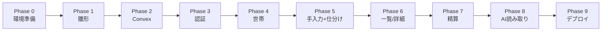

# warikapp 実装計画書

同棲カップル向けレシート割り勘精算アプリの実装計画。**バックエンドは Convex + Clerk 構成**(Convexは有料プラン契約済み)。

> **正本の要件定義書**: [requirements.md](./requirements.md) — 仕様の真実はそちらを参照。本書は「どの順番で・何を・どう作るか」を初心者向けに具体化したもの。
>
> **視覚補助**: [implementation-plan.html](./implementation-plan.html) — 本書のチェックリストをブラウザで進捗管理できるトラッカー(本書が正本。MD更新時はHTMLを再生成する)。

## この計画書の使い方

1. **Phase 0 から順番に進める**。フェーズを飛ばさない。
2. 各フェーズの最後にある **「✅ 動作確認」をすべてパスしてから次へ進む**。
3. **mainに直接コミットしない**。フェーズ(またはひとまとまりの修正)ごとにブランチを切り、終わったらPRを作ってレビュー後にmainへマージする。例: `git checkout -b feature/phase-3-auth` → 作業・コミット → push → PR作成。
4. 分からないエラーが出たら、エラーメッセージ全文をそのままAI(Claude Code等)に貼って相談する。Convexは日本語情報が少ないため、**公式ドキュメント(docs.convex.dev)+AIへの質問**を基本の調べ方にする。

## 目次

1. [全体方針とフェーズ一覧](#1-全体方針とフェーズ一覧)
2. [Phase 0: 開発環境とアカウント準備](#2-phase-0-開発環境とアカウント準備)
3. [Phase 1: Next.jsプロジェクト作成](#3-phase-1-nextjsプロジェクト作成)
4. [Phase 2: Convexセットアップ(スキーマ・認可ヘルパー)](#4-phase-2-convexセットアップ)
5. [Phase 3: 認証(F-001 / Clerk)](#5-phase-3-認証f-001--clerk)
6. [Phase 4: 世帯作成・招待(F-002)](#6-phase-4-世帯作成招待f-002)
7. [Phase 5: 手入力支出登録+品目仕分け(F-005, F-004)](#7-phase-5-手入力支出登録品目仕分けf-005-f-004)
8. [Phase 6: 支出一覧・詳細・編集・削除(F-006)](#8-phase-6-支出一覧詳細編集削除f-006)
9. [Phase 7: 精算(F-007)](#9-phase-7-精算f-007)
10. [Phase 8: AIレシート読み取り(F-003)](#10-phase-8-aiレシート読み取りf-003)
11. [Phase 9: 仕上げ・本番デプロイ](#11-phase-9-仕上げ本番デプロイ)
12. [初心者がハマりやすいポイント集](#12-初心者がハマりやすいポイント集)
13. [要件との対応表](#13-要件との対応表)

---

## 1. 全体方針とフェーズ一覧

### 1.1 実装順序の考え方

**AIレシート読み取り(F-003)は最後に実装する。**

理由:
- 外部API連携(Claude/Gemini)はエラー要因が多く、最初に着手すると詰まりやすい
- 手入力支出(F-005)だけでも「登録 → 仕分け → 精算」というアプリの縦の流れが完成する
- データ構造は共通(レシート由来も手入力も同じ `expenses`)なので、後からAIを足しても作り直しにならない

つまり **「手入力だけで動く割り勘アプリ」をまず完成させ、そこにAI読み取りを追加する** 進め方をとる。

### 1.2 Convex構成の要点(初心者向けまとめ)

- **クライアントはDBに直接触れない**。データの読み書きはすべて `convex/` ディレクトリに書くサーバー関数(query / mutation / action)経由。**この関数の冒頭で毎回メンバー確認をする**のがセキュリティの要(要件5.2)
- **query** = 読み取り(画面が自動でリアルタイム更新される)/ **mutation** = 書き込み(**自動でトランザクション**になる)/ **action** = 外部API呼び出し(Claude APIはここ)
- 認証はClerkに任せ、ConvexがClerkの発行するJWTを検証する(Convex公式推奨の定番構成)

### 1.3 フェーズ一覧

| Phase | 内容 | 対応機能 | 目安時間 |
|---|---|---|---|
| 0 | 開発環境・アカウント準備 | — | 1〜2時間 |
| 1 | Next.jsプロジェクト作成 | — | 1時間 |
| 2 | Convex(スキーマ・認可ヘルパー) | 全機能の土台 | 2〜3時間 |
| 3 | 認証(Clerk) | F-001 | 2〜4時間 |
| 4 | 世帯作成・招待 | F-002 | 3〜4時間 |
| 5 | 手入力支出+品目仕分け | F-005, F-004 | 5〜8時間 |
| 6 | 支出一覧・詳細・編集・削除 | F-006 | 4〜6時間 |
| 7 | 精算 | F-007 | 3〜5時間 |
| 8 | AIレシート読み取り | F-003 | 5〜8時間 |
| 9 | 仕上げ・本番デプロイ | 非機能要件 | 3〜5時間 |


```mermaid
graph LR
    P0[Phase 0<br>環境準備] --> P1[Phase 1<br>雛形] --> P2[Phase 2<br>Convex] --> P3[Phase 3<br>認証] --> P4[Phase 4<br>世帯]
    P4 --> P5[Phase 5<br>手入力+仕分け] --> P6[Phase 6<br>一覧/詳細] --> P7[Phase 7<br>精算] --> P8[Phase 8<br>AI読み取り] --> P9[Phase 9<br>デプロイ]
```

### 1.4 スコープ外(作らないもの)

要件定義書 1.3 の通り: 固定費の自動計上 / 月次サマリー・グラフ / プッシュ通知 / 送金連携 / iOSネイティブアプリ。F-008(仕分けAI提案)・F-009・F-010 もMVPでは実装しない。

---

## 2. Phase 0: 開発環境とアカウント準備

### タスク

- [ ] **Node.js LTS** をインストール(`node -v` で v20 以上を確認)
- [ ] **Git** の動作確認(`git -v`)
- [ ] **GitHubアカウント** — リポジトリ `warikapp` を作成(privateでよい)
- [ ] **Convexアカウント** — 契約済みのアカウントに https://dashboard.convex.dev でログインできることを確認(プロジェクト作成はPhase 2の `npx convex dev` が自動で行う)
- [ ] **Clerkアカウント** — https://clerk.com で無料サインアップ。アプリケーション `warikapp` を作成し、Sign-in方法で **Google** を有効化(開発環境ではClerk共有のGoogle認証がそのまま使えるため、Google Cloud Consoleの設定は本番デプロイのPhase 9まで不要)
- [ ] **Vercelアカウント** — https://vercel.com でGitHub連携サインアップ(Phase 9まで使わない)
- [ ] **Anthropicアカウント** — https://platform.claude.com でAPIキーを発行(Phase 8まで使わない)。課金上限アラートをコンソールで設定しておく

### ✅ 動作確認

- `node -v` / `npm -v` / `git -v` がすべてバージョンを表示する
- ConvexとClerkのダッシュボードにログインできる

---

## 3. Phase 1: Next.jsプロジェクト作成

### タスク

- [ ] プロジェクト作成(既存リポジトリの直下に作る。`docs/` は許容されるのでそのままでよい):

```bash
npx create-next-app@latest . --typescript --tailwind --app --eslint --no-src-dir --yes
```

質問には基本すべてデフォルト(Enter)でよい。**App Router: Yes / Tailwind: Yes / TypeScript: Yes** になっていることだけ確認。

- [ ] 必要パッケージをインストール:

```bash
npm install convex @clerk/nextjs
npm install @anthropic-ai/sdk zod
```

- [ ] ディレクトリ構成の骨組みを作る:

```text
warikapp/
├── app/
│   ├── login/[[...rest]]/page.tsx  # S-001 ログイン(Clerkの<SignIn/>・唯一の公開ルート)
│   └── (app)/                      # 保護ルート群(URLは変わらないルートグループ)
│       ├── layout.tsx              # サーバー側auth()で未ログインを/loginへ(リソースレベル認証)
│       ├── page.tsx                # S-003 ホーム
│       ├── setup/page.tsx          # S-002 世帯セットアップ
│       ├── expenses/
│       │   ├── new/
│       │   │   ├── receipt/page.tsx  # S-004 レシート登録
│       │   │   └── manual/page.tsx   # S-006 手入力登録
│       │   └── [id]/page.tsx         # S-005 支出詳細・編集
│       ├── settlement/page.tsx       # S-007 精算確認・実行
│       ├── settlements/page.tsx      # S-008 精算履歴
│       └── settings/page.tsx         # S-009 設定
├── convex/                         # ★バックエンド本体(Phase 2で npx convex dev が生成)
│   ├── schema.ts                   # テーブル定義
│   ├── auth.config.ts              # Clerk連携設定
│   ├── couples.ts                  # 世帯作成・参加・招待
│   ├── expenses.ts                 # 支出のCRUD
│   ├── settlements.ts              # 精算
│   ├── receipts.ts                 # 画像アップロードURL発行・AI読み取りaction
│   ├── ai/
│   │   ├── types.ts               # ReceiptParser インターフェース
│   │   ├── claude.ts              # Claude実装
│   │   ├── gemini.ts              # Gemini実装(後回し可)
│   │   └── index.ts               # env切り替え
│   └── lib/
│       └── auth.ts                # requireMember 認可ヘルパー
├── lib/
│   ├── settlement.ts               # 差額計算(UI表示とConvex関数の両方から使う純粋関数)
│   └── types.ts                    # 共通型定義
├── components/
│   ├── ConvexClientProvider.tsx    # Clerk+Convexのプロバイダ
│   └── ExpenseEditor.tsx           # 仕分けUI(3画面で共用)
├── proxy.ts                         # Clerkの認証Proxy(Next.js 16。旧middlewareファイル相当)
└── docs/
```

最初はページの中身が空(`export default function Page() { return <div>TODO</div> }` 程度)でよい。

### ✅ 動作確認

- `npm run dev` → http://localhost:3000 が表示される
- `/setup` `/settings` など各URLで「TODO」ページが出る(404にならない)
- ここで最初のコミット: `git add -A && git commit -m "Next.js雛形"`

---

## 4. Phase 2: Convexセットアップ

DBスキーマと「全関数で世帯メンバーか確認する」認可ヘルパーというアプリ全体の土台を作る。**このフェーズが品質の要**(要件5.2: テナント分離の強制)。

### 4.1 Convexプロジェクト初期化

- [ ] 開発サーバーを起動(初回はブラウザでログイン→プロジェクト作成まで自動で進む):

```bash
npx convex dev
```

- 成功すると `convex/` ディレクトリと `.env.local`(`CONVEX_DEPLOYMENT` / `NEXT_PUBLIC_CONVEX_URL`)が自動生成される
- **以後、開発中は `npm run dev`(Next.js)と `npx convex dev`(Convex)の2つを常に起動しておく**。`convex dev` が `convex/` 配下の変更を検知して即デプロイしてくれる

### 4.2 スキーマ定義(`convex/schema.ts`)

- [ ] 以下を作成。品目と負担割合は**支出ドキュメントに内包**する(常に支出単位で読み書きするため。Convexではこれが自然な設計):

```ts
import { defineSchema, defineTable } from "convex/server";
import { v } from "convex/values";

// 負担割合: 2名で合計100%(検証はアプリ層で行う)
const shareValidator = v.object({
  memberId: v.id("members"),
  ratioPercent: v.number(), // 0〜100の整数
});

// 品目
const itemValidator = v.object({
  name: v.string(),        // 1〜50文字
  price: v.number(),       // 税込・円・整数(1〜9,999,999)
  quantity: v.number(),    // 1以上の整数
  shares: v.array(shareValidator),
});

export default defineSchema({
  couples: defineTable({
    name: v.string(), // 省略時「わたしたち」
  }),

  members: defineTable({
    coupleId: v.id("couples"),
    // 認証プロバイダ発行の安定ID(identity.tokenIdentifier)。
    // Convex公式ガイドラインに従い subject ではなくこちらを使う
    tokenIdentifier: v.string(),
    displayName: v.string(), // 1〜20文字
  })
    .index("by_tokenIdentifier", ["tokenIdentifier"])
    .index("by_coupleId", ["coupleId"]),

  invitations: defineTable({
    coupleId: v.id("couples"),
    code: v.string(),               // 8文字英数字
    expiresAt: v.number(),          // 発行から72時間(エポックms)
    usedAt: v.optional(v.number()),
  })
    .index("by_code", ["code"])
    // 設定画面での有効コード表示・再発行時の旧コード削除に使う(Phase 4で追加)
    .index("by_coupleId", ["coupleId"]),

  expenses: defineTable({
    coupleId: v.id("couples"),
    paidBy: v.id("members"),
    storeName: v.optional(v.string()),
    purchasedAt: v.string(),        // "YYYY-MM-DD"
    totalAmount: v.number(),        // 品目合計から算出して保存
    items: v.array(itemValidator),  // 1件以上
    imageStorageId: v.optional(v.id("_storage")), // レシート画像。手入力はundefined
    source: v.union(v.literal("receipt"), v.literal("manual")),
    status: v.union(v.literal("draft"), v.literal("confirmed")),
    settlementId: v.optional(v.id("settlements")), // undefinedなら未精算
    deletedAt: v.optional(v.number()),             // 論理削除
  })
    // 「すべて」表示用: 世帯内を購入日順に読む
    .index("by_coupleId_and_purchasedAt", ["coupleId", "purchasedAt"])
    // 「未精算のみ」(デフォルト表示)と精算対象の収集用。
    // 未精算・未削除の両方をインデックス範囲で絞り込む(Phase 7で deletedAt を追加)
    .index("by_coupleId_and_settlementId_and_deletedAt_and_purchasedAt", [
      "coupleId",
      "settlementId",
      "deletedAt",
      "purchasedAt",
    ]),

  settlements: defineTable({
    coupleId: v.id("couples"),
    fromMemberId: v.id("members"), // 支払う側
    toMemberId: v.id("members"),   // 受け取る側
    amount: v.number(),
    memo: v.optional(v.string()),  // 100文字以内
    settledBy: v.id("members"),
    expenseCount: v.number(),      // 履歴に出す対象支出数(Phase 7で追加)
  }).index("by_coupleId", ["coupleId"]),

  // アップロードした画像の世帯帰属台帳(Phase 8で追加)
  uploads: defineTable({
    coupleId: v.id("couples"),
    storageId: v.id("_storage"),
    uploadedBy: v.id("members"),
  }).index("by_storageId", ["storageId"]),
});
```

> 💡 作成日時はConvexが自動で付ける `_creationTime` を使う(自分でcreatedAtカラムを作らない)。精算日時もこれで足りる。
>
> 💡 AI読み取りのレート制限(30回/時/世帯)用のテーブルはここには作らない。`@convex-dev/rate-limiter` コンポーネントが自前のテーブルで持つため(Phase 8 / §10.3)。

### 4.3 認可ヘルパー(`convex/lib/auth.ts`)

- [ ] **全公開関数の冒頭で必ず呼ぶ**共通関数を作る。これがSupabaseでいうRLSの代わり。ポイントは4つ:
  1. `requireUser` は `ctx.auth` さえあれば呼べる型(`{ auth: Auth }`)にして、query/mutationだけでなくactionからも使えるようにする
  2. `requireMember` で世帯所属を確認し、自分のmemberレコードを返す
  3. `assertCoupleMemberIds` で、クライアントから来た `paidBy` や `shares[].memberId` が**自世帯のメンバーか**を必ず検証する(他世帯のIDを混ぜて送られても弾く)
  4. **画面に出すエラーは `ConvexError` で投げる**。素の `Error` は本番デプロイではメッセージがクライアントに届かず「Server Error」に伏せられるため、ユーザー向け文言が消える。クライアント側は `lib/convex-error.ts` の `toUserMessage()` で取り出す(想定外の例外は汎用文言にフォールバックし、内部情報を露出させない)

```ts
import { Auth } from "convex/server";
import { ConvexError } from "convex/values";
import { internalQuery, QueryCtx, MutationCtx } from "../_generated/server";
import { Id } from "../_generated/dataModel";

// ログイン済みか確認。auth さえあれば良いので query/mutation/action どれからも呼べる
export async function requireUser(ctx: { auth: Auth }) {
  const identity = await ctx.auth.getUserIdentity();
  if (identity === null) throw new ConvexError("ログインしてください");
  return identity;
}

// ログイン済み+世帯所属を確認し、自分のmemberレコードを返す。
// これを呼ばずにDBを触る公開関数を書いてはいけない(セキュリティの要)。
export async function requireMember(ctx: QueryCtx | MutationCtx) {
  const identity = await requireUser(ctx);
  const member = await ctx.db
    .query("members")
    .withIndex("by_tokenIdentifier", (q) =>
      q.eq("tokenIdentifier", identity.tokenIdentifier),
    )
    .unique();
  if (member === null) throw new ConvexError("世帯に参加してください");
  return member;
}

// paidBy / shares[].memberId など、クライアント由来の member ID が
// すべて自世帯のメンバーであることを検証する(他世帯IDの混入を防ぐ)
export async function assertCoupleMemberIds(
  ctx: QueryCtx | MutationCtx,
  coupleId: Id<"couples">,
  memberIds: Id<"members">[],
) {
  for (const memberId of new Set(memberIds)) {
    const member = await ctx.db.get("members", memberId);
    if (member === null || member.coupleId !== coupleId) {
      throw new ConvexError("権限がありません");
    }
  }
}

// actionはDBに直接触れないので、認証+所属確認は internal query 経由で行う
// 使い方: await ctx.runQuery(internal.lib.auth.getCurrentMember, {})
export const getCurrentMember = internalQuery({
  args: {},
  handler: async (ctx) => requireMember(ctx),
});
```

さらに、取得した支出などが**自分の世帯のものか**を確認するチェックも徹底する:

```ts
// 使用例(支出取得時): 世帯が違えば見せない
if (expense.coupleId !== member.coupleId) throw new Error("権限がありません");
```

### ✅ 動作確認

- `npx convex dev` がエラーなく起動し、Convexダッシュボード → Data に5テーブル(couples, members, invitations, expenses, settlements)が表示される(uploads はPhase 8で追加。テーブルは最初のデータ投入時に現れる)
- ダッシュボードのDataタブから `couples` にテスト行を手動追加→削除できる

---

## 5. Phase 3: 認証(F-001 / Clerk)

### 5.1 ClerkとConvexの接続

- [ ] Clerkダッシュボード → JWT Templates → **New template → Convex** を選択して作成(名前は `convex` のまま)。表示される **Issuer URL**(`https://xxx.clerk.accounts.dev` 形式)をコピー
- [ ] Convexダッシュボード → Settings → Environment Variables に `CLERK_JWT_ISSUER_DOMAIN` = (Issuer URL) を登録(CLIなら `npx convex env set CLERK_JWT_ISSUER_DOMAIN <Issuer URL>`)。**auth.config.ts が参照する環境変数が未設定だとConvexへのデプロイ自体が失敗する**ため、Issuer URL取得前に開発を進める場合は一時的なプレースホルダ値を設定しておく
- [ ] `convex/auth.config.ts` を作成:

```ts
export default {
  providers: [
    {
      domain: process.env.CLERK_JWT_ISSUER_DOMAIN,
      applicationID: "convex",
    },
  ],
};
```

- [ ] Clerkダッシュボード → API Keys から2つのキーを `.env.local` に追加:

```bash
NEXT_PUBLIC_CLERK_PUBLISHABLE_KEY=pk_test_...
CLERK_SECRET_KEY=sk_test_...
```

### 5.2 Next.js側の組み込み

- [ ] `components/ConvexClientProvider.tsx`(client component): `ClerkProvider` → `ConvexProviderWithClerk`(`convex/react-clerk` パッケージ、Clerkの `useAuth` を渡す)の順で全体をラップし、`app/layout.tsx` から使う
- [ ] `proxy.ts`(プロジェクト直下): **Next.js 16でファイル名が `middleware.ts` から `proxy.ts` に変わった**(置き場所はプロジェクト直下のままで機能も同じ。旧ファイル名は使わない)。Clerk側の関数名は引き続き `clerkMiddleware` なので、`proxy.ts` の中で呼び出す形になる。`/login` 以外を保護:

```ts
// proxy.ts(createRouteMatcherはClerk v7で非推奨のためpathname判定を使う)
import { clerkMiddleware } from "@clerk/nextjs/server";

const isPublicPath = (pathname: string) =>
  pathname === "/login" || pathname.startsWith("/login/");

export default clerkMiddleware(
  async (auth, req) => {
    if (isPublicPath(req.nextUrl.pathname)) return;
    const { userId, redirectToSignIn } = await auth();
    if (userId === null) {
      // returnBackUrlで「復帰後は元のページへ」(要件F-001)を満たす
      return redirectToSignIn({ returnBackUrl: req.url });
    }
  },
  { signInUrl: "/login" },
);

export const config = {
  // Clerk公式推奨: 静的アセットの拡張子のみ除外(「.を含むパス全除外」は動的ルートの保護漏れになる)
  matcher: [
    "/((?!_next|[^?]*\\.(?:html?|css|js(?!on)|jpe?g|webp|png|gif|svg|ttf|woff2?|ico|csv|docx?|xlsx?|zip|webmanifest)).*)",
    "/expenses/:path*", // 動的セグメントを持つルートは明示(拡張子風URLも必ず通す)
    "/(api|trpc)(.*)",
  ],
};
```

> 実装のベースはClerk公式の「Next.js Quickstart」と Convex公式の「Convex & Clerk」ガイドのコードでよいが、ファイル名は `proxy.ts` に読み替えること。自己流にアレンジしない。Clerk側の最新の組み込み方法(関数名・引数の変更有無)は念のため **Clerk公式のNext.jsガイド参照**で確認する。

- [ ] **リソースレベル認証(Clerkベストプラクティス)**: 共通ヘルパー `lib/server-auth.ts` の `requireSignedIn()` を、**各保護ページの冒頭**と `app/(app)/layout.tsx` で呼ぶ。layoutはクライアント遷移時に再実行されないことがあるため、**ページ側のチェックが本体でlayout/proxyは追加防御**。Clientページ(ホーム)はServerページ+Clientコンポーネント(`home-client.tsx`)に分割する
- [ ] proxyのmatcherには動的セグメントを持つルート(`/expenses/:path*`)を明示し、拡張子風のURL(例: `/expenses/foo.css`)も必ずclerkMiddlewareを通す(これにより保護ページで `auth()` が例外になる経路を作らない。**以後、動的ルートを追加したらmatcherにも追加する**)

### 5.3 画面とフロー

- [ ] `/login`(S-001): Clerkの `<SignIn />` コンポーネントを配置(Googleボタンが自動で出る)
- [ ] ログイン後の振り分け(要件 F-001): Convexに query `couples.currentMember` を作り、ホームで `useQuery` して **null なら `/setup` へリダイレクト**。この queryは**ルーティング用プローブ**で、未ログイン・世帯未所属とも null を返す(認可ゲートではない。世帯データに触る関数は従来どおり requireMember の throw を使う)。返却は `_id / coupleId / displayName` のみに射影する
- [ ] ホーム側は **`useConvexAuth()` で認証確立を待ってから** queryを実行する(`isAuthenticated ? {} : "skip"`)。待たないと認証確立前の null を「未所属」と誤解し、所属済みユーザーを /setup へ誤誘導するバグになる
- [ ] `/settings` に仮のログアウトボタン(Clerkの `<UserButton />` か `<SignOutButton />`)を置く

### ✅ 動作確認

- 未ログインで `/` にアクセス → `/login` にリダイレクトされる
- Googleログインが成功し、`/setup` に到達する(まだ世帯がないため)
- Clerkダッシュボード → Users に自分が表示される
- Convexダッシュボード → Logs で `currentMember` の実行ログが見える
- ログアウト → 再び `/login` に飛ばされる
- **失敗系**: Google同意画面で「キャンセル」→ ログイン画面に戻れる

---

## 6. Phase 4: 世帯作成・招待(F-002)

Convexではすべてサーバー関数(mutation)なので、Supabase構成で必要だった「service_roleキーの特別扱い」は不要。**普通にmutationを書くだけでよい**。

### 6.1 実装内容(`convex/couples.ts`)

**A. 世帯を作成する(作成側)** — mutation `createCouple`
- [ ] 引数: 自分の表示名(必須1〜20文字)、世帯名(任意、省略時「わたしたち」・30文字以内)
- [ ] 処理: `requireUser` → すでに世帯所属なら拒否(V-202) → `couples` 作成 → `members` に自分を登録 → 招待コードを発行して `{ code, expiresAt }` を返す
- [ ] 招待コード: 8文字英数字(紛らわしい `0/O/1/I/L` を除いた31文字)、有効期限72時間(`Date.now() + 72*3600*1000`)。`crypto.getRandomValues` で生成し、剰余バイアスが出るバイトは捨てる。`by_code` で衝突を確認して数回引き直す

**B. 招待コードで参加する(参加側)** — mutation `joinCouple`
- [ ] 引数: 招待コード、自分の表示名
- [ ] 処理(mutationなので全体が自動でトランザクション):
  1. `requireUser` → コードを `by_code` インデックスで検索(入力は trim + 大文字化して照合)。存在しない/使用済み(`usedAt`あり)/期限切れ → 「招待コードが無効です」(V-201)
  2. 参加者がすでに世帯所属 → 「既存の世帯から退出してください」(V-202)
  3. 世帯メンバーが既に2名 → 「この世帯は満員です」(V-203)
  4. OKなら `members` に登録し、`invitations.usedAt` を記録(コード無効化)

**C. 設定画面用** — query `household` / mutation `updateDisplayName` / mutation `reissueInvitation`
- [ ] query `household`: `requireMember` → 世帯名・メンバー数・自分・パートナー・有効な招待コードを返す。**有効期限の判定はクライアント側で行う**(queryの中で時刻を読むと結果が陳腐化するため、`expiresAt` をそのまま返す)。招待コードはパートナー未参加(1名)のときだけ返す
- [ ] mutation `updateDisplayName`: `requireMember` → 自分の `members` 行だけを更新
- [ ] mutation `reissueInvitation`: `requireMember` → 満員なら拒否 → 未使用の旧コードを削除 → 新規発行(有効なコードが常に1つだけになる)

**D. 画面**
- [ ] `/setup`(S-002): 「世帯を作る」「招待コードで参加する」の2タブ(`setup-client.tsx`)。作成後は招待コードを表示し、共有してからホームへ。参加後はホームへ遷移。所属済みのユーザーがURL直打ちで来た場合はホームへ戻す
- [ ] 招待URL(`/setup?code=XXXXXXXX`)は**サーバーコンポーネントの `searchParams`(Next.js 16ではPromise)**で受け取り、初期値としてクライアントへ渡す(`useSearchParams` のSuspense要件を避ける)
- [ ] `components/InviteCodeCard.tsx`: コード・有効期限の表示と「コードをコピー」「招待URLをコピー」。S-002 と S-009 で共用
- [ ] `/settings`(S-009)の最小実装: 世帯名表示、表示名変更、招待コード再発行(パートナー未参加時のみ)、ログアウト
- [ ] エラー表示: Convex側は `ConvexError`、画面側は `lib/convex-error.ts` の `toUserMessage()` で文言を取り出す(4.3参照)

### 6.2 テスト(vitest + convex-test)

- [ ] `npm install -D convex-test vitest @edge-runtime/vm` と `vitest.config.ts`(`environment: "edge-runtime"`)を用意し、`npm test` = `vitest run` を追加する
- [ ] `convex/couples.test.ts` に V-201 / V-202 / V-203 と世帯分離のテストを書く。`t.withIdentity(...)` で複数ユーザーを演じ分けられるため、Googleアカウントを3つ用意しなくてもブラウザ確認の大半を自動化できる

> 💡 当初はPhase 5(`lib/settlement.ts` の単体テスト)でvitestを入れる計画だったが、V-201〜V-203の検証を手作業でやるコストが高いためPhase 4に前倒しした。

### ✅ 動作確認

- `npm test` が通る(V-201/V-202/V-203・世帯分離・表示名バリデーション・コード再発行を自動検証)
- ユーザーAで世帯作成 → 招待コードが表示され、コピーできる
- 別ブラウザ(シークレットウィンドウ+別Googleアカウント)でユーザーBがコード入力 → 参加できる
- 招待URLを開くと「招待コードで参加」タブがコード入力済みで開く
- 参加後、3人目のアカウントが同じコードを使うと「招待コードが無効です」になる(参加時にコードが無効化されるため、ブラウザ操作でV-203の「この世帯は満員です」に到達する経路はない。V-203は多重防御であり `npm test` で検証する)
- 参加後、Aの設定画面にパートナー名が出て、招待コード欄が消える
- **分離検証(重要)**: 3つ目のアカウントで別世帯を作成 → A/Bの世帯のデータが一切見えないこと(この後のフェーズでも常に意識する)

---

## 7. Phase 5: 手入力支出登録+品目仕分け(F-005, F-004)

アプリの中核。ここで作る「品目リスト+負担区分」のUIは、Phase 8のAI読み取り結果確認でもそのまま再利用する。

### 7.1 型定義と保存mutation

- [ ] `lib/types.ts` に画面用の型を定義(Convexスキーマと対応):

```ts
export type ShareRatio = { memberId: string; ratioPercent: number }; // 2名合計100
export type ExpenseItemInput = {
  name: string;
  price: number;    // 円・整数
  quantity: number;
  shares: ShareRatio[];
};
```

- [ ] mutation `expenses.save`(新規作成と更新を兼ねる):
  - 引数: `expenseId`(省略時は新規作成)/ `paidBy` / `storeName?` / `purchasedAt` / `items` / `source?` / `status`
    - `items` のバリデータは `convex/schema.ts` の `itemValidator` を **export して再利用**する(品目の形を1箇所に保つ)
    - `source`(`"receipt" | "manual"`)は**新規作成時のみ**使い、省略時は `"manual"`。更新時は既存の由来を変えない(Phase 8 のレシート由来支出を手入力に化けさせないため)
  - `requireMember` → 更新時は対象支出の `coupleId` が自世帯か確認。**他世帯・存在しない・論理削除済みはすべて同じ「支出が見つかりません」**にする(他世帯の支出の存在を漏らさない)
  - `assertCoupleMemberIds` で **`paidBy` と全 `shares[].memberId` が自世帯のメンバーであること**を検証(他世帯のmember IDが紛れ込むテナント境界破りを防ぐ)
  - バリデーション:
    - **V-401**: 各品目の負担割合の合計=100。割合は0〜100の整数で、同一メンバーの重複は不可
    - **V-402**: 品目1件以上(上限100件。レシート1枚=数十品目に対する安全弁)
    - **V-403**: 金額は1〜9,999,999円の整数。数量は1〜999の整数
    - 品目名は1〜50文字(前後の空白は除去)、店名は50文字以内(空文字なら未設定として保存)
    - 購入日は `YYYY-MM-DD` 形式・実在する日付・**JST基準で未来日不可**(Convexの実行環境はUTCなので +9時間して比較する。`Date.now()` はmutationなら使ってよい)
    - **精算済み(`settlementId`あり)は変更拒否**
  - `totalAmount` は `lib/settlement.ts` の `calcTotalAmount` で品目合計から算出して保存
  - 引数 `status: "draft" | "confirmed"` で確定状態を制御
  - 戻り値は `Id<"expenses">`(新規作成でも更新でも保存した支出のID)

### 7.2 仕分けUIコンポーネント(F-004の中核)

- [ ] `components/ExpenseEditor.tsx` を作る。手入力・レシート確認・編集の3画面で共用する
  - 上部: 店名/名目(任意)、購入日、支払者(デフォルト: ログイン中の本人)
    - 支払者の選択肢は `couples.household` から取る。このため **Phase 4 の `household` query の `partner` に `_id` を追加**した(表示名だけでは memberId が分からない)
    - パートナー未参加のうちは支払者は本人固定・負担区分は「自分100%」のみ
  - 中央: 品目リスト(品目名・金額・負担区分チップ)。行の追加・削除可
    - 金額は文字列で保持して整数のみ許可する(`0`・小数・記号は行エラー)。**数量はUIに出さず1固定**(Phase 8 のレシート読み取りで初めて必要になる)
  - 負担区分チップ: **タップで 折半(50:50) → 自分(100:0) → 相手(0:100) → 折半 と循環**。隣の「%」ボタンでカスタム割合(例 70:30)の入力欄を開く(要件の「長押し」は誤タップが多いためボタンにした)
    - 自分%と相手%を別々に入力させ、**合計が100でない行は赤枠+行内にエラー文言+確定ボタン無効化**(V-401)
    - 行のエラー(品目名・金額・割合)は**該当するものをすべて列挙する**。1件だけ出すと直した先に別のエラーが現れて原因が分かりにくい
    - ただし**まだ一度も編集していない空行は赤枠にしない**(画面を開いた直後・品目を追加した直後に全行が赤くなるのを防ぐ)。行を編集した時点から検証結果を出し、既存の支出を読み込んだ行は最初から出す
    - 空行を赤くしない代わりに、**確定できない理由をフッターに控えめに表示する**(品目0件 / 割合が100%でない / 品目名と金額の未入力 で文言を切り替える)
  - 立て替え額は**割合が100%でない行があるあいだ「—」にする**。確定できない状態の金額を出すと誤解を招くため(合計金額は金額が読める行の合計を出し続ける)
    - 保存時に0%のメンバーは `shares` から除く(「自分100:相手0」は自分だけの `shares` になる)
    - `shares` は配列の添字ではなく `memberId` で引く。**入力中にパートナーが参加したら既存行の `shares` を [自分, 相手] に揃える**(参加前に作った行は1要素しかなく、そのままでは折半に切り替えられない)
    - 確定が成功したときは送信ボタンのロックを解除しない。親の画面遷移は `await` の後に完了するため、解除すると遷移前に二重登録できてしまう
  - 下部固定フッター: 合計金額(`calcTotalAmount`)と「この支出で発生する立て替え額」(`calcAdvanceAmount`)をリアルタイム表示、確定ボタン
    - 金額が読めない入力途中の行は集計から除いて表示を壊さない
  - `onSubmit` は親から渡す(手入力は `expenses.save`、Phase 6 の編集は同じ mutation に `expenseId` 付きで呼ぶ)。サーバーのエラーは `toUserMessage` でフォーム内に表示する
- [ ] 初期値: 全品目「折半」

### 7.3 手入力画面(S-006)

- [ ] `/expenses/new/manual`: 最短「名目+金額」だけ入力して確定できる(他はデフォルト: 支払者=本人、日付=当日、負担=折半)
  - 画面は `ExpenseEditor` をそのまま使い、品目1行(空・折半)で開く。**名目は品目名の欄に入力する**(上部の「店名・名目」は任意項目)
  - `page.tsx` は `requireSignedIn()` だけ行い、Convexを使う本体は `manual-client.tsx`(client component)に分ける。世帯未所属なら `/setup` へ送る(Phase 3・4と同じ `currentMember` → `household` の順で購読する)
  - 日付の初期値は `lib/date.ts` の `todayLocalDate()`(ユーザーのローカル日付。サーバー側の未来日判定はJST基準)
- [ ] 内部的には品目1件の支出として `expenses.save`(source: "manual" / status: "confirmed")を呼ぶ
- [ ] 保存後はホームへ戻す(登録済み支出の一覧はPhase 6で作る)

### 7.4 立て替え額の計算ロジック

- [ ] `lib/settlement.ts` に**純粋関数**として実装。UIの表示・Phase 7の精算mutationの両方からimportして使う(Convex関数はプロジェクト内のファイルを普通にimportできる):

```ts
import type { ExpenseItemInput } from "./types";

// 1つの支出について「支払者が相手の分を立て替えた金額」を返す。
// 品目単位で 品目金額 × 相手の負担割合% を計算し、品目ごとに四捨五入(要件 F-007)
export function calcAdvanceAmount(
  paidBy: string,
  items: ExpenseItemInput[],
): number {
  return items.reduce((sum, item) => {
    const otherRatio = item.shares
      .filter((s) => s.memberId !== paidBy)
      .reduce((r, s) => r + s.ratioPercent, 0);
    return sum + Math.round((item.price * item.quantity * otherRatio) / 100);
  }, 0);
}
```

- [ ] 合計金額 `calcTotalAmount(items)` も同じファイルに置く(フッター表示と `expenses.save` の `totalAmount` で同じ計算を使う)
- [ ] この関数には**単体テストを書く**(`lib/settlement.test.ts`: 端数の四捨五入、100:0、70:30、数量、支払者が負担0%のケース)。vitestはPhase 4(6.2)で導入済みなので `npm test` に足すだけでよい
- [ ] `convex/expenses.test.ts` で `expenses.save` も検証する(V-401〜403・購入日・精算済みガード・**他世帯のmemberIDを混ぜられないこと**・更新時に `source` が変わらないこと)

### ✅ 動作確認

- `npm test` が通る(計算関数の端数処理・V-401〜403・世帯分離・精算済みガードを自動検証)
- 手入力で「焼肉 5,000円 / 支払者A / 折半」を登録 → Convexダッシュボード → Data → expenses に保存されている
- 品目を3行に増やし、行ごとに 折半/自分/相手/カスタム70:30 を設定 → フッターの立て替え額が手計算と一致する
- 割合合計が100にならない行があると確定できず、赤枠が表示される
- 金額に0や小数を入れるとエラーになる
- スマホ幅(DevToolsのモバイル表示)で親指操作できるレイアウトになっている

---

## 8. Phase 6: 支出一覧・詳細・編集・削除(F-006)

### タスク

- [x] **ホーム(S-003)**: 未精算差額の常時表示(Phase 7で本実装、まずは枠だけ)+支出一覧
  - query `expenses.list`: `requireMember` → 自世帯の `deletedAt` なしを購入日降順で返す。`usePaginatedQuery` で20件ずつ
  - インデックスの使い分け: 「未精算のみ」= `by_coupleId_and_settlementId_and_deletedAt_and_purchasedAt` で `.eq("settlementId", undefined).eq("deletedAt", undefined)` まで絞る(deletedAt はPhase 7で追加)。「すべて」= `by_coupleId_and_purchasedAt`
  - 論理削除の除外は `.paginate()` の**前に** `.filter()` で行う。ページを取得してから配列で捨てると1ページの件数が削除済みのぶんだけ目減りする
  - **ドラフト(未確定)も一覧に含める**(除外すると確定させる導線が画面から消える。差額計算からの除外はPhase 7の精算側で行う)。行にバッジを出す
  - 転送量を抑えるため行は射影して返す(`title` = 店名、無ければ先頭の品目名 / `itemCount` / `purchasedAt` / `totalAmount` / `paidBy` / `status` / `settled`)。品目の中身は詳細の `expenses.get` で読む
  - フィルタ「未精算のみ(デフォルト)/すべて」
  - 各行: 店名/名目、日付、合計金額、支払者、精算状態バッジ、ドラフトバッジ
  - 「+レシート」「+手入力」の登録ボタン(レシートはPhase 8までリンクのみ)
  - 💡 queryは`useQuery`/`usePaginatedQuery`で**自動リアルタイム更新**される。パートナーが登録した支出は画面を触らなくても即座に現れる(追加実装ゼロ)
- [x] **詳細(S-005)** `/expenses/[id]`: 品目・仕分け内訳・立て替え額・レシート画像サムネイル(画像はPhase 8以降に表示される)
  - query `expenses.get`: `requireMember` → 自世帯・未削除なら支出を返す。**他世帯・削除済み・存在しないIDはすべて `null`**(存在を漏らさない)
  - `expenses.get` / `getImageUrl` の `expenseId` は **`v.string()` で受けて `ctx.db.normalizeId` で検証する**。URLに直接打たれた不正なIDが `v.id()` の引数検証エラーになると、画面が「見つかりません」ではなくクラッシュするため
  - 品目ごとの負担額は `lib/settlement.ts` の `calcItemShareAmount` で出す(立て替え額と同じ「品目ごとに四捨五入」)
  - 画像URLは query `expenses.getImageUrl`: `requireMember` → 支出が自世帯か確認 → `ctx.storage.getUrl(imageStorageId)` を返す
- [x] **編集** `/expenses/[id]/edit`: `ExpenseEditor` を再利用して `expenses.save` を `expenseId` 付きで呼ぶ。`source` と `status` は既存の値を引き継ぐ。**精算済みは編集・削除ボタンを非表示/非活性**にし「精算済みの記録は変更できません」を表示(サーバー側でも7.1のガードで二重に防ぐ)
- [x] **削除**: mutation `expenses.remove` — 確認ダイアログ → `deletedAt` に `Date.now()` をセット(論理削除)。精算済みは拒否
- [x] 競合(相手が同時編集): Convexのリアルタイム同期により画面が常に最新に保たれるため、MVPは**後勝ち**でよい(要件どおり)
- [x] 金額・日付の表示書式は `lib/format.ts`(`formatYen` / `formatDateLabel`)に集約する
- [x] `convex/expenses.test.ts` に `list`(並び順・フィルタ・論理削除の除外・ページング・世帯分離)・`get`・`getImageUrl`・`remove`(論理削除・精算済み拒否)のテストを追加する

### ✅ 動作確認

- `npm test` が通る(一覧のフィルタ・並び順・世帯分離・論理削除・精算済みガードを自動検証)
- 登録した支出がホームに新しい順で並ぶ
- **ブラウザを2つ並べ、Aで支出を登録するとBの画面に自動で現れる**(リアルタイム同期)
- 詳細 → 編集 → 金額変更 → 保存 → 一覧に反映される
- 削除するとリストから消える(ダッシュボードでは `deletedAt` 付きで残っている)

---

## 9. Phase 7: 精算(F-007)

### 9.1 差額計算

- [x] `lib/settlement.ts` に世帯全体の未精算差額を計算する `calcNetBalance` を追加(要件の式そのまま):

```text
netA = Σ(Aが支払った未精算支出のAの立て替え額) − Σ(Bが支払った未精算支出のBの立て替え額)
netA > 0 → 「BがAにnetA円支払う」/ netA < 0 → 逆 / 0 → 精算不要
```

  - 差額0のときは `{ fromMemberId: null, toMemberId: null, amount: 0 }` を返す(方向を持たない)
  - メンバーIDは型変数にしてある。Convexから `Id<"members">` を渡すと戻り値も `Id<"members">` のままになり、`execute` の insert でキャストが要らない

- [x] query `settlements.currentBalance`: `requireMember` → 未精算・confirmed・未削除の支出を集めて上記を計算し、「誰が誰にいくら」を返す
  - **未精算支出の取得は有界にする**: ガイドラインが `.collect()` を禁じているため `.take(200 + 1)`。上限超過をエラーにすると差額表示も精算もできない詰みになるので、**古い順に200件までを1回の精算の対象として切り出し、あふれたぶんは次回の精算に回す**(`truncated` で画面に伝える)
  - 200件の根拠は**読み取りバイト数**。支出1件は最大でも 100品目 × (品目名50文字 + 金額・数量 + 2名の負担割合) ≒ 35KB なので、200件でも約7MBとトランザクション読み取り上限(16MiB)に収まる。件数だけ見て500件などにすると最大サイズの支出が並んだ最悪ケースで上限を超え、query ごと落ちる
  - **論理削除の除外はインデックス範囲で行う**(`by_coupleId_and_settlementId_and_deletedAt_and_purchasedAt`)。削除済みの支出は `settlementId` 未設定のままこの範囲に残り続けるため、`.filter()` で落とす作りだと取得件数は有界でも**走査行数が削除の蓄積とともに増える**
  - ドラフトは金額が変わりうるため差額から除外し、`draftCount` として返す(V-701の警告とガードに使う)
- [x] ホーム上部に常時表示: 金額+「あなたが ○○さんに 支払います」。カード全体が `/settlement` へのリンク

### 9.2 精算実行(S-007)

- [x] query `settlements.pending`: 精算画面用に、差額サマリー+対象支出の一覧(見出し・購入日・支払者・合計・立て替え額)を返す。一覧は購入日の新しい順
- [x] `/settlement`: 対象の未精算支出一覧と内訳、メモ入力(任意100文字)、「精算する」ボタン
- [x] mutation `settlements.execute` — **mutationは自動でトランザクション**なので、Supabase構成で必要だったPostgres RPCは不要。1つの関数に素直に書く:

```ts
export const execute = mutation({
  args: { memo: v.optional(v.string()) },
  handler: async (ctx, args) => {
    const member = await requireMember(ctx);
    const memo = normalizeMemo(args.memo);

    const partner = await findPartner(ctx, member);
    if (partner === null) throw new ConvexError("パートナーが参加してから精算してください");

    // 未精算・未削除の支出を有界に読む(古い順に最大200件。§9.1参照)
    const { expenses } = await collectUnsettled(ctx, member.coupleId);

    // V-701: ドラフトが残っていたら拒否
    if (expenses.some((e) => e.status === "draft")) {
      throw new ConvexError("未確定のレシートがあります");
    }
    if (expenses.length === 0) throw new ConvexError("精算対象がありません");

    // サーバー側で差額を再計算(クライアントの表示値は信用しない)
    const balance = calcNetBalance(member._id, partner._id, expenses);

    const settlementId = await ctx.db.insert("settlements", {
      coupleId: member.coupleId,
      // 差額0のときは方向に意味がないので 実行者 → パートナー で記録する
      fromMemberId: balance.fromMemberId ?? member._id,
      toMemberId: balance.toMemberId ?? partner._id,
      amount: balance.amount,
      memo,
      settledBy: member._id,
      expenseCount: expenses.length,
    });
    // 対象支出すべてに精算IDを付与
    for (const expense of expenses) {
      await ctx.db.patch("expenses", expense._id, { settlementId });
    }
    return settlementId;
  },
});
```

  - **画面に出すエラーは `ConvexError` で投げる**(素の `Error` は本番デプロイでメッセージがクライアントに届かず「Server Error」に伏せられる。既存の `couples.ts` / `expenses.ts` と同じ規約)
  - パートナー未参加の世帯は立て替えが発生しないため実行を拒否する(`toMemberId` を決められない)
  - 差額0でも対象があれば実行を許す(「ここで区切る」ことに意味があるため)
  - `expenseCount` を精算レコードに持たせる。履歴の対象件数を出すために expenses を数え直さないため(精算済み支出は編集・削除できず、取り消しは精算ごと消すので値はずれない)
- [x] 二重実行防止(V-702): mutationのトランザクション性+「対象0件ならエラー」のガードで、ボタン連打しても2件目は失敗する。UI側でも実行中はボタンを無効化する(成功時は遷移するまで無効のまま)
- [x] 競合検知(V-702): `execute` は確認画面に出ていた差額を `expectedAmount` で受け取り、**サーバーで計算し直した差額と食い違ったら実行を中止する**。金額の決定には使わない(あくまで「ユーザーが見ていない金額で精算しない」ためのガード)。確認直後にパートナーが支出を足した場合に効く
- [x] `cancel` は戻した件数が `expenseCount` と一致しなければ取り消し全体を失敗させる(中途半端に戻して `settlementId` だけ残った支出を作らない)
- [x] 実行後: ホームの未精算差額が0円になり、対象支出に「精算済み」バッジが付く(リアルタイム反映)。実行後は `/settlements` へ遷移して記録を見せる

### 9.3 精算履歴(S-008)と取り消し

- [x] query `settlements.list` + `/settlements`: 日時(`_creationTime`)・方向・金額・メモ・対象支出数の一覧。20件ずつページングする(履歴は消えないので上限固定にはしない)
- [x] **直近1件のみ取り消し可**: mutation `settlements.cancel` — 最新の精算か確認 → 対象支出の `settlementId` を外す → `settlements` の行を削除。取り消しボタンは一覧の先頭行にだけ出す
- [x] `convex/settlements.test.ts` に `currentBalance`(差額計算・ドラフト/精算済み/論理削除の除外・世帯分離)・`pending`・`execute`(V-701/V-702・サーバー再計算・メモ検証・差額0)・`list`・`cancel`(復活・直近以外の拒否・世帯分離)のテストを追加する。`lib/settlement.test.ts` には `calcNetBalance` の単体テストを追加する

### ✅ 動作確認

- `npm test` が通る(差額計算・V-701/V-702・取り消し・世帯分離を自動検証)
- A支払い5,000円折半+B支払い2,000円折半を登録 → 差額表示が「BがAに1,500円」になる(手計算と一致)
- 精算実行 → 差額0円、履歴に1件記録される
- 精算ボタンを素早く2回押しても精算は1件しかできない
- 精算済み支出が編集・削除できない(Phase 6のガード再確認)
- 取り消し → 差額が復活する
- ドラフト支出がある状態で精算しようとすると「未確定のレシートがあります」が出る(ダッシュボードから `status: "draft"` の行を手で作って確認してよい)

---

## 10. Phase 8: AIレシート読み取り(F-003)

最後の難所。**「画像アップロード → AI抽出 → ExpenseEditorで確認 → 確定」**をつなげる。

### 10.1 プロバイダ抽象化レイヤー

- [x] `convex/ai/types.ts`(型だけ。SDKに依存させない):

```ts
export type ParsedReceipt = {
  store_name: string | null;
  purchased_at: string | null; // YYYY-MM-DD
  total_amount: number;
  items: { name: string; price: number; quantity: number }[];
};

export type ReceiptMediaType = "image/jpeg" | "image/png" | "image/gif" | "image/webp";

export interface ReceiptParser {
  readonly providerName: string;
  parse(imageBase64: string, mediaType: ReceiptMediaType): Promise<ParsedReceipt>;
}

// スキーマ不適合だけを区別する(これだけ1回リトライする。通信エラーはしない)
export class ReceiptSchemaError extends Error {}
```

- [x] `convex/ai/index.ts`: 環境変数 `RECEIPT_AI_PROVIDER` で `claude` / `gemini` を切り替えて実装を返す。MVPは **Claudeのみ実装し、`gemini.ts` は「未実装エラーを投げるだけ」**(TBD-006)。`claude.ts` / `gemini.ts` / `index.ts` は SDK を読むので先頭に `"use node";` を書く(`types.ts` は型だけなので不要)
- [x] **モデルIDの設定ミスは専用の文言で出す**: 綴り間違い・提供終了は404で返るが、汎用の「読み取りに失敗しました」だと原因にたどり着けない。「AIモデル『◯◯』が使えません。ConvexのRECEIPT_AI_MODELを確認してください」にして、環境変数を直せば済むと分かるようにする(モデルIDはSDKの型では縛れない=`model` は任意の文字列なので、間違いは実行時にしか出ない)
- [x] ⚠️ **スキーマ不適合は例外で飛んでくる**: SDKの `messages.parse()` は不正JSON・Zod検証エラーを `AnthropicError("Failed to parse structured output: ...")` として**throwする**(`parsed_output` が null になるより先に例外)。これを `ReceiptSchemaError` に変換しないと「1回だけリトライ」が動かない。API側のエラー(`APIError` 系)はリトライ対象外なので、変換前に除外する
- [x] **環境変数はConvexダッシュボード → Settings → Environment Variables に登録する**(`.env.local` ではない! actionはConvex側で実行されるため):
  - `ANTHROPIC_API_KEY`
  - `RECEIPT_AI_PROVIDER` = `claude`
  - `RECEIPT_AI_MODEL` = `claude-opus-5`(省略時もこの値。下記参照)

### 10.2 Claude実装(`convex/ai/claude.ts`)

構造化出力(`output_config.format`)を使うと、スキーマに適合したJSONが保証されて楽:

```ts
import Anthropic from "@anthropic-ai/sdk";
import { z } from "zod";
import { zodOutputFormat } from "@anthropic-ai/sdk/helpers/zod";
import type { ReceiptParser, ParsedReceipt } from "./types";

const ReceiptSchema = z.object({
  store_name: z.string().nullable(),
  purchased_at: z.string().nullable(), // YYYY-MM-DD。判読不能ならnull
  total_amount: z.number().int(),
  items: z.array(
    z.object({
      name: z.string(),
      price: z.number().int(),    // 税込・円
      quantity: z.number().int(),
    }),
  ),
});

const PROMPT = `このレシート画像から購入情報を抽出してください。
- 品目名は略称を可能な範囲で正式名に展開する
- 価格は税込・円・整数。値引きはその品目の価格に反映する
- total_amount はレシートの合計金額(税込)
- 店名・購入日が判読できなければ null`;

export class ClaudeReceiptParser implements ReceiptParser {
  readonly providerName = "claude";

  // APIキーが未設定だとコンストラクタが例外を投げるので、生成はparse()の中で行う。
  // SDK側の自動リトライ(既定2回)は切る: 1リクエストで最大90秒かかり
  // 「タイムアウト30秒」を満たせなくなるため。リトライはスキーマ不適合時の1回だけ
  private client() {
    return new Anthropic({ maxRetries: 0, timeout: 30_000 }); // timeoutはms指定
  }

  async parse(imageBase64: string, mediaType: ReceiptMediaType): Promise<ParsedReceipt> {
    const response = await this.client().messages.parse({
      model: process.env.RECEIPT_AI_MODEL ?? "claude-opus-5",
      max_tokens: 16_000, // 思考(adaptive thinking)の出力も含むため余裕を持たせる
      messages: [
        {
          role: "user",
          content: [
            { type: "image", source: { type: "base64", media_type: mediaType, data: imageBase64 } },
            { type: "text", text: PROMPT },
          ],
        },
      ],
      // 読み取りは推論より知覚が主なので effort は低くてよい(「通常15秒以内」のため)
      output_config: { effort: "low", format: zodOutputFormat(ReceiptSchema) },
    });
    if (response.parsed_output === null) throw new ReceiptSchemaError();
    return response.parsed_output;
  }
}
```

> 💡 既定モデルは `claude-opus-5`(精度優先)。計画時点では `claude-opus-4-8` を想定していたが、実装時の最新世代(Claude 5系)のOpusに更新した。コスト・速度優先ならConvexの環境変数 `RECEIPT_AI_MODEL` で `claude-sonnet-5` / `claude-haiku-4-5` に差し替えられる(TBD-001)。実レシート数枚で試して決める。

### 10.3 Convex関数(`convex/uploads.ts` と `convex/receipts.ts`)

**ファイル分割**: Convexのガイドラインは「`"use node"` のファイルに query / mutation を同居させない」(Node.jsランタイムで動かせるのは action だけ)。当初は両方を `convex/receipts.ts` に置く想定だったが、**mutation は `convex/uploads.ts`、action は `convex/receipts.ts`** に分けた。

- [x] `convex/uploads.ts`(V8ランタイム):
  - mutation `generateUploadUrl`: `requireMember` → `ctx.storage.generateUploadUrl()` を返す(クライアントはこのURLに画像をPOSTして `storageId` を得る)。**ここにも世帯ごとの回数制限(60回/時)を掛ける**: 読み取りを呼ばずにURL発行だけを繰り返せば、読み取りの制限を迂回して無制限にファイルを置けてしまうため。圧縮のやり直しや再試行があるので読み取りの上限より緩めにしてある
  - mutation `registerUpload`: クライアントがアップロード直後に呼び、`uploads` テーブルに `(coupleId, storageId, uploadedBy)` を記録する(**storageIdの世帯帰属台帳**。スキーマに `uploads` テーブルを追加: index by_storageId)。実体のないIDは拒否し、同じIDの再登録は自世帯なら何もしない(通信リトライで壊れないように)/他世帯なら拒否する
  - mutation `discard`: 撮り直しで使わなくなった画像を消す。**どの支出からも参照されていない(`usedByExpenseId` 未設定)ものだけ**消せる
  - `assertOwnedUpload()` / `attachUpload()` / `releaseUpload()`(共通ヘルパー)と internalQuery `authorizeUpload`(認証+帰属検証をまとめて1回で行う。actionからの往復を減らすため)
  - 台帳は「使った時刻」ではなく **`usedByExpenseId`(参照している支出)** を持つ。こうしておくと、**支出の画像が差し替わったときに「その支出のものだった画像」だけを安全に消せる**(`expenses.save` が新しい画像を `attachUpload`、古い画像を `releaseUpload` する)。1枚の画像を2つの支出で共有することは拒否する(共有を許すと、片方が差し替えたときに消してよいか判断できなくなる)
  - ⚠️ **残課題**: 画面から離脱して置き去りになったアップロードは消えない。撮り直し・差し替えぶんは回収できるが、恒久対応(`usedByExpenseId` 未設定のまま一定時間経った行をcronで掃除する等)は運用を見てから決める(TBD-002)
- [x] `convex/receipts.ts`(**ファイル先頭に `"use node";`** — Anthropic SDKを使うため)。action `parse`:
  1. 認証+storageIdの帰属検証: actionはDBに触れないので `await ctx.runQuery(internal.uploads.authorizeUpload, { storageId })` で行う(他世帯のstorageIdを渡されても読めない)。`expenses.save` の `imageStorageId` にも同じ検証を掛ける
  2. **レート制限**: `@convex-dev/rate-limiter` コンポーネントで「30回/時/世帯」(fixed window、キーは `coupleId`)。AI呼び出しの前に消費する(失敗した呼び出しも数えることで連打による暴走を止める)
  3. `ctx.storage.get(storageId)` で画像Blobを取得し base64 化(20MB超は拒否)
  4. `ReceiptParser.parse()` を呼ぶ。**`ReceiptSchemaError` のときだけ1回自動リトライ**(要件)。タイムアウト30秒は**読み取り全体**の上限なので、1回目と2回目で残り時間を分け合う(2回目にも30秒渡すと合計60秒かかってしまう)。ただし1回目に全時間を渡すとリトライ枠が残らないので、**1回目の上限は「全体 − リトライの最低枠(5秒)」= 25秒**にする(半分に切ると、正常だが遅いだけの読み取りまで落としてしまう)
  5. `lib/receipt.ts` の `normalizeParsedReceipt()` で整形(下記)
  6. **調整行を足す前のAI由来の品目数(`sourceItemCount`)が0なら**「レシートを読み取れませんでした」(レシート以外・不鮮明な画像)。整形後の `items` で判定すると、品目0件でも合計金額だけ返ってきたときに「調整行だけの支出」ができてしまう。成功ログもこの判定の後に出す
- [x] `lib/receipt.ts`(**純粋関数。AI呼び出しと切り分けてテストする**。`lib/settlement.ts` と同じ方針):
  - AIの返り値を `expenses.save` の制約(V-402 / V-403)に均す(名前50字・金額1〜9,999,999の整数・数量1〜999、保存できない行は捨てる、品目は99件まで)
  - **数量は品目名に畳み込んで `quantity` は常に1にする**(「牛乳 ×3」)。理由: (1) `price` は「その行の合計金額」なので `price × quantity` にすると数量ぶん二重に効く、(2) 仕分けUIに数量の入力欄が無く(Phase 5の設計)、残すと画面に出ない値が合計に効いてユーザーが読み取り誤りを確認・修正できない
  - AIが `price` を単価で返してしまった場合の救済: 行合計として足すと `total_amount` に合わず、`price × quantity` なら一致するときは単価とみなして行合計に直す(どちらとも判定できなければ指示どおり行合計として扱い、ズレは調整行が吸収する)
  - 品目合計 ≠ `total_amount` のとき、差額を品目 `調整(税・割引等)` として追加(負担区分の初期値は画面側の既定=折半)
  - ⚠️ **差額がマイナス(品目合計 > 合計金額)のとき、または上限9,999,999円を超えるときは調整行を作らない**。金額は「1円以上9,999,999円以下の整数」(V-403)で、そのままでは `expenses.save` が必ず弾くため。代わりに `adjustmentSkipped: true` を返し、画面が「金額を確認してください」と促す(TBD-003で運用しながら見直す)
- [x] `expenses.save` に `imageStorageId`(任意)を追加。**省略時は既存の画像を変更しない**(編集画面は画像を扱わないので、undefinedを「削除」と解釈するとレシート画像が編集のたびに消える)
- [x] ログ: 成否・所要時間・使用プロバイダを `console.log` / `console.error`(Convexダッシュボード → Logs で見える)。**レシートの中身はログに出さない**(要件 5.4。失敗時もエラーの種別名だけを出す)

> 💡 **レート制限に `parseLogs` テーブルを使わなかった理由**: 「直近1時間のログ行を数える」実装は (1) 件数カウントに必要な `.collect().length` がガイドラインで禁止されている(Convexに件数演算子はなく、行が増えるほど読み取り量が伸びる)、(2) ログ行が無限に溜まり続けて掃除のcronが要る、の2点で不利。ガイドラインが per-key quota に推奨している `@convex-dev/rate-limiter` は世帯ごとに1行の集計値しか持たないため、どちらも起きない。これに伴い `parseLogs` テーブルは廃止した(`convex/convex.config.ts` でコンポーネントを登録する)。

### 10.4 レシート登録画面(S-004)

- [x] `/expenses/new/receipt`:
  1. `<input type="file" accept="image/*" capture="environment">` で撮影/選択
  2. **クライアント側で縮小・圧縮**(`lib/image.ts`): Canvasで長辺2,000pxにリサイズ → JPEG(quality 0.8)に変換。20MB超は弾く。寸法計算は純粋関数 `fitWithinLongEdge()` に切り出してテストする
     - ⚠️ **HEICの扱い**: Canvasで拾えるのは「ブラウザがデコードできる画像」だけ。iPhoneは選択時にJPEGへ変換して渡すことが多く、iOS Safari自体もHEICをデコードできるので実運用(スマホ撮影)はこれで足りる。デコードできない環境(デスクトップChromeでHEICを選ぶ等)では「この画像は読み込めませんでした。JPEGまたはPNGでお試しください」を出す。デコーダライブラリの追加やサーバー変換はMVPの対象外
  3. `generateUploadUrl` で得たURLに画像をPOST(**60秒で打ち切る**。応答が返らないままだと画面が「アップロード中…」で固まり、撮り直しにも戻れなくなる)→ `storageId` を取得 → `registerUpload` で台帳に登録。撮り直したときは前の画像を `discard` で消す(置き去りのファイルを残さない)
  4. `useAction` で `receipts.parse` を呼ぶ。処理中はスケルトン+「レシートを読み取っています…」表示(通常15秒以内)
  5. 結果を `ExpenseEditor` に流し込み、**まず `expenses.save`(status: "draft")で保存**(ドラフト)
  6. ユーザーが修正・仕分けして「確定」→ 同じ `expenseId` に `status: "confirmed"` で保存し直す
- [x] エラーハンドリング(要件の表どおり):
  - 読み取り失敗/タイムアウト → 「読み取りに失敗しました。手入力に切り替えますか?」→ `storageId` を保持したまま手入力(空の品目1件のExpenseEditor)へ。画像は確定時に紐付く
  - レシート以外/不鮮明 → 「レシートを読み取れませんでした。撮り直してください」+ 再読み取り・手入力導線
  - アップロード失敗 → 再試行ボタン(画像はクライアントに保持)
- [x] **ドラフトの再開**: ホームの「未確定」バッジ → 詳細 → 編集 が再開導線になる。編集画面(`/expenses/[id]/edit`)は、開いた支出がドラフトなら見出しとボタンを「確定」に変え、保存時に `status: "confirmed"` にする(ここで確定できないと再開しても確定できないため)

### ✅ 動作確認

- 実物のレシートをスマホで撮影(またはPCで画像選択)→ 品目・金額・店名・日付が自動入力される
- 品目合計と合計金額がズレるレシートで「調整(税・割引等)」行が自動追加される
- 読み取り結果を修正して確定 → ホームの一覧と未精算差額に反映される
- 確定前に離脱したドラフトがホームに「未確定」バッジ付きで表示され、詳細 → 編集から確定できる
- 詳細画面で元のレシート画像が閲覧できる
- レシート以外(風景写真など)を送るとエラーメッセージと手入力導線が出る
- 31回連続で解析するとレート制限エラーになる(確認は任意。`convex/receipts.test.ts` で自動テスト済み)

> ⚠️ AI読み取りの実地確認には Convexダッシュボードでの環境変数登録(`ANTHROPIC_API_KEY` / `RECEIPT_AI_PROVIDER` / `RECEIPT_AI_MODEL`)が必要。未登録のうちは読み取りが「読み取りに失敗しました。手入力に切り替えますか?」になる(圧縮・アップロード・帰属検証・レート制限・調整行・ドラフト復帰はテストで検証済み)。

---

## 11. Phase 9: 仕上げ・本番デプロイ

### タスク

- [ ] **Clerkを本番インスタンスに**: Clerkダッシュボードで Production インスタンスを作成し、**Google Cloud ConsoleでOAuthクライアントを作成して認証情報を登録**(本番はClerk共有認証が使えないため。リダイレクトURIはClerkの画面に表示されるものを貼る)。本番用の `pk_live_...` / `sk_live_...` を控える
- [ ] **Convexを本番デプロイ**: Convexダッシュボードの本番(Production)環境に環境変数(`ANTHROPIC_API_KEY` / `RECEIPT_AI_PROVIDER` / `RECEIPT_AI_MODEL` / `CLERK_JWT_ISSUER_DOMAIN`=本番ClerkのIssuer URL)を登録
- [ ] **Vercelデプロイ**:
  - GitHubリポジトリをVercelにImport
  - Build Command を `npx convex deploy --cmd 'npm run build'` に変更(フロントとConvex関数を同時デプロイ)
  - 環境変数: `CONVEX_DEPLOY_KEY`(Convexダッシュボード → Settings → Deploy Keysで生成)、`NEXT_PUBLIC_CLERK_PUBLISHABLE_KEY` / `CLERK_SECRET_KEY`(本番キー)
- [ ] **スマホ実機テスト**: 本番URLをiPhone(Safari)とAndroid(Chrome)で開き、撮影→仕分け→確定→精算の一連を実施
- [ ] **表示速度**: 主要画面の初期表示が体感2秒以内か確認
- [ ] **コスト管理**: AnthropicコンソールのAPI利用上限アラート設定を再確認。Convexダッシュボードの使用量も一度眺めておく
- [ ] パートナーを招待して実運用開始 🎉

### ✅ 動作確認(最終チェック)

- 本番URLで2人とも Googleログイン → 同じ世帯データが見える
- スマホで「撮影 → 仕分け → 確定」が1分程度で完結する
- 精算実行 → 差額0円 → 履歴確認、まで通しで動く
- 片方が登録した支出がもう片方の画面にリアルタイムで現れる

> 💡 実装完了後、`/verification-checklist` スキルで要件定義書と突き合わせた検証チェックリストを生成すると、抜け漏れ確認がしやすい。

---

## 12. 初心者がハマりやすいポイント集

| # | 罠 | 対策 |
|---|---|---|
| 1 | **`requireMember` の呼び忘れ** | Convexの公開関数は誰でも呼べる。認可ヘルパーを呼ばない関数が1つあるだけで他世帯のデータが漏れる。**公開query/mutation/actionの1行目は必ず認可チェック**、をルール化する(SupabaseのRLS忘れに相当する最重要の罠) |
| 2 | **環境変数の置き場所間違い** | Convexのaction(AI呼び出し)が読む環境変数は**Convexダッシュボード**に登録する。`.env.local` やVercelに置いても届かない。逆にClerkのキーはNext.js側(`.env.local` / Vercel)に置く |
| 3 | **`"use node"` の付け忘れ・同居** | Anthropic SDKなどNode依存のパッケージを使うactionファイルは先頭に `"use node";` が必要(無いとデプロイ時にバンドルエラー)。逆に **`"use node"` のファイルに query / mutation を同居させてはいけない**(Node.jsランタイムで動かせるのは action だけ)。Phase 8では mutation を `convex/uploads.ts`、action を `convex/receipts.ts` に分けている |
| 4 | **devとprodは別世界** | `npx convex dev` の開発環境と本番デプロイはデータも環境変数も完全に別。本番で「データがない」「APIキーがない」と焦ったらこれ |
| 5 | **本番でGoogleログインが失敗** | Clerkの開発インスタンスはGoogle設定不要だが、**本番インスタンスは自前のGoogle OAuth認証情報が必須**(Phase 9)。設定漏れが本番ログイン失敗のほぼすべて |
| 6 | **iPhoneのHEIC画像** | `accept="image/*"` で受けてもHEICが来ることがある。Canvasで再エンコードしてJPEG化する実装(10.4)で吸収する |
| 7 | **金額の浮動小数点誤差** | 金額は常に「円・整数」で扱う。`0.1 + 0.2 !== 0.3` の世界に近づかない |
| 8 | **APIキーのコミット** | `.env.local` がgit管理外であることを最初に確認。誤ってコミットしたら即キーを再発行 |
| 9 | **AI応答のパース失敗** | 構造化出力(`output_config.format`)を使えばJSONの手動パースは不要。それでも失敗時のリトライ1回+手入力フォールバックを必ず実装 |
| 10 | **actionとmutationの役割混同** | actionは外部API呼び出し用でDBに直接触れない(`ctx.runQuery`/`ctx.runMutation` 経由)。トランザクションが必要な書き込みはmutationに寄せる |
| 11 | **ドキュメント上限** | Convexの1ドキュメントは最大1MB。品目20件程度の支出なら余裕だが、画像などを直接ドキュメントに入れない(必ずFile Storageへ) |
| 12 | **エラーメッセージが本番で消える** | Convex関数が投げた素の `Error` は、本番デプロイではメッセージがクライアントに届かず「Server Error」に伏せられる(内部情報の漏洩防止)。開発中は見えるので気づきにくい。**画面に出す文言は `ConvexError` で投げる**(4.3) |
| 13 | **Reactの新lintルールで落ちる** | `next lint` の `react-hooks/purity` はレンダー中の `Date.now()` を、`react-hooks/set-state-in-effect` はeffect本体での `setState` をエラーにする。時刻の判定は `setTimeout` のコールバック側へ、`window` 依存の値は `useSyncExternalStore` で読む(`components/InviteCodeCard.tsx` が実例) |

---

## 13. 要件との対応表

| 要件ID | 内容 | 実装フェーズ |
|---|---|---|
| F-001 | 認証 | Phase 3 |
| F-002 | 世帯作成・招待ペアリング | Phase 4 |
| F-003 | レシート読み取り | Phase 8 |
| F-004 | 品目仕分け・確認 | Phase 5(UI)、Phase 8(AI結果への適用) |
| F-005 | 手入力支出登録 | Phase 5 |
| F-006 | 支出一覧・詳細・編集・削除 | Phase 6 |
| F-007 | 精算 | Phase 7 |
| F-008〜F-010 | Should/Could機能 | MVP対象外(実装しない) |
| SR-001 | AI読み取りAPI(Convex action) | Phase 8(10.3) |
| US-001〜US-010 | ユーザーストーリー | 各対応機能のフェーズに含む |
| 5.2 セキュリティ | requireMemberによる認可・Storage保護・APIキー管理 | Phase 2(土台)、全フェーズで維持 |
| 5.4 運用 | ログ・コスト管理・自動デプロイ | Phase 8(ログ)、Phase 9 |
| TBD-001 | Claudeモデル選定 | Phase 8で実レシート検証して決定 |
| TBD-002 | Convexストレージ容量の推移確認 | 運用開始後 |
| TBD-003 | 調整行方式の妥当性 | 運用開始後に二人で確認 |
