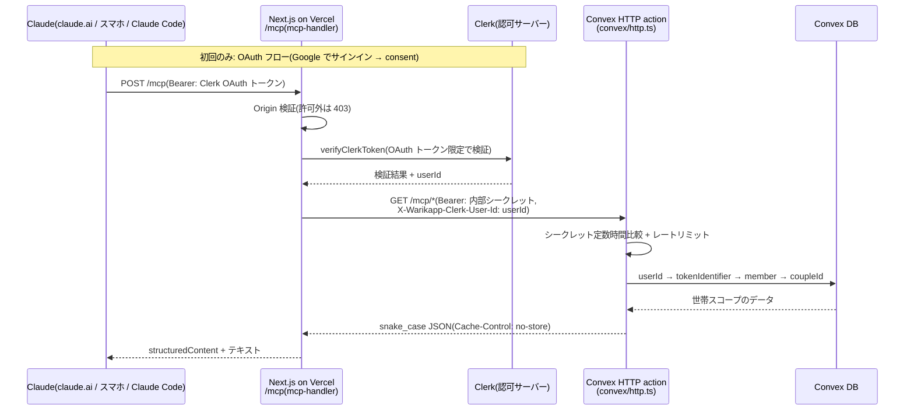

# warikapp リモート MCP サーバー実装計画書

claude.ai・スマホ・Claude Code から「今月の未精算いくら?」「先週何買った?」と聞けるようにする、読み取り専用のリモート MCP サーバーの実装計画。

> **ステータス**: v5 — GPT(Codex)による4巡のレビューを反映済み(2026-08-11)。1巡目: 重大6・中12・軽微3 → 全件反映。2巡目(計画再レビュー): 解消16・不十分5・新規9 → 全件反映。3巡目(実装レビュー): 重大1・中8・軽微2 → 全件対応。4巡目(修正再レビュー): 解消8・不十分3・新規2 → コード側は反映済み、**audience 拘束(R7)と実 OAuth E2E は Phase C(手動セットアップ前提)に持ち越し**。反映内容は [§13](#13-レビュー反映記録) を参照。
> **関連文書**: [requirements.md](./requirements.md)(アプリ本体の要件定義)/ [implementation-plan.md](./implementation-plan.md)(アプリ本体の実装計画。本書はその後続機能)
> **本書の位置づけ**: 実装の正本。

## 目次

1. [背景と目的](#1-背景と目的)
2. [決定済み事項(決定ログ)](#2-決定済み事項決定ログ)
3. [全体アーキテクチャ](#3-全体アーキテクチャ)
4. [Convex 側設計(内部 API)](#4-convex-側設計内部-api)
5. [Next.js 側設計(MCP エンドポイント)](#5-nextjs-側設計mcp-エンドポイント)
6. [セキュリティ設計](#6-セキュリティ設計)
7. [テスト計画](#7-テスト計画)
8. [実装フェーズと完了条件](#8-実装フェーズと完了条件)
9. [手動作業チェックリスト](#9-手動作業チェックリスト)
10. [リスクと未確定事項](#10-リスクと未確定事項)
11. [スコープ外](#11-スコープ外)
12. [レビューで見てほしい観点](#12-レビューで見てほしい観点)
13. [レビュー反映記録](#13-レビュー反映記録)

---

## 1. 背景と目的

- warikapp は同棲カップル向けレシート割り勘アプリ(Next.js 16 + Convex + Clerk + Vercel、本番: `https://warikapp.yamk12nfu.com`)。
- 目的: Claude(claude.ai の Web/モバイル、Claude Code)から自然言語で家計データを照会できるようにする。
  - 例: 「今月の未精算いくら?」「8月の食費っぽい買い物を一覧して」「この前のスーパーで何買った?」
- **業務データは読み取り専用**。登録・変更・精算実行は行わない(書き込みはフェーズ2以降の検討事項)。

## 2. 決定済み事項(決定ログ)

| # | 決定 | 理由 |
|---|---|---|
| D1 | ローカル stdio 案を廃し、**最初からリモート MCP(Streamable HTTP)** | 本命の利用シーンがスマホ / claude.ai であるため |
| D2 | MCP サーバーは **Next.js アプリ内**(Vercel)にホスト。独立 `mcp/` パッケージは作らない | Clerk 公式の MCP サポート(`mcp-handler` + `@clerk/mcp-tools`)が Next.js route handler 前提。既存のデプロイパイプラインに相乗りできる |
| D3 | ユーザー認証は **Clerk の OAuth**(ユーザーは既存の Google ログインで認可)。静的な個人用トークンは廃止 | 「Google でログインした本人が、その権限で見える範囲だけ読める」というモデル。パートナーも自分のアカウントで使える |
| D4 | Vercel → Convex 間は **内部共有シークレット + 検証済み Clerk userId** の server-to-server 呼び出し | Clerk OAuth トークンを下流に流さない(MCP 仕様が禁じる token passthrough の回避)。Convex は Clerk OAuth トークンを直接検証できない |
| D5 | クライアント登録は **CIMD 優先、Dynamic Client Registration(DCR)フォールバック** | Clerk 自身が「DCR は無認証の公開登録エンドポイントを作るため CIMD 推奨」と明記。ただし Clerk の CIMD はベータ |
| D6 | ページネーションは **opaque cursor 方式**(`cursor` / `next_cursor` / `has_more`)、期間指定は **`date_from` / `date_to`** | Convex の `.paginate()` がカーソルベース。offset 方式は有界読み取り方針に反する。「先週何買った?」に answering できるよう任意の日付範囲を受ける(レビュー指摘 C5) |
| D7 | HTTP レスポンスは **snake_case**。Convex 側のレスポンス組み立て関数で一度だけ変換 | MCP ツールの outputSchema と HTTP API を同形にし、Next.js 層をほぼパススルーにする |
| D8 | Clerk 課金は発生しない見込み(調査済み) | Hobby プラン 50,000 MRU に対し利用者2名。OAuth applications 機能にプラン制限・課金の記載なし |
| D9 | MCP セキュリティベストプラクティス照合済み | token passthrough 回避 / RS 分類(metadata 公開)/ confused deputy 非該当 / セッション非依存認証 / スコープ最小化。**トークンの audience 拘束のみ R7 の既知の制約**(Phase C で実クレーム確認後に実装判断) |
| D10 | **採用バージョンは Phase 0 で確定・固定**する(`mcp-handler` の対応 MCP revision・SDK 世代・zod 要件・Claude 各クライアントの対応 revision) | `mcp-handler` 2.x は MCP 2026-07-28 世代 + SDK v2 + zod ≥4.2 前提で、1.x とは構成が異なる。過去版に認証コンテキスト混線の修正履歴もあり、セキュアな最小バージョン固定が必要(レビュー指摘 C1) |
| D11 | ツール名は `list_expenses` / 引数は `expense_id`(旧案 `list_receipts` / `receipt_id` を改名) | 手入力支出も含むため「レシート」は不正確。一覧にも `source` を返す(レビュー指摘 M12) |
| D12 | **レートリミットを初期リリースから導入**(既存 `@convex-dev/rate-limiter`、member 単位、**rate 120/時 + capacity 20** の token bucket) | トークン漏えい・暴走クライアントによる読み取りコストの抑止。capacity を明示して瞬間バーストを20回に制限。member 単位のため**世帯全体では最大 240回/時**。rate limiter の書き込みはコンポーネント内部テーブルのみで、**業務データ(expenses 等)は読み取り専用のまま**(レビュー指摘 C3・再レビュー指摘 N4) |
| D13 | 一覧の `limit` は **`.paginate()` の `numItems` としてそのまま渡し、返却後の切り詰めをしない** | 切り詰めると `continueCursor` が切り捨て前の位置を指し、切り捨てた支出が次ページにも出ず**永久に欠落**する(再レビュー指摘 M7)。`returned_count` は「通常 limit 件だが前後しうる」契約にする |

## 3. 全体アーキテクチャ



- 認証境界は2つ:
  1. **Claude ↔ Next.js**: MCP 仕様の OAuth(Clerk が認可サーバー、`/mcp` がリソースサーバー)。毎リクエスト Bearer 検証。**OAuth トークン限定で受け付け**(Cookie セッション・通常の Clerk session token・期限切れ・別 issuer は拒否。§6.1。audience(resource)拘束のみ R7 の既知の制約)。
  2. **Next.js ↔ Convex**: 内部シークレット(`WARIKAPP_MCP_INTERNAL_SECRET`、環境ごとに別値。§6.3)。Clerk OAuth トークンはこの境界を越えない。
- Convex への転送リクエストは**受信ヘッダーを転送せず、新しい `Headers` をゼロから構築**する(クライアント由来の `X-Warikapp-Clerk-User-Id` が紛れ込む余地を構造的に断つ)。
- 「誰か」の解決は毎リクエスト: 検証済み userId → `${CLERK_JWT_ISSUER_DOMAIN}|${userId}` で tokenIdentifier を組み立て(Convex 側の env を使用)→ 既存インデックス `members.by_tokenIdentifier` + **`.unique()`**(重複時は throw = fail closed)で member → coupleId。
- 世帯未所属ユーザーは既存原則どおりエラー(「世帯に参加してください」)。

## 4. Convex 側設計(内部 API)

### 4.1 新設ファイルと既存変更

| ファイル | 内容 |
|---|---|
| `convex/http.ts`(新設) | `httpRouter` で内部 API 4本を配線。シークレット検証・レートリミット・パラメータ検証・snake_case 変換・`Cache-Control: no-store` 付与 |
| `convex/mcp.ts`(新設) | `internalQuery` 群 + `requireMcpMember(ctx, clerkUserId)`(userId → member 解決。`.unique()` で fail closed) |
| `convex/settlements.ts`(変更) | `collectUnsettled` / `summarize` / `findPartner` / `MAX_UNSETTLED_EXPENSES` を export 化(ロジック変更なし。上限定数は再定義せず共有) |
| `convex/schema.ts`(変更) | expenses に **`by_coupleId_and_deletedAt_and_purchasedAt` インデックス追加**(§4.4) |
| `convex/rateLimits.ts`(変更) | MCP 用のリミット定義を追加(member 単位 120回/時。既存コンポーネントに相乗り) |
| `convex/mcp.test.ts`(新設) | テスト(§7) |

集計は既存の純関数(`lib/settlement.ts` の `calcNetBalance` / `calcAdvanceAmount` / `calcItemShareAmount` / `calcTotalAmount`)を再利用し、**Web 画面の表示と1円単位で一致**させる(丸めは品目ごと四捨五入)。

### 4.2 認証・認可・レートリミット

- `Authorization: Bearer <WARIKAPP_MCP_INTERNAL_SECRET>` を全エンドポイントで要求。
  - 比較は自前の定数時間比較(Convex V8 ランタイムに `timingSafeEqual` がないため XOR 累積で実装)。
  - **fail closed**: env 未設定なら一律 503(`server_not_configured`)。不一致は一律 401(理由の詳細は返さない)。
- 呼び出しユーザーは `X-Warikapp-Clerk-User-Id` ヘッダーで受け取る。このヘッダーを信用してよいのは**内部シークレットが一致した場合のみ**。
- member 解決に失敗(未所属・未知の userId・tokenIdentifier 重複)は 403(`not_a_member`)。
- **レートリミット**: member 単位、`{ kind: "token bucket", rate: 120, period: HOUR, capacity: 20 }`(capacity を明示しないと満タン時に120回連続実行を許してしまうため。D12)。超過は 429 + `retry_after_seconds`。rate limiter の書き込みはコンポーネント内部テーブルに閉じるため、業務データの読み取り専用性は保たれる。
- 業務データへの mutation を呼ぶコードパスを一切作らない(読み取り専用の構造的保証)。

### 4.3 エンドポイント仕様

すべて GET。全レスポンスに `Cache-Control: no-store` を付与。金額はすべて円の整数で、各レスポンスのトップレベルに `"currency": "JPY"` を1つ持つ。共通エラー形:

```json
{ "error": { "code": "unauthorized | forbidden | invalid_request | not_found | rate_limited | server_not_configured", "message": "..." } }
```

ステータス: 401 / 403 / 400 / 404 / 429 / 503。

#### (1) `GET /mcp/balance` — 未精算差額

`collectUnsettled` + `summarize` を再利用。クエリパラメータなし。

```json
{
  "currency": "JPY",
  "amount": 3210,
  "direction": "partner_pays_self",
  "self": { "member_id": "...", "display_name": "かえで" },
  "partner": { "member_id": "...", "display_name": "..." },
  "paid_by_self": 21000,
  "paid_by_partner": 13000,
  "included_expense_count": 12,
  "draft_count": 1,
  "truncated": false
}
```

- `direction`: `"self_pays_partner" | "partner_pays_self" | "even"`。from/to の ID だけだと LLM が読み違えるため冗長に持つ。
- パートナー未参加の世帯では `partner: null`、`direction: "even"`、`amount: 0`。
- **truncated セマンティクス(重要)**: 既存 `collectUnsettled` は古い順 200 件のみを対象にするため、`truncated: true` のとき `amount` 等は**部分集計値**である。件数フィールドは `included_expense_count`(集計に含めた件数)と命名して「全件数」との誤読を防ぎ、outputSchema の description に部分集計であることを明記。ツール層は `truncated: true` のとき応答テキストの先頭に「⚠️ 未精算が200件を超えているため部分集計。確定値として答えないこと」を必ず付ける。エラーにしない理由: 上限超過をエラーにすると差額を一切答えられない詰みになる(既存 `settlements.ts` が truncated 方式を選んだのと同じ判断)。
- `draft_count > 0` のとき「未確定レシートは差額に含まれない」ことをツール側テキストで注記。

#### (2) `GET /mcp/expenses` — 支出一覧

| パラメータ | 型 | 既定値 | 説明 |
|---|---|---|---|
| `filter` | `unsettled \| all` | `unsettled` | 既存 `expenses.list` と同じ使い分け |
| `date_from` | `YYYY-MM-DD` | なし | 購入日の下限(含む)。`purchasedAt` のインデックス範囲条件 |
| `date_to` | `YYYY-MM-DD` | なし | 購入日の上限(含む) |
| `cursor` | opaque 文字列 | なし | 前ページの `next_cursor`。**HMAC 署名付きエンベロープ方式**: `base64url(JSON { v: 1, filter, date_from, date_to, c: coupleId, convex_cursor }) + "." + base64url(HMAC-SHA256 署名)`。鍵は内部シークレット(現行・旧の両方で検証 = ローテーション耐性)。署名不一致・復号不能・条件不一致・coupleId 不一致・内部 cursor 不正(InvalidCursor)はすべて 400 |
| `limit` | 1〜50 | 20 | `.paginate()` の `numItems` としてそのまま渡す。**返却後の切り詰めはしない**(切り詰めると continueCursor との不整合で支出が永久に欠落する。D13)。`returned_count` は通常 `limit` 件だがページ分割時は前後しうる契約 |

購入日の降順。論理削除済み(`deletedAt` 設定済み)は除外。

日付パラメータの検証(400 契約): `YYYY-MM-DD` 形式・**実在日**(既存 `assertPurchasedAt` と同じ往復方式で 2026-02-31 等を弾く)・`date_from <= date_to`・**年は 2000〜2100 を正式な業務制約とする**(`Date.UTC` の2桁年解釈の回避を兼ねる。`expenses.save` は過去日を広く受理するが、MCP 照会 API の範囲指定はこの制約内とする)。summary の `month` も同様に形式・実在月・年範囲を検証。エラー文は正しい形式の例を含める。

```json
{
  "currency": "JPY",
  "expenses": [
    { "id": "...", "title": "オーケー 川崎", "purchased_at": "2026-08-05",
      "total_amount": 4321, "item_count": 8, "source": "receipt",
      "paid_by": { "member_id": "...", "display_name": "..." },
      "status": "confirmed", "settled": false }
  ],
  "returned_count": 20, "has_more": true, "next_cursor": "..."
}
```

- `title` は既存 `expenses.list` と同じ規則(店名 → 先頭品目名 → "(名称なし)")。
- `source` を返す(手入力支出とレシート由来の区別。D11)。
- 最終ページは `has_more: false`、`next_cursor: null`(欠落ではなく明示的 null。outputSchema で統一)。
- 無効な cursor は 400(`invalid_request`)+「cursor を捨てて最初から取得し直してください」。

#### (3) `GET /mcp/summary` — 月次サマリー

`month=YYYY-MM` **必須**(Convex query 内で wall clock を読まない既存規約のため。「今月」のデフォルトは Next.js 層が JST で計算して付与する)。

```json
{
  "currency": "JPY",
  "month": "2026-08",
  "included_expense_count": 23, "draft_count": 1,
  "total_amount": 84210,
  "settled_amount": 30000, "unsettled_amount": 54210,
  "unsettled_balance": { "amount": 3210, "direction": "partner_pays_self" },
  "members": [
    { "member_id": "...", "display_name": "かえで", "is_self": true,
      "paid_amount": 50000, "share_amount": 42000, "unsettled_paid_amount": 32000 }
  ],
  "truncated": false
}
```

- **`unsettled_balance`(月内純差額)**: その月の未精算(confirmed)支出だけを `calcNetBalance` に通した「誰が誰にいくら」。「今月の未精算いくら?」に月スコープで一意に答えるための項目(前月の未精算が混ざる `get_unsettled_balance`(全期間の現在残高)との違いをツール説明文にも明記する)。`unsettled_paid_amount` はメンバー別の未精算分支払額。追加の読み取りは不要(同じ行から算出)。

- 金額集計は **confirmed のみ**(draft は件数のみ。Web の差額計算と同じ扱い)。
- `paid_amount` = 支払った合計、`share_amount` = 負担すべき合計(品目ごと四捨五入)。
- 読み取りは新インデックス(§4.4)で論理削除を範囲除外した上で月 200 件 + 1 件を `take`。`truncated: true` の扱いは (1) と同じ(部分集計の明示 + ツール文言強制)。
- 200 件の根拠: 支出1件の上限サイズ ≒ 35KB × 200 ≒ 7MB でトランザクション読み取り上限 16MiB に収まる。**35KB はスキーマではなくアプリ層の検証で保証されている**(全書き込みが `expenses.save` の `normalizeItems` / `MAX_ITEMS=100` / 品目名50文字等を通る。他に expenses への書き込み経路がないことを Phase A で確認しテストに明記する)。

#### (4) `GET /mcp/expense?id=...` — 品目内訳

```json
{
  "currency": "JPY",
  "id": "...", "store_name": "オーケー 川崎", "purchased_at": "2026-08-05",
  "total_amount": 4321, "status": "confirmed", "settled": true, "source": "receipt",
  "paid_by": { "member_id": "...", "display_name": "..." },
  "advance_amount": 2100,
  "items": [
    { "name": "牛乳", "price": 258, "quantity": 2, "subtotal": 516,
      "shares": [ { "member_id": "...", "display_name": "...",
                    "ratio_percent": 50, "amount": 258 } ] }
  ]
}
```

- `store_name` が未設定の支出では `store_name: null`(欠落ではなく明示的 null)。
- `id` は `ctx.db.normalizeId` で検証。**不正形式・他世帯・論理削除済みはすべて一律 404**(既存の「存在を漏らさない」原則)。
- レシート画像の署名付き URL は返さない(§11)。

### 4.4 インデックスと有界読み取り方針

- **schema 変更**: expenses に `by_coupleId_and_deletedAt_and_purchasedAt` を追加する。`filter=all` の一覧と月次サマリーで「論理削除の範囲除外 + 購入日範囲」を同一インデックスで実現するため(既存の `by_coupleId_and_purchasedAt` では deletedAt を `.filter()` で落とすしかなく、削除が積み上がるほど走査が増える — 既存 schema コメントと同じ理屈)。個人規模のテーブルなので非 staged の直接追加を既定とするが、デプロイがブロックされる場合は**3段階に分ける**(staged index は解除まで query から使えないため): (1) schema のみ `staged: true` でデプロイ → (2) バックフィル完了をダッシュボードで確認 → (3) staged 解除 + 利用コードを同時デプロイ。この条件分岐は Phase A の手順に含める。
- `filter=unsettled` は既存の `by_coupleId_and_settlementId_and_deletedAt_and_purchasedAt` を使用(month 範囲も同インデックスの `purchasedAt` 段で適用)。
- 一覧: `.paginate()`(カーソル)。返却後の切り詰めはしない(D13)。
- バランス・サマリー: 上限 +1 件を `take` して `truncated` 判定(既存 `collectUnsettled` と同じパターン)。
- `.collect()` は使わない。

## 5. Next.js 側設計(MCP エンドポイント)

### 5.1 ルート配置

| ルート | 役割 |
|---|---|
| `app/mcp/route.ts` | MCP エンドポイント(Streamable HTTP)。`createMcpHandler` + `withMcpAuth` + `verifyClerkToken`。配線のみ |
| `app/.well-known/oauth-protected-resource/mcp/route.ts` | RFC 9728 protected resource metadata(公開必須)。**`OPTIONS`(CORS preflight)にも応答**(`metadataCorsOptionsRequestHandler`) |
| `app/.well-known/oauth-authorization-server/route.ts` | 旧仕様クライアント互換用の AS metadata(公開必須)。同じく `OPTIONS` 対応 |

- Clerk のガイドは `app/[transport]/route.ts`(ルート直下の動的セグメント)を例示しているが、**採用しない**。ルート直下の catch-all は既存ページと衝突し、任意の1セグメントパスを拾ってしまう。`/mcp` に固定する。
- 対応トランスポート・プロトコル revision は **Phase 0 で確定**する(D10): `mcp-handler` の採用バージョンが実装する MCP revision と、claude.ai / Claude Code が話す revision の交差を確認し、旧クライアント向けフォールバック(旧 SSE 等)の要否をそこで判断する。

### 5.2 proxy.ts の公開パス追加(重要)

現状の `proxy.ts`(Next.js 16 の Proxy = 旧 middleware)は `/login` 以外の全ルートを Clerk のログインへリダイレクトする。**MCP クライアントは cookie セッションを持たないため、公開パスに追加しないと OAuth フロー以前に 3xx でプロトコルが壊れる**。

- `isPublicPath` に追加するのは**次の3パスの完全一致のみ**(プレフィックス丸ごと公開にしない。`/mcpfoo` や将来の別 `.well-known` ルートを巻き込まないため):
  - `/mcp`
  - `/.well-known/oauth-protected-resource/mcp`
  - `/.well-known/oauth-authorization-server`
- `/mcp` 自体の認証は `withMcpAuth`(Bearer 検証)が担う。Proxy は素通しでよい。
- 認可モデルの knowledge(`.ai/local/knowledge/authorization-model.md`)の「UI層のリソースレベル認証」節に、この公開パスの追加を明記する(公開プローブの列挙ルールに準拠)。

### 5.3 層構成(mdlog-mcp の流儀を踏襲)

```
lib/mcp/
  client.ts      # Convex 内部 API の fetch ラッパー(MCP 非依存)。Bearer 付与・cache: "no-store"・タイムアウト・エラーマッピング。Headers は毎回新規構築
  format.ts      # 円表記・テキストサマリー生成(MCP 非依存)
  schemas.ts     # zod 入出力スキーマ(inputSchema / outputSchema)
  respond.ts     # errorResult / テキスト部の 25,000 字上限切り詰め
  tools/
    get-unsettled-balance.ts
    list-expenses.ts
    monthly-summary.ts
    get-item-breakdown.ts
```

- `app/mcp/route.ts` は配線のみ(ツール登録の列挙)。
- 各ツールは `registerTool` + `outputSchema` + `structuredContent` を返し、**互換性のため同じ JSON のシリアライズを TextContent にも含める**(MCP 仕様の推奨)。
- **エラー契約**: API の 400/403/404/429/503 と入力検証エラーは、プロトコルエラーではなく `isError: true` の Tool Execution Error として返す(モデルが読んで再試行・言い換えできる形)。エラー文には次の一手を含める。
- **テキスト部の上限処理**: TextContent の JSON が 25,000 字を超える場合、**JSON を機械的に切らない**(不正 JSON になる)。代わりに有効な短縮テキスト要約 +「完全なデータは structuredContent 参照。テキストは省略済み」の注記に置き換える。`structuredContent` は絶対に切り詰めない(outputSchema 違反になるため)。
- **annotations は完全形で付与**: `{ title: "<人間向け名>", readOnlyHint: true, destructiveHint: false, idempotentHint: true, openWorldHint: false }` を全ツールに。

### 5.4 MCP ツール仕様

| ツール | 対応 API | 引数 | 説明文に書くこと |
|---|---|---|---|
| `get_unsettled_balance` | `/mcp/balance` | なし | 「未精算の差額と方向を知りたいとき最初に呼ぶ。内訳は `list_expenses` へ」 |
| `list_expenses` | `/mcp/expenses` | `filter?`(省略時 `all`) `date_from?` `date_to?` `cursor?` `limit?` | 「支出(レシート読み取り・手入力の両方)の一覧。期間指定可。品目まで見るには `get_item_breakdown`」 |
| `monthly_summary` | `/mcp/summary` | `month?`(省略時 = JST の今月) | 「月の合計・メンバー別の支払/負担・精算状況のサマリー」 |
| `get_item_breakdown` | `/mcp/expense` | `expense_id` | 「1件の支出の品目・数量・金額・負担割合の内訳」 |

- エラー文は次の一手を含める(例: 404 →「`list_expenses` で有効な ID を確認してください」、403 →「warikapp で世帯に参加してから再接続してください」、429 →「時間をおいて再試行してください」)。
- **相対日付の責務分担**(Next.js 層は元の自然言語プロンプトを見られないため): 「先週」「今月」等から絶対日付への変換は**モデル(Claude)の責務**とし、各ツールの説明文に「日付は JST 基準の絶対値(`YYYY-MM-DD`)で渡すこと」を明記する。Next.js 層が補完するのは **`month` 省略時の「JST の今月」既定値のみ**(引数なし呼び出しを成立させるため)。Convex query は wall clock を読まない(既存規約)。
- `get_unsettled_balance`(全期間の現在残高)と `monthly_summary` の `unsettled_balance`(月内純差額)の使い分けを両ツールの説明文に明記する(「今月の未精算」→ summary、「いま精算するといくら」→ balance)。
- **`list_expenses` の `filter` 既定は MCP ツール層で `all`**(3巡目レビュー指摘 中6): Convex 側 API(`GET /mcp/expenses`、§4.3(2))の既定は既存 `expenses.list` を踏襲して `unsettled` のままだが、MCP ツール層は `filter` 省略時に常に明示で `all` を送る。「先週何買った?」のような一般的な購入履歴の質問でモデルが `filter` を省略すると、精算済みの購入が一覧から欠落してしまうため(C5 の再発防止)。ツール説明文には「一般的な購入履歴の質問は `all`(既定)。未精算だけを見たいときのみ `unsettled` を指定」と明記する。

### 5.5 依存パッケージ(Phase 0 で確定済み・2026-08-11)

**採用(exact 固定)**:

| パッケージ | バージョン | 根拠 |
|---|---|---|
| `mcp-handler` | **1.1.0** | 認証コンテキスト混線バグは 1.0.6 で修正済み(含有)。SDK 1.x 世代 = MCP 2025-06-18 仕様で、Claude クライアント(claude.ai / Claude Code)の対応 revision と一致。2.x は MCP 2026-07-28 + SDK v2 前提でクライアント互換が未確認のため見送り(CIMD 世代への追随はフェーズ2) |
| `@modelcontextprotocol/sdk` | **1.26.0** | `mcp-handler@1.1.0` の peer が `1.26.0` 完全固定のため合わせる。zod peer は `^3.25 \|\| ^4.0` で既存 zod 4.4.3 を充足 |
| `@clerk/mcp-tools` | **0.6.0** | SDK 依存は**通常依存(内包)**のため上記と衝突しない(Phase 0 で npm レジストリを直接確認)。peer の `next ^16.0.10`(16.2.10 ✓)・`@clerk/nextjs ^7.2.3`(7.5.20 ✓)を充足 |

- 検証済みの前提: `members.tokenIdentifier` の実形式は `<issuer>|<subject>`(dev 実データで確認。issuer は `CLERK_JWT_ISSUER_DOMAIN` と完全一致、subject は `user_` 始まりの Clerk userId。prod の issuer も env で確認済み: `https://clerk.warikapp.yamk12nfu.com`)。
- Phase 0 のうち「Clerk dev インスタンスで OAuth 認証済みツール呼び出し」は Clerk ダッシュボードの DCR/CIMD 設定(手動)が前提のため、Phase C の dev E2E に統合して検証する。
- Next.js 16 は通常と異なるため、実装前に `node_modules/next/dist/docs/` の該当ガイド(route handlers / proxy)を読む(リポジトリ規約)。

## 6. セキュリティ設計

### 6.1 認証契約(Claude ↔ Next.js)

- `verifyClerkToken` では **OAuth アクセストークンのみを受理**する(`auth({ acceptsToken: "oauth_token" })` 相当の限定)。以下はすべて 401 で拒否し、テストで保証する(§7.2):
  - Cookie セッション/通常の Clerk session token
  - 期限切れトークン
  - 別 issuer のトークン(**audience(resource)拘束は未実装 — R7 の既知の制約**。Phase C で実トークンの `aud` クレームを確認し、resource が反映されるなら JWT 必須化 + `WARIKAPP_MCP_RESOURCE_URL` との完全一致検証を追加する)
- **Origin 検証**(Streamable HTTP の必須要件): `mcp-handler` 採用バージョンの Origin 検証実装を Phase 0 で確認し、不足していれば `/mcp` route で自前検証を足す。`proxy.ts` の `authorizedParties` は Clerk トークンに対する検査であり、この代替にならない。契約は次のとおり:
  - **Origin ヘッダーなし → 受理**(Claude Code 等の非ブラウザクライアント)。
  - **Origin ヘッダーあり → 環境別 allowlist との完全一致以外は 403**。allowlist は env `WARIKAPP_MCP_ALLOWED_ORIGINS`(カンマ区切り)で管理:
    - dev: `http://localhost:3000`, `http://localhost:6274`(MCP Inspector 既定ポート)
    - production: `https://claude.ai`(必要になったクライアントのみ追加)
  - テストは拒否系(許可外 Origin → 403)と**正常系(許可 Origin → 通過、Origin なし → 通過)**の両方を書く。
- **スコープ**: `profile` のみ(`email` は不要なので要求しない。MCP 処理が使うのは userId だけ)。Clerk はアプリ固有スコープ(例 `warikapp:read`)を一般提供していないため、**「この OAuth 認可 = 4ツールすべてへの一括読み取り許可」という粒度**であることを本書と consent 画面の説明文に明記する。DCR の `default_scopes` 設定は手動チェックリスト(§9)に含める。

### 6.2 MCP ベストプラクティス対応(照合済み)

| 仕様の要求 | 本設計の対応 |
|---|---|
| Token passthrough 禁止 | Clerk OAuth トークンは `/mcp` で検証・消費し、Convex には渡さない(内部シークレット + userId に交換) |
| RS 分類・audience 検証(RFC 9728 / 8707) | protected resource metadata は実装済み。**トークンの audience 拘束は R7 の既知の制約**(現経路の Clerk ヘルパーが audience を露出しないため。Phase C で実クレーム確認後に実装判断) |
| Origin 検証(Streamable HTTP) | §6.1(Phase 0 で実装位置を確定、テストで保証) |
| Confused deputy | 非該当構成(Clerk 自身が AS。per-client consent を Clerk が強制) |
| セッションを認証に使わない | 毎リクエスト Bearer 検証。ステートレス運用 |
| スコープ最小化 | `profile` のみ。読み取り専用ツールのみ |
| ツールのセキュリティ考慮(レート制御) | member 単位 120回/時(§4.2) |

### 6.3 クライアント登録方式・シークレット運用

- クライアント登録: **第一候補 CIMD**(「Advertise CIMD support」+「事前登録クライアントのみ許可」+ Claude のメタデータ URL を事前登録)。フォールバックは DCR(consent 画面は Clerk が強制)。consent 画面は無効化しない。
- 内部シークレット:
  - `openssl rand -base64 48` で生成。**環境ごとに別値**: dev(`.env.local` ↔ Convex dev)と production(Vercel Production ↔ Convex prod)のみに設定。**preview 環境には設定しない = preview では MCP は 503(fail closed)で無効**(preview から本番 Convex を呼べる経路を作らない)。
  - **ローテーション手順(コマンド順まで固定)**: Convex 側は `WARIKAPP_MCP_INTERNAL_SECRET`(現行)と `WARIKAPP_MCP_INTERNAL_SECRET_PREVIOUS`(旧)の2値を受理する実装にする。手順:
    1. `npx convex env set WARIKAPP_MCP_INTERNAL_SECRET_PREVIOUS <現行値> --prod`(現行値を旧スロットへ複写)
    2. `npx convex env set WARIKAPP_MCP_INTERNAL_SECRET <新値> --prod`
    3. Vercel の env を新値に更新して再デプロイ
    4. 動作確認後 `npx convex env remove WARIKAPP_MCP_INTERNAL_SECRET_PREVIOUS --prod`
    5. 旧値が 401 になることを確認(テスト §7.1 にも「PREVIOUS 削除後は旧値 401」を含める)
  - リポジトリ・ログに出さない。エラー詳細は伏せる(401/403 は一律文言)。
  - 将来リプレイ耐性まで求める場合は短命 JWT / 時刻付き HMAC 署名へ移行する(§11 に記載。初期は2値ローテーション付き共有シークレットで開始)。

## 7. テスト計画

### 7.1 Convex 側(`convex/mcp.test.ts`、vitest + convex-test、`t.fetch()` で HTTP action を直接叩く)

- 認証: シークレット未設定 → 503 / 不一致 → 401 / ヘッダー欠落 → 401 / 旧シークレット(ローテーション中)→ 200 / **PREVIOUS 削除後の旧値 → 401**。
- 認可: 未知の userId → 403、世帯未所属 → 403、tokenIdentifier 重複 → 403。
- **テナント分離(全 API)**: 2世帯のデータを同時投入し、balance / expenses / summary / expense の**4 API すべて**で相手世帯の ID・金額・件数・display_name が一切混入しないことを検査。さらに**異なる2ユーザーからの並行呼び出し(`Promise.all` で同時実行)**でもコンテキストが混ざらないこと(過去の認証コンテキスト混線バグの回帰検出)。
- `/mcp/balance`: 差額の計算・方向・draft 除外・パートナー未参加(`even`)・truncated 時の `included_expense_count` セマンティクス。既存 `settlements.currentBalance` と同じ結果になること。
- `/mcp/expenses`: filter / date_from / date_to の絞り込み(境界日を含む・翌日を含まない)、論理削除の除外、ページング往復で**全件が漏れなく一度ずつ列挙されること**(切り詰めによる欠落の回帰検出)、**cursor エンベロープの条件不一致 → 400**、無効 cursor → 400、最終ページ `next_cursor: null`。
- 日付検証: 実在しない日付(2026-02-31)・`date_from > date_to`・不正な month → 400。
- `/mcp/summary`: メンバー別集計・settled/unsettled 内訳・**`unsettled_balance`(月内純差額)の金額と方向**・月境界・削除済み支出の範囲除外(新インデックス使用)。
- `/mcp/expense`: 品目内訳・負担額の丸め(Web 表示と一致)・不正 ID / 他世帯 / 削除済み → 404。
- レートリミット: 上限到達 → 429 + `retry_after_seconds`。

### 7.2 Next.js 側(vitest)

- **`/mcp` ルートの認証**: OAuth トークン以外(セッション token・期限切れ・別 issuer・トークンなし)→ 401、scope なし → 403(audience 検証テストは R7 解消時に追加)。**許可外 Origin → 403 / 許可 Origin → 通過 / Origin なし → 通過**。
- **OAuth discovery の内容検証**: protected resource metadata の `resource`・`authorization_servers`・`scopes_supported` の値、401 応答の `WWW-Authenticate` ヘッダー(`resource_metadata` と scope)、metadata ルートの `OPTIONS` が返す CORS ヘッダー。
- `lib/mcp/client.ts`: fetch モックで 401/403/404/429/503 → エラーマッピング、タイムアウト、`cache: "no-store"` の付与、Headers が毎回新規構築されること。
- `lib/mcp/format.ts`: 円表記・テキスト要約・truncated 時の警告文・**25,000 字超過時の置き換え(不正 JSON を出さない)**。
- 各ツールハンドラ: client をモックし、structuredContent が outputSchema に適合・TextContent に JSON が併記されること、API エラーが `isError: true` で返ること、エラー文に次の一手が含まれること。

### 7.3 E2E(手動チェックリスト、§9 と対応)

- MCP Inspector で `http://localhost:3000/mcp` に接続(Clerk dev インスタンス + Convex dev deployment)→ OAuth フロー完走 → 4ツール実行。
- **ツール選択評価**(claude.ai または Claude Code で以下の質問セットを実行し、期待どおりのツール・引数が選ばれるかを確認。ズレたらツール説明文を調整):
  | 質問 | 期待ツール | 期待引数の要点 |
  |---|---|---|
  | 「今月の未精算いくら?」 | `monthly_summary` | 今月(省略可)。`unsettled_balance` で回答 |
  | 「いま精算するとどっちがいくら払う?」 | `get_unsettled_balance` | なし |
  | 「先週何買った?」 | `list_expenses` | `date_from`/`date_to` が JST の先週の月〜日。`filter` は省略(既定 `all`)されること(精算済みの購入も含めて答える) |
  | 「このレシートの中身見せて」(一覧提示後) | `get_item_breakdown` | 直前に列挙した `expense_id` |
  | 「続きを見せて」(一覧の続き) | `list_expenses` | 前回の `next_cursor` |
  | 「8月の合計と内訳は?」 | `monthly_summary` | `month: "2026-08"` |
- 本番デプロイ後: claude.ai のカスタムコネクタ登録 → Google サインイン → 上記質問セットの主要3問が正答すること。
- Claude Code: `claude mcp add --transport http --scope user warikapp https://warikapp.yamk12nfu.com/mcp` → `/mcp` で認証 → ツール実行。

### dev E2E 実施記録(2026-08-11)

Clerk dev インスタンスで DCR を有効化し、自作 OAuth クライアント(DCR 登録 + PKCE + `resource` パラメータ明示)で以下を確認済み:

- OAuth フロー完走(authorize → Google サインイン → consent → code → トークン交換)
- 実トークン: JWT(`typ: at+jwt`、RS256)、scope `profile offline_access`(`offline_access` は Clerk が自動付与)、**`aud` なし**(→ R7 の実測確定)
- MCP `initialize`(protocolVersion 2025-06-18 でネゴシエート)・`tools/list`(4ツール)
- 4ツールすべて実データで正常応答(差額の方向・品目按分の1円単位の値・ページング・月フィルタを目視確認)
- ネガティブ: トークンなし → 401(`WWW-Authenticate` + `resource_metadata` 付き)、許可外 Origin → 403
- 未実施(本番デプロイ後): claude.ai / Claude Code からの接続、ツール選択評価の質問セット

## 8. 実装フェーズと完了条件

ブランチ: `feature/mcp-remote-server`(main へ直接コミットしない)。

| Phase | 内容 | 完了条件 |
|---|---|---|
| **0** | **バージョン・互換性の確定**: `mcp-handler` + SDK + `@clerk/mcp-tools` の組み合わせ(§5.5 の (a)/(b))を決定。Origin 検証の実装位置(mcp-handler 委譲 or 自前)を確定。claude.ai / Claude Code の対応 revision との交差を確認し、旧トランスポートのフォールバック要否を決定。`members.tokenIdentifier` の実形式を dev / **production 両方**の実データで確認。認証配線の検証はモック(vi.mock)による route 統合テストまで(**実 Clerk OAuth の完走・実トークンのクレーム確認は Phase C** — Clerk ダッシュボードの手動設定が前提のため。§5.5 の注記と整合) | 採用バージョン・SDK 世代・対応 revision を §5.5 に追記。モック統合テストで JSON-RPC 成功パスが通る |
| **A** | Convex 側(schema インデックス追加 / `http.ts` / `mcp.ts` / settlements export 化 / rateLimits / テスト) | `npm test` 緑。`npx convex dev` でデプロイが通る |
| **B** | Next.js 側(依存追加 → `lib/mcp/` → ルート3本 → `proxy.ts` 公開パス → テスト)。ツール実装は mcp-builder スキルの指針に従う | `npm test` + `npm run lint` + `npm run build` 緑 |
| **C** | dev 環境 E2E(Clerk dev インスタンスに CIMD/DCR 設定 → dev 用シークレット設定 → ローカルで Inspector から OAuth 完走 → 4ツール動作) | §7.3 の dev 項目すべて ✅ |
| **D** | PR(日本語)→ Codex レビュー(/codex:rescue)→ 指摘修正 → 再レビュー → ユーザーがマージ | レビュー指摘ゼロ or 対応済み |
| **E** | 本番セットアップ(§9)→ claude.ai / Claude Code 登録 → 本番 E2E | §7.3 の本番項目すべて ✅ |

- Phase A と B は同一 PR にまとめる(片方だけでは動かないため)。
- テナント分離の観点は PR 前に `tenant-isolation-reviewer` エージェントでも検査する(このリポジトリの慣習)。

## 9. 手動作業チェックリスト

実装完了後にユーザーが行う作業(コマンドは実装時に確定版を提示):

1. **Clerk(dev → 本番の順)**: ダッシュボードで CIMD トグルの有無を確認。
   - CIMD 可 → 「Advertise CIMD support」+ 事前登録のみ許可 + Claude のクライアントメタデータ URL を登録。
   - 不可 → `npx clerk@latest api instance/oauth_application_settings -X PATCH -d '{"dynamic_oauth_client_registration": true}'`
   - あわせて **`default_scopes` を `profile` のみに設定**する。
2. **シークレット生成と設定(環境ごとに別値)**:
   - dev: `openssl rand -base64 48` → `.env.local`(Next 側)と `npx convex env set WARIKAPP_MCP_INTERNAL_SECRET <値>`(dev deployment)。
   - production: 別の値を生成 → Vercel env(Production)と `npx convex env set WARIKAPP_MCP_INTERNAL_SECRET <値> --prod`。
   - preview 環境からは本番 Convex を呼べないこと(preview に本番シークレットを設定しない)を確認。
3. **デプロイ**: main マージ → Vercel 本番デプロイ(既存パイプライン)。
4. **claude.ai**: 設定 → コネクタ → `https://warikapp.yamk12nfu.com/mcp` を追加 → Google でサインイン → consent 承認。
5. **Claude Code**: `claude mcp add --transport http --scope user warikapp https://warikapp.yamk12nfu.com/mcp`。
6. **初月の Clerk usage 確認**(OAuth トークン検証が従量枠に数えられていないかの実測)。

## 10. リスクと未確定事項

| # | リスク | 影響 | 対応 |
|---|---|---|---|
| R1 | `mcp-handler` 2.x が Next.js 16.2.10(特殊バージョン)で動かない | 計画停止 | **Phase 0 で最小ルート疎通を最初に検証**。ダメなら `@modelcontextprotocol/sdk` の Streamable HTTP transport を素の route handler に直接組む(工数 +1〜2h) |
| R2 | claude.ai / Claude Code と `mcp-handler` 採用版の対応 MCP revision が交差しない | 接続不可 | Phase 0 で確認。必要なら旧 revision 対応の `mcp-handler` 版を選ぶ、または revision を下げる |
| R3 | Clerk の CIMD がベータで使えない | セキュリティ堅牢性が一段落ちる | DCR + consent 強制で開始(§6.3)。CIMD GA 後に切り替え |
| R4 | `members.tokenIdentifier` の実形式が `issuer\|subject` の想定と異なる、または dev と production で issuer が異なることによる解決失敗 | member 解決が全滅(全リクエスト 403) | **Phase 0 で dev・production 両環境の実データと env を照合**してから結合ロジックを確定。テストにも実形式を反映 |
| R5 | OAuth トークン検証が Clerk の従量枠(検証10万回/月)にカウントされる | 課金リスク | 個人利用(月数百回)では枠の 0.1% 未満。§9-6 で初月に実測確認 |
| R6 | Vercel の関数実行時間・コールドスタート | 応答遅延 | 読み取り専用の軽い query のみで実測は短いはず。Inspector で計測し、問題があれば maxDuration 設定 |
| R7 | OAuth トークンの resource/audience 拘束が実装できない(3巡目レビュー指摘 重大1) | 他リソースサーバー向けに発行されたトークンが本サーバーに流用される経路を、サーバー側の検証だけでは遮断できない(MCP 2025-06-18 仕様が要求する audience 検証の未実装) | `auth({ acceptsToken: "oauth_token" })` が返す `AuthenticatedMachineObject<"oauth_token">`(`@clerk/backend` の型定義)は `id / subject / scopes / tokenType / userId / clientId` のみで audience・resource・azp に相当するフィールドを持たず、`@clerk/mcp-tools@0.6.0` の `verifyClerkToken` もそれをそのまま素通しするだけ(`AuthInfo.resource` を設定しない)。オパークトークン・JWT形式トークンいずれの検証結果(`IdPOAuthAccessToken`)にも aud クレームは残らないことを `@clerk/backend` の実装で確認済み。`mcp-handler@1.1.0` の `withMcpAuth` 自体も resource 照合を行わない。**現実の緩和要因**: このClerkインスタンスのリソースサーバーは本 MCP サーバー1つのみで、他リソースサーバー向けに発行されたトークンが存在しない(構造的に流用元が無い)。**正確な帰結(4巡目レビューで訂正)**: 実装不能なのは「現経路(`auth()` → `verifyClerkToken`)では」であり、生の Bearer トークンは `verifyToken` に渡っているため、`@clerk/backend` の公開 `verifyToken` による JWT 手動検証で `aud` を読める可能性が残っている(Clerk の OAuth アクセストークンは既定で JWT)。**実測結果(2026-08-11 Phase C dev E2E で確定)**: 認可リクエスト・トークン交換の両方に `resource=http://localhost:3000` を明示しても、Clerk 発行のアクセストークン(JWT、`typ: at+jwt`)に **`aud` クレームは含まれない = Clerk は RFC 8707 resource パラメータを反映しない**(シナリオ(b))。手動 JWT 検証でも検証対象の `aud` が存在しないため、**Clerk を認可サーバーとする限り audience 拘束は実装不能**。認可サーバーの変更やトークン交換層の追加は個人利用2名のアプリには過大と判断し、**本制約を受容して運用する**(受容の根拠: 単一RS・scope 強制・issuer 検証・consent 必須・24h失効・レートリミット)。Clerk が resource 対応した時点で JWT の `aud` 完全一致検証を追加する |

## 11. スコープ外(明示)

- **書き込みツール**(支出登録・精算実行)— フェーズ2。安全設計(confirm フロー・冪等性)を別途検討。
- **レシート画像の URL 返却** — 署名付き URL の取り扱いを詰めてから。
- **品目横断の検索ツール**(「牛乳をいつ買った?」)— 読み取り量が大きく専用設計が要る。まず4ツールで運用して必要性を判断。
- **内部認証の短命 JWT / HMAC 署名化** — 初期は環境分離 + 2値ローテーション付き共有シークレットで開始(§6.3)。リプレイ耐性が必要になったら移行。
- **旧 SSE トランスポート対応** — Phase 0 の互換性確認で必要と判明した場合のみ追加。

## 12. レビューで見てほしい観点

1. **認証設計の妥当性**: 内部シークレット + 検証済み userId ヘッダーの受け渡し(§3, §4.2, §6.3)に穴はないか。
2. **MCP 仕様準拠**: token passthrough 回避・RS メタデータ・Origin 検証・スコープ設計(§6)に見落としはないか。
3. **テナント分離**: `X-Warikapp-Clerk-User-Id` を信用する条件(シークレット一致)は十分か。
4. **API 形状**: LLM が誤読しにくいレスポンス設計(`direction` の冗長化、truncated セマンティクス、snake_case、cursor)に改善余地はないか。
5. **フェーズ分割**: Phase 0〜E の順序・粒度・完了条件は適切か。
6. **リスク表の抜け**: R1〜R6 以外に実装を止めうる要素はないか。

## 13. レビュー反映記録

2026-08-11 の GPT(Codex)レビュー(重大6・中12・軽微3)を以下のとおり反映した。

| 指摘 | 区分 | 対応 |
|---|---|---|
| C1 バージョン未固定(mcp-handler 2.x / MCP 2026-07-28 / SDK v2 / zod≥4.2、認証コンテキスト混線の修正版) | 重大 | **採用**: Phase 0 新設(D10、§8)。zod 4.4.3 で要件充足を確認 |
| C2 Origin 検証の欠落 | 重大 | **採用**: §6.1 に追加、テスト §7.2 に「許可外 Origin → 403」 |
| C3 レートリミットのスコープ外は要件と衝突 | 重大 | **採用**: 初期から member 単位 120回/時を導入(D12、§4.2)。「業務データは読み取り専用」に保証を言い換え |
| C4 論理削除をインデックス範囲除外できない | 重大 | **採用**: `by_coupleId_and_deletedAt_and_purchasedAt` を追加(§4.4) |
| C5 「先週何買った?」を month では満たせない | 重大 | **採用**: `date_from` / `date_to` に変更(D6、§4.3(2)) |
| C6 truncated 時の金額が確定値に見える | 重大 | **修正付き採用**: エラー化は詰みを作るため不採用(既存 settlements と同じ判断)。`included_expense_count` へ改名 + outputSchema description + ツール文言で部分集計を強制(§4.3(1)(3)) |
| M1 OAuth トークン限定の認証契約とネガティブテスト | 中 | **採用**: §6.1、§7.2 |
| M2 スコープから email 削除・粒度の明記・default_scopes | 中 | **採用**: §6.1、§9-1 |
| M3 シークレットのローテーション・環境分離・Headers 新規構築 | 中 | **採用**: §3、§6.3、§9-2。短命 JWT 化は §11 に将来項目として記載 |
| M4 `requireMcpMember` は `.unique()` で fail closed、本番 issuer 照合 | 中 | **採用**: §3、R4 を Phase 0 に拡張 |
| M5 テナント分離テストを全 API・並行呼び出しに拡張 | 中 | **採用**: §7.1 |
| M6 エラー契約(isError / TextContent 併記 / structuredContent を切らない) | 中 | **採用**: §5.3 |
| M7 limit の厳密保証・cursor 契約(終端 null・条件不一致・無効値) | 中 | **採用**: §4.3(2)、§7.1 |
| M8 metadata ルートの OPTIONS/CORS・公開パスの完全一致列挙 | 中 | **採用**: §5.1、§5.2 |
| M9 dev E2E 用シークレットの環境別手順 | 中 | **採用**: §6.3、§9-2 |
| M10 35KB 上限の根拠はアプリ層検証に依存 | 中 | **採用**: §4.3(3) に根拠を明記し Phase A で書き込み経路の単一性を確認 |
| M11 キャッシュ禁止(no-store)の明示 | 中 | **採用**: §4.3、§5.3 |
| M12 `list_receipts` → `list_expenses` 改名 + `source` 返却 | 中 | **採用**: D11、§4.3(2)、§5.4 |
| L1 `returned_count` / `currency: "JPY"` | 軽微 | **採用**: §4.3 |
| L2 null と欠落の統一(next_cursor / partner / store_name) | 軽微 | **採用**: §4.3 各所で明示的 null に統一 |
| L3 `MAX_UNSETTLED_EXPENSES` の共有 | 軽微 | **採用**: §4.1 |

### 2巡目(再レビュー)の反映(v3)

判定: 前回21件のうち解消16・不十分5・未対応0。以下は不十分5件と新規9件の対応。

| 指摘 | 区分 | 対応 |
|---|---|---|
| C1 不十分: SDK v2 peer 未記載・`@clerk/mcp-tools` の SDK 1.x 依存との衝突 | 重大 | **採用**: §5.5 に組み合わせ (a)/(b) を明記。Phase 0 の完了条件を「OAuth 認証済みツール呼び出しで userId 取得」に拡張(§8) |
| C2 不十分: Origin allowlist が未定義 | 重大 | **採用**: §6.1 に「Origin なし受理 / あり→環境別 allowlist 完全一致」契約と env 管理・正常系テストを追加 |
| M7 重大へ引き上げ: paginate 後の切り詰めで支出が永久欠落 | 重大 | **採用**: 切り詰め廃止(D13)。`numItems=limit` をそのまま渡し、`returned_count` は前後しうる契約に変更。cursor はエンベロープ方式(条件を封入し不一致 400)。「全件漏れなく列挙」の回帰テスト追加(§4.3(2)、§7.1) |
| 新規: 「今月の未精算」に一意に答えられない | 重大 | **採用**: summary に `unsettled_balance`(月内純差額、calcNetBalance 使用)と `unsettled_paid_amount` を追加。balance(全期間)との使い分けをツール説明文に明記(§4.3(3)、§5.4) |
| M3 不十分: ローテーションのコマンド順・preview の扱い | 中 | **採用**: §6.3 に5ステップの手順を固定。preview はシークレット非設定 = 503 で MCP 無効に統一 |
| M5 不十分: 並行テストになっていない | 中 | **採用**: `Promise.all` による2ユーザー同時呼び出しテストに変更(§7.1) |
| 新規: 相対日付は Next.js 層では解決不能 | 中 | **採用**: 変換はモデルの責務としてツール説明文に明記。Next.js は `month` 省略時の既定値のみ補完(§5.4) |
| 新規: 日付検証契約の不足 | 中 | **採用**: 実在日・`date_from <= date_to`・不正月の 400 契約とテスト(§4.3(2)、§7.1) |
| 新規: token bucket の capacity 未指定 | 中 | **採用**: `rate: 120, capacity: 20` を明示。世帯最大 240回/時を決定ログに記載(D12、§4.2) |
| 新規: OAuth discovery の内容・challenge 未テスト | 中 | **採用**: PRM フィールド・`WWW-Authenticate`・OPTIONS の CORS を検査(§7.2) |
| 新規: staged index のフォールバック手順 | 中 | **採用**: 3段階デプロイの条件分岐を §4.4 に明記 |
| 新規: TextContent 切り詰めで不正 JSON | 中 | **採用**: JSON を切らず有効な要約テキストへ置き換える方式に変更(§5.3、§7.2) |
| 新規: ツール選択評価の不足 | 中 | **採用**: 6問の質問セット(期待ツール・期待引数付き)を E2E に追加(§7.3) |
| 新規: annotations の完全化 | 軽微 | **採用**: title / destructiveHint / idempotentHint / openWorldHint を全ツールに付与(§5.3) |

### 3巡目(実装レビュー)の反映

判定: マージ前に対処すべき指摘は重大1・中8・軽微2。テナント分離そのもの(全クエリの `coupleId` 制約・詳細APIの所有権確認・4 API の分離テスト)には明確な漏えい経路なしと確認済み。以下は指摘11件(重大1・中1〜8・軽微1〜2)全件の対応。

| 指摘 | 区分 | 対応 |
|---|---|---|
| 重大1 OAuthトークンのresource/audience拘束が未実装 | 重大 | **一部対応(R7 に記録、Phase C で解消判断)**: 現経路(`auth()` → `verifyClerkToken`)では audience を取得できないことを型・実装で確認し、`requiredScopes` 強制 + 実装コメント + **R7** に記録。4巡目レビューで「生 Bearer の JWT 手動検証(`@clerk/backend` の `verifyToken`)で `aud` を読める可能性が残る」と訂正を受け、R7 に Phase C での解消手順(実トークンの `aud` に resource が反映されるかの確認 → JWT 必須化 + 完全一致検証 or 構成見直し)を明記した |
| 中1 requiredScopesが指定されておらずscope:[]のトークンが通る | 中 | **採用**: `mcp-handler@1.1.0` の `withMcpAuth` が `requiredScopes` をネイティブサポートすることを実装(node_modules)で確認し、`requiredScopes: ["profile"]` を指定(§6.1)。テスト追加: scopeなし→403(`InsufficientScopeError`。`WWW-Authenticate`に`insufficient_scope`)、profileあり→スコープ検証を通過(app/mcp/route.test.ts) |
| 中2 cursorエンベロープが署名されておらず改ざん可能・InvalidCursorが500になる | 中 | **採用**: cursorエンベロープにHMAC-SHA256署名(Web Crypto `crypto.subtle`、現行・旧内部シークレットの両方で検証)を追加(`base64url(payload) + "." + base64url(signature)`)。`convex/mcp.ts` の `.paginate()` をtry/catchで包み、InvalidCursor系エラー(名前・メッセージ判定)を400に変換。テスト追加: 署名なしcursor→400、convex_cursorだけ書き換え(署名不一致)→400、正規署名だがconvex_cursor自体が無効→400(500にならないことを確認) |
| 中3 paginationOptsValidatorを使わずcursor/limitを個別再構築している | 中 | **採用**: `convex/mcp.ts` の `listExpenses` の引数を `paginationOpts: paginationOptsValidator` に変更し、`.paginate(args.paginationOpts)` へ無変更で渡す。numItemsの組み立て(limitのclamp)は `convex/http.ts` 側で `paginationOpts` オブジェクトとして構築 |
| 中4 Convex側env変数がprocess.env直読み | 中 | **採用**: convex 1.42.3 の型定義(`node_modules/convex/dist/esm-types/server/components/index.d.ts`)で `defineApp({ env: {...} })` が利用可能と確認。`convex/convex.config.ts` に `WARIKAPP_MCP_INTERNAL_SECRET` / `_PREVIOUS` / `CLERK_JWT_ISSUER_DOMAIN`(すべて`v.optional(v.string())`)を宣言し、`npx convex codegen` で `_generated/server` に型付き `env` を生成。`convex/http.ts`・`convex/mcp.ts` の `process.env` 直読みを `env` 経由に置換(`convex/auth.config.ts` は生成コードの外で評価される設定ファイルのため対象外・現状維持)。convex-testでの全44テストが引き続き成功することを確認済み(`env` は `process.env` への参照そのものなので `vi.stubEnv` の挙動に影響しない) |
| 中5 MCP成功パスの統合テストが無く、認証コンテキスト混線の回帰を検出できない | 中 | **採用**: `app/mcp/route.test.ts` にmcp-handler本体・SDK実物を使った統合テストを追加。Clerk(auth/verifyClerkToken)とlib/mcp/clientのfetchをモックし、実際のJSON-RPC(initialize→tools/call)をPOST /mcp相当のRequestで通してstructuredContentが返ることを検証。異なるBearerトークンでのPromise.all並行呼び出しでもX-Warikapp-Clerk-User-Idヘッダーが混線しないことも検証。mcp-handler@1.1.0は既定でステートレスモード(セッションID不要)かつSSE形式で応答するため、その実挙動に合わせてパースした |
| 中6 list_expensesのfilter既定がunsettledで一般的な購入履歴の質問に答えられない | 中 | **採用**: MCPツール層(`lib/mcp/tools/list-expenses.ts`)でfilter省略時に常に`"all"`を明示送信するよう変更。Convex側API(`convex/http.ts`)の既定は`unsettled`のまま変更なし。説明文を「一般的な購入履歴の質問はall(既定)。未精算だけを見たいときのみunsettled」に更新(`lib/mcp/schemas.ts`も同様)。`docs/mcp-server-plan.md` §5.4・§7.3も追随修正。テスト追加 |
| 中7 想定外例外のerror.messageがそのままクライアントに露出する | 中 | **採用**: `lib/mcp/respond.ts` の `toolErrorFromUnknown` を、McpApiError以外の例外では固定文言(「内部エラーが発生しました。時間をおいて再試行してください。」)のみ返し、詳細は`console.error`でサーバーログにのみ記録するよう変更。`respond.test.ts` の"boom"露出期待を修正 |
| 中8 balanceツール説明の「直近200件」が実装(購入日の古い順)と不一致 | 中 | **採用**: `lib/mcp/tools/get-unsettled-balance.ts` の説明文を「購入日の古い順に最大200件」に修正(`convex/settlements.ts` の `collectUnsettled` の実装と一致)。`lib/mcp/format.ts` のtruncated警告文は元々「直近」を含まない表現だったため変更不要と確認 |
| 軽微1 月・日付検証に年範囲チェックが無くDate.UTCの2桁年問題を回避できない | 軽微 | **採用**: `convex/http.ts` の日付・月検証(`isValidCalendarDate`・`isValidMonth`)に年範囲チェック(2000〜2100)を追加。テスト追加: `month=0001-01`→400 |
| 軽微2 summaryテキストの「対象N件、うち未確定M件」が包含表現に見える | 軽微 | **採用**: `lib/mcp/format.ts` の `buildMonthlySummaryText` を「確定N件・未確定M件」の並列表現に修正。文字列を検証するテストを追加(`lib/mcp/format.test.ts`) |

### 4巡目(修正の再レビュー)の反映(v5)

判定: 3巡目11件のうち解消8・不十分3・未対応0、新規2。

| 指摘 | 区分 | 対応 |
|---|---|---|
| 重大1 不十分: 「実装不能」は言い過ぎ(生 Bearer の JWT 手動検証で `aud` を読める可能性が残る)。計画書の audience 記載とも矛盾 | 重大 | **反映**: R7 に正確な帰結と Phase C での解消手順((a) `aud` に resource が反映されるなら JWT 必須化 + 完全一致検証 /(b)されないなら構成見直し)を明記。D9・§3・§6.1・§6.2・§7.2 の「audience 拒否」記載を「R7 の既知の制約」に統一し矛盾を解消 |
| 中2 不十分: InvalidCursor 判定が name・メッセージ文字列のみ(構造化 ConvexError で 500 に抜ける) | 中 | **採用**: convex 公式実装(use_paginated_query.ts)と同じ `ConvexError.data.isConvexSystemError === true && paginationError === "InvalidCursor"` の構造化判定を `isInvalidCursorError` に追加し、その形のエラーの単体テストを追加 |
| 中5 不十分: 実 Clerk OAuth のトークン形式・クレームは未検証(モック統合テストの限界)。Phase 0 と §5.5 の記載矛盾 | 中 | **反映**: Phase 0 の完了条件を「モック統合テストまで」に修正し、実 OAuth 完走(Inspector でのトークン実クレーム確認を含む)を Phase C の必須項目として整理(§8)。実施時に R7 の解消判断も行う |
| 新規: 計画書 §4.3/§4.4 の cursor・pagination 契約が旧実装(未署名・切り詰め)のまま | 中 | **採用**: §4.3(2) を HMAC 署名付きエンベロープ(coupleId 束縛・2値検証)に、§4.4 を「切り詰めなし」に更新 |
| 新規: 年範囲 2000〜2100 が `expenses.save` の受理範囲より狭いのに契約として明記されていない | 軽微 | **採用**: §4.3 の日付検証に「2000〜2100 を正式な業務制約とする」と明記(保存側は変更しない。照会 API の範囲指定のみの制約) |
