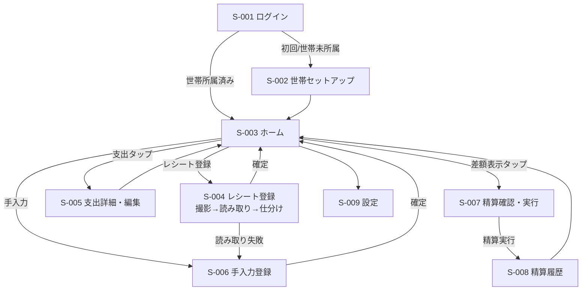
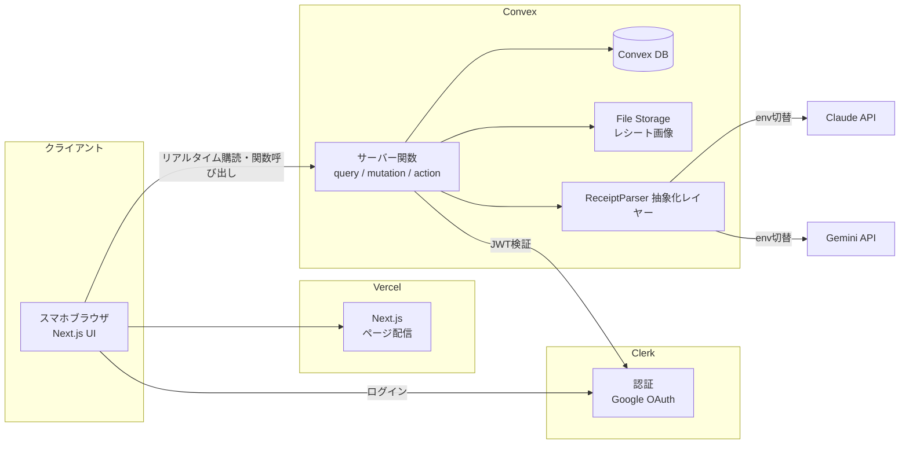

# warikapp 要件定義書

同棲カップル向けレシート割り勘精算アプリ

## 目次

1. [プロジェクト概要](#1-プロジェクト概要)
2. [ターゲット](#2-ターゲット)
3. [機能要件](#3-機能要件)
4. [画面構成](#4-画面構成)
5. [非機能要件](#5-非機能要件)
6. [技術要件](#6-技術要件)
7. [用語集](#7-用語集)
8. [未確定事項一覧](#8-未確定事項一覧)

---

## 1. プロジェクト概要

### 1.1 背景

- 同棲中のカップルが、日々の買い物レシートをもとに「どちらが支払ったか」「どの品目が誰のものか」を毎回手計算で集計しており、負担が大きい。
- 1枚のレシートに共通のもの(食材・日用品)と個人のもの(化粧品・酒類など)が混在するため、レシート合計の単純折半では精算できない。
- 「自分のものは自分が負担する」ルールで運用しており、品目単位の仕分けが必須。

### 1.2 目的

- レシート写真を撮るだけで品目・金額が自動でデータ化され、品目ごとの仕分けと精算額の計算が完了する状態を作る。
- 手計算・レシート保管の手間をなくす。
- 将来的にはiOSアプリとして一般公開する可能性があるため、他のカップルも使える構造(認証・データ分離)で設計する。

### 1.3 スコープ

**対応する範囲:**

- レシート画像のアップロードとAIによる品目読み取り
- 品目単位の負担仕分け(自分 / 相手 / 任意の負担割合)
- レシートがない支出の手入力登録
- 支払者の記録と未精算差額の計算
- 任意タイミングでの精算実行と精算履歴の記録
- レシート画像の保存・閲覧
- 二人を「世帯(カップル)」としてペアリングする招待機能

**対応しない範囲(スコープ外):**

- 固定費(家賃・光熱費など)の毎月自動計上
- 月次サマリー・グラフ・カテゴリ別集計(家計簿機能)
- プッシュ通知・登録通知
- 銀行・決済サービス連携(実際の送金)
- iOSネイティブアプリの実装(将来対応。ただし設計上の考慮は行う)

### 1.4 構成要素

- [x] Web UI(スマホ最適化のレスポンシブWeb)
- [x] API(レシート読み取りAI呼び出し、データCRUD)
- [ ] バッチ処理
- [ ] 業務自動化

---

## 2. ターゲット

### 2.1 利用主体

| 利用主体 | 種別 | 説明 | 主な利用シーン |
|---|---|---|---|
| パートナーA(開発者本人) | 人間 | 世帯の作成者。ITリテラシー高 | 買い物後にスマホでレシートを撮影・仕分け。月数回精算 |
| パートナーB(彼女) | 人間 | 招待コードで参加。一般的なスマホユーザー | パートナーAと同様、買い物後にスマホでレシートを撮影・仕分けし、月数回精算。操作は直感的に完結する必要がある |
| AI読み取りサービス | システム | Claude API / Gemini API(切り替え可能) | レシート画像から品目・金額を構造化データとして抽出 |

- 想定同時利用: 2名(将来の一般公開時は世帯数×2名。世帯間のデータは完全分離)
- 利用デバイス: ほぼスマートフォン(iOS Safari / Android Chrome)。PC利用は補助的

### 2.2 要求仕様一覧

#### 人間ユーザー向け(ユーザーストーリー形式)

| ID | ユーザー種別 | ストーリー | 受け入れ条件 | 優先度 |
|----|------------|-----------|------------|--------|
| US-001 | パートナー | 手入力をなくすため、レシートを撮影するだけで品目と金額が記録されるようにしたい | - 写真アップロード後、品目名・金額・店名・日付が自動入力される<br>- 読み取り完了まで進捗が表示される | Must |
| US-002 | パートナー | 正確に精算するため、品目ごとに「自分/相手/共通(割合指定)」を仕分けたい | - 品目ごとにタップで負担区分を切り替えられる<br>- 任意の負担割合(例: 70:30)を品目単位で設定できる | Must |
| US-003 | パートナー | 立て替えを記録するため、どちらが支払ったかを支出ごとに記録したい | - 登録時に支払者を選択できる(デフォルト: ログイン中の本人) | Must |
| US-004 | パートナー | 精算額を把握するため、現在の未精算差額をいつでも確認したい | - ホーム画面に「誰が誰にいくら」が常時表示される | Must |
| US-005 | パートナー | 区切りをつけるため、好きなタイミングで精算を実行して記録をリセットしたい | - 精算実行で対象支出が精算済みになる<br>- 精算後の未精算差額は0円になる<br>- 精算履歴が残る | Must |
| US-006 | パートナー | レシートがない支出(外食の割り勘など)も同じ仕組みで精算したい | - 手入力で支出(名目・金額・支払者・仕分け)を登録できる | Must |
| US-007 | パートナー | AIの読み取りミスを直すため、読み取り結果を確認・修正してから確定したい | - 確定前に品目名・金額を編集、品目の追加・削除ができる<br>- 確定後も編集できる | Must |
| US-008 | パートナー | 記録に疑問があったとき、元のレシート画像を確認したい | - 支出詳細から元画像を閲覧できる | Must |
| US-009 | パートナー | 二人で同じデータを使うため、招待コードでパートナーと世帯を組みたい | - 一方が発行した招待コードで他方が参加できる<br>- 参加後は同じ支出データを両者が閲覧・編集できる | Must |
| US-010 | パートナー | 外出先で使うため、スマホで快適に操作したい | - 主要操作(撮影→仕分け→確定)がスマホ画面で完結する | Must |

#### システム連携向け(システム要求形式)

| ID | トリガー | 処理概要 | 成功条件 | 異常時の振る舞い | 優先度 |
|----|---------|---------|---------|----------------|--------|
| SR-001 | レシート画像アップロード(APIコール) | AIプロバイダ(Claude/Gemini)に画像を送信し、品目・金額・店名・日付を構造化JSONで取得 | - スキーマに適合したJSONが返る<br>- 品目合計とレシート合計の差額が調整行として補完される | エラー内容を返却し、UI側は手入力モードへフォールバック | Must |

---

## 3. 機能要件

### 3.1 機能一覧と優先度

| ID | 機能名 | 概要 | 構成要素 | 優先度 | 関連ID | 詳細度 |
|----|--------|------|---------|--------|--------|--------|
| F-001 | 認証 | Googleアカウントによるログイン/ログアウト | UI, API | Must | US-009 | 詳細 |
| F-002 | 世帯作成・招待ペアリング | 世帯の作成、招待コード発行、参加 | UI, API | Must | US-009 | 詳細 |
| F-003 | レシート読み取り | 画像アップロード→AI読み取り→構造化 | UI, API | Must | US-001, SR-001 | 詳細 |
| F-004 | 品目仕分け・確認 | 読み取り結果の修正と負担区分の設定 | UI | Must | US-002, US-007 | 詳細 |
| F-005 | 手入力支出登録 | レシートなし支出の登録 | UI | Must | US-006 | 詳細 |
| F-006 | 支出一覧・詳細・編集・削除 | 登録済み支出の管理、元画像閲覧 | UI | Must | US-004, US-007, US-008 | 詳細 |
| F-007 | 精算 | 差額計算、精算実行、精算履歴 | UI, API | Must | US-004, US-005 | 詳細 |
| F-008 | 仕分けのAI提案 | 過去の仕分け実績をもとに品目の負担区分をAIが初期提案 | API | Should | US-002 | 概要のみ |
| F-009 | 月次サマリー・カテゴリ集計 | 支出の可視化(家計簿的機能) | UI | Could | — | 概要のみ |
| F-010 | PWA/iOSアプリ化 | ホーム画面追加、ストア公開 | UI | Could | US-010 | 概要のみ |

### 3.2 機能詳細(Must機能)

#### F-001: 認証

**概要**: Google OAuth(Clerk)によるログイン。将来のiOS公開時にSign in with Apple・メール認証を追加できる構成とする。

**関連要求仕様**: US-009

**処理フロー**:
1. 未ログインユーザーはログイン画面(S-001)へリダイレクト
2. 「Googleでログイン」→ OAuth同意 → セッション確立
3. 世帯未所属の場合はセットアップ画面(S-002)へ、所属済みならホーム(S-003)へ

**エラーハンドリング**:
| エラー条件 | エラーメッセージ | 振る舞い |
|-----------|----------------|---------|
| OAuth失敗/キャンセル | 「ログインできませんでした」 | ログイン画面に留まり再試行可能 |
| セッション期限切れ | (メッセージなし) | ログイン画面へリダイレクト。復帰後は元のページへ |

**データ永続化**: アカウント情報は Clerk が保持。表示名は世帯参加時に Convex の `members` テーブルへ保存。保持期間: アカウント削除まで。

---

#### F-002: 世帯作成・招待ペアリング

**概要**: 支出データの単位となる「世帯(couple)」を作成し、招待コードでパートナーを迎え入れる。全データは世帯にスコープされ、世帯間は完全分離(マルチテナント設計)。

**関連要求仕様**: US-009

**入力項目**:
| 項目名 | 型 | 必須 | バリデーション | 備考 |
|--------|-----|------|--------------|------|
| 世帯名 | string | No | 1〜30文字 | 省略時「わたしたち」等のデフォルト |
| 自分の表示名 | string | Yes | 1〜20文字 | 例: 「たろう」 |
| 招待コード(参加側) | string | Yes | 8文字英数字・有効期限内・未使用 | |

**処理フロー**:
1. 作成側: 世帯を作成 → 招待コードを発行(有効期限72時間) → コードまたは招待URLを共有
2. 参加側: ログイン後、招待コードを入力 → 世帯メンバーとして登録(表示名を設定)
3. 世帯メンバーが2名に達したら招待コードを無効化

**バリデーションルール**:
| ルールID | 対象項目 | ルール | エラー時の振る舞い |
|---------|---------|--------|-----------------|
| V-201 | 招待コード | 存在・未使用・期限内 | 「招待コードが無効です」を表示 |
| V-202 | 世帯参加 | 1ユーザーが所属できる世帯は1つ | 既存世帯からの退出を案内 |
| V-203 | メンバー数 | 世帯の上限2名 | 「この世帯は満員です」を表示 |

**データ永続化**: `couples` / `members` / `invitations`。保持期間: 世帯削除まで。

---

#### F-003: レシート読み取り

**概要**: スマホカメラ撮影またはファイル選択でレシート画像をアップロードし、AIが品目・金額・店名・購入日を構造化データとして抽出する。AIプロバイダは抽象化レイヤーを介して Claude API / Gemini API を環境変数で切り替え可能とする。

**関連要求仕様**: US-001, SR-001

**入力項目**:
| 項目名 | 型 | 必須 | バリデーション | 備考 |
|--------|-----|------|--------------|------|
| レシート画像 | image (JPEG/PNG/HEIC/WebP) | Yes | 20MB以下 | クライアント側で長辺2,000pxに縮小・JPEG圧縮してからアップロード |

**出力項目(AI抽出結果)**:
| 項目名 | 型 | 条件 | 備考 |
|--------|-----|------|------|
| store_name | string \| null | 判読できた場合 | 店名 |
| purchased_at | date \| null | 判読できた場合 | 購入日。nullなら当日をデフォルト表示 |
| total_amount | int | 必須 | レシート合計(税込・円) |
| items[] | array | 1件以上 | 品目リスト |
| items[].name | string | 必須 | 品目名(略称は可能な範囲で正式名に展開) |
| items[].price | int | 必須 | 税込価格(円)。値引きはその品目に反映 |
| items[].quantity | int | 必須 | 数量(既定1) |

**処理フロー**:
1. ユーザーが画像を撮影/選択 → クライアントで縮小・圧縮
2. 画像を Convex File Storage へアップロード(アップロードURLはサーバー関数で発行)
3. API(SR-001)がAIプロバイダへ画像+抽出プロンプト(JSONスキーマ指定)を送信
4. 応答JSONをスキーマ検証。品目合計 ≠ total_amount の場合、差額を「調整(税・割引等)」品目として自動追加(初期負担区分: 折半)
5. 確認・仕分け画面(F-004)へ遷移。**この時点ではドラフト状態**(未確定)

**エラーハンドリング**:
| エラー条件 | エラーメッセージ | 振る舞い |
|-----------|----------------|---------|
| AI応答がスキーマ不適合 | (内部リトライ) | 1回だけ自動リトライ。再失敗で下記へ |
| 読み取り失敗(タイムアウト30秒/API障害) | 「読み取りに失敗しました。手入力に切り替えますか?」 | 画像を保持したまま手入力フォーム(F-005)へフォールバック |
| 画像が不鮮明・レシート以外 | 「レシートを読み取れませんでした。撮り直してください」 | 再撮影を促す。手入力への切り替えも提示 |
| アップロード失敗(通信断) | 「アップロードに失敗しました」 | 再試行ボタン表示。画像はクライアントに保持 |

**APIインターフェース**:
- エンドポイント: Convex action `receipts.parse`
- リクエスト: `{ storageId: string }`(Convex File Storage 上のID)
- レスポンス: 上記出力項目のJSON
- 認証: Clerk認証必須。世帯メンバーのみ(サーバー関数内で検証)
- レート制限: 1世帯あたり30回/時(暴走・悪用対策)

**データ永続化**:
- 対象: レシート画像(Convex File Storage、storageId を支出レコードに保持)、抽出結果(`expenses` テーブル)
- 保持期間: ユーザーが削除するまで

---

#### F-004: 品目仕分け・確認

**概要**: AI読み取り結果(または手入力)の品目リストに対し、品目ごとの負担区分を設定して支出を確定する。

**関連要求仕様**: US-002, US-003, US-007

**入力項目**:
| 項目名 | 型 | 必須 | バリデーション | 備考 |
|--------|-----|------|--------------|------|
| 支払者 | member_id | Yes | 世帯メンバーのいずれか | デフォルト: ログイン中の本人 |
| 店名 | string | No | 50文字以内 | |
| 購入日 | date | Yes | 未来日不可 | |
| 品目名(各行) | string | Yes | 1〜50文字 | |
| 金額(各行) | int | Yes | 1〜9,999,999円 | 円単位・整数 |
| 負担区分(各行) | enum + ratio | Yes | 下記参照 | |

**負担区分の仕様(本アプリの中核)**:
- 各品目はプリセット「自分(100:0)」「相手(0:100)」「折半(50:50)」をタップ1回で切り替えられる
- 「カスタム」を選ぶと負担割合をパーセントで指定できる(例: 70:30。合計100になること)
- 初期値: 全品目「折半」(F-008導入後はAI提案値)
- 内部表現は品目ごとの `[{member_id, ratio_percent}]`。2名合計100%を必須とする

**処理フロー**:
1. 品目リストを表示(品目名・金額・負担区分トグル)
2. 各品目をタップして負担区分を設定。品目の追加・削除・金額修正も可能
3. 合計金額・「この支出で発生する立て替え額」をリアルタイム表示
4. 「確定」で支出を確定状態にし、未精算差額に反映

**バリデーションルール**:
| ルールID | 対象項目 | ルール | エラー時の振る舞い |
|---------|---------|--------|-----------------|
| V-401 | 負担割合 | 各品目の割合合計=100% | 確定ボタンを無効化し行を赤枠表示 |
| V-402 | 品目 | 1件以上 | 「品目を1件以上入力してください」 |
| V-403 | 金額 | 整数・1円以上 | 行単位でエラー表示 |

**画面要件**:
- レイアウト: 縦1カラム。上部に店名/日付/支払者、下部に品目リスト(スクロール)、最下部に固定フッター(合計・確定ボタン)
- 主要UI要素: 品目行(名前・金額・負担区分チップ)、負担区分チップは タップで 折半→自分→相手→折半 を循環、長押しまたは詳細でカスタム割合入力
- インタラクション: 片手・親指操作で全品目を仕分けられること。1レシート20品目を1分以内で仕分け完了できる操作性を目標

---

#### F-005: 手入力支出登録

**概要**: レシートがない支出(外食、ネット購入、立て替えなど)を手入力で登録する。データ構造はレシート由来の支出と共通(品目1件以上を持つ)。

**関連要求仕様**: US-006

**入力項目**:
| 項目名 | 型 | 必須 | バリデーション | 備考 |
|--------|-----|------|--------------|------|
| 名目 | string | Yes | 1〜50文字 | 例: 「焼肉」「Amazon 洗剤」 |
| 金額 | int | Yes | 1〜9,999,999円 | |
| 支払者 | member_id | Yes | | デフォルト: 本人 |
| 日付 | date | Yes | 未来日不可 | デフォルト: 当日 |
| 負担区分 | enum + ratio | Yes | F-004と同じ | デフォルト: 折半 |

**処理フロー**:
1. フォーム入力(最短: 名目+金額のみ入力し、他はデフォルトで確定可能)
2. 内部的には品目1件の支出として保存(後から品目分割も可能 = F-004の編集と同一UI)

**エラーハンドリング**: F-004のバリデーションに準ずる。

---

#### F-006: 支出一覧・詳細・編集・削除

**概要**: 登録済み支出の一覧表示と管理。未精算/精算済みの区別、元レシート画像の閲覧を含む。

**関連要求仕様**: US-004, US-007, US-008

**出力項目(一覧)**:
| 項目名 | 型 | 条件 | 備考 |
|--------|-----|------|------|
| 支出リスト | array | 購入日降順 | 店名/名目、日付、合計金額、支払者、精算状態バッジ |
| フィルタ | — | | 「未精算のみ」(デフォルト)/「すべて」 |

**処理フロー**:
1. ホーム(S-003)に未精算支出を新しい順に表示。無限スクロールまたはページング(20件単位)
2. 支出をタップ → 詳細(S-005): 品目・仕分け内訳・立て替え額・レシート画像サムネイル(タップで拡大)
3. 編集: F-004と同じ仕分けUIを再利用。**精算済み支出は編集・削除不可**(閲覧のみ)
4. 削除: 確認ダイアログの上、論理削除

**エラーハンドリング**:
| エラー条件 | エラーメッセージ | 振る舞い |
|-----------|----------------|---------|
| 精算済み支出の編集操作 | 「精算済みの記録は変更できません」 | 編集UIを表示しない(ボタン非活性) |
| 相手が同時に編集して競合 | 「他の端末で更新されました」 | 最新データを再取得して表示(後勝ち) |

**データ永続化**: 論理削除(`deleted_at`)。画像は支出の物理削除時のみ削除。

---

#### F-007: 精算

**概要**: 未精算支出から差額を計算・常時表示し、任意タイミングで精算を実行して区切る。

**関連要求仕様**: US-004, US-005

**差額計算ロジック**:
```
各未精算支出について:
  支払者の立て替え額 = Σ(品目金額 × 相手の負担割合%)   ※品目単位で計算し、端数は品目ごとに四捨五入
世帯全体:
  netA = Σ(Aが支払った支出のAの立て替え額) − Σ(Bが支払った支出のBの立て替え額)
  netA > 0 なら「BがAにnetA円支払う」、netA < 0 なら逆、0なら精算不要
```

**入力項目(精算実行)**:
| 項目名 | 型 | 必須 | バリデーション | 備考 |
|--------|-----|------|--------------|------|
| メモ | string | No | 100文字以内 | 例: 「6月分」 |

**処理フロー**:
1. ホームに未精算差額を常時表示(「例: あなたが Bさんに 3,450円」)
2. 精算画面(S-007)で対象支出の一覧と内訳を確認
3. 「精算する」実行 → その時点の未精算支出すべてに精算IDを付与し、精算レコードを作成
4. 実行後、未精算差額は0円に戻る。精算履歴(S-008)に日時・金額・対象支出数を記録
5. 実際の送金はアプリ外(現金・送金アプリ等)で行う前提

**バリデーションルール**:
| ルールID | 対象項目 | ルール | エラー時の振る舞い |
|---------|---------|--------|-----------------|
| V-701 | 精算実行 | 未精算支出が1件以上 かつ ドラフト状態の支出が0件 | ドラフトがある場合は「未確定のレシートがあります」と警告し、確定or破棄を促す |
| V-702 | 精算実行 | 二重実行防止(トランザクション内で対象を確定) | 競合時は再計算して確認画面を再表示 |

**データ永続化**: `settlements`(精算者、日時、方向、金額、メモ)。精算済み支出は `settlement_id` で紐付け。精算の取り消し(直近1件のみ)を可能とする。

### 3.3 機能概要(Should/Could機能)

#### F-008: 仕分けのAI提案(Should)
**概要**: AI読み取り時に、過去の同一・類似品目の仕分け実績(直近100件程度)をプロンプトに含め、品目ごとの負担区分の初期値をAIが提案する(例: 「ビール」→過去実績から「自分」)。ユーザーは確認画面で修正するだけになる。
**想定される入出力**: 入力=品目リスト+過去の仕分け実績、出力=品目ごとの推奨負担区分と確信度。

#### F-009: 月次サマリー・カテゴリ集計(Could)
**概要**: 月別支出合計・二人の負担額推移・カテゴリ別集計。MVPでは対象外。データモデル上は購入日を持つため後付け可能。

#### F-010: PWA/iOSアプリ化(Could)
**概要**: まずPWA(ホーム画面追加・カメラ起動)対応、その後Capacitor等でのストア公開を検討。認証はClerkのままApple providerを追加。

---

## 4. 画面構成

### 4.1 画面一覧

| ID | 画面名 | 概要 | URL(想定) |
|----|--------|------|------------|
| S-001 | ログイン | Googleログインボタン | /login |
| S-002 | 世帯セットアップ | 世帯作成 or 招待コード入力 | /setup |
| S-003 | ホーム | 未精算差額+支出一覧+登録ボタン | / |
| S-004 | レシート登録 | 撮影/選択→読み取り中→仕分け確認 | /expenses/new/receipt |
| S-005 | 支出詳細・編集 | 品目内訳・画像・編集・削除 | /expenses/[id] |
| S-006 | 手入力登録 | 手入力フォーム | /expenses/new/manual |
| S-007 | 精算確認・実行 | 対象一覧・内訳・精算ボタン | /settlement |
| S-008 | 精算履歴 | 過去の精算一覧・取り消し | /settlements |
| S-009 | 設定 | 表示名変更・招待コード再発行・ログアウト | /settings |

### 4.2 画面遷移図



---

## 5. 非機能要件

### 5.1 パフォーマンス

- 画面表示: 主要画面の初期表示 2秒以内(4G回線)
- AI読み取り: アップロード開始から結果表示まで通常15秒以内、タイムアウト30秒。処理中はスケルトン+進捗表示
- 同時接続: 世帯あたり2名。一般公開時もConvex/Vercelのマネージドスケールに委ねる

### 5.2 セキュリティ

- 認証方式: Clerk(Google OAuth)。将来 Apple / メール追加可能な構成
- 認可モデル: クライアントからDBへの直接アクセスは不可能で、全アクセスがConvexサーバー関数(query/mutation/action)を経由する。**全公開関数の冒頭で認証確認+世帯メンバーシップ検証を共通ヘルパー(`requireMember`)で強制**し、世帯メンバーのみが自世帯のデータにアクセス可能とする(一般公開を見据えた必須要件)。認可失敗は例外(throw)で表現する。ただし例外として、支出等の保護対象データを返さず**本人の最小限のメンバーシップ情報(_id / coupleId / displayName)のみを返す状態確認プローブ**(現時点では `couples.currentMember` のみ。対象は明示列挙して管理)に限り、未ログイン・未所属を null 返却で表現してよい(認可ゲートとしては使用しない)
- レシート画像: Convex File Storage に保存。画像URLは世帯メンバーシップを検証したサーバー関数経由でのみ取得
- AI APIキー: サーバーサイド(Convex環境変数)のみで保持。クライアントに露出しない
- 通信: HTTPS必須

### 5.3 可用性

- 稼働率目標: 個人利用フェーズでは明示的SLAなし(Vercel/Convexの稼働に準ずる)
- AI障害時: 手入力フォールバックにより記録機能は継続可能
- バックアップ: Convexのバックアップ/スナップショットエクスポート機能に依存。重要データ(支出・精算)のCSVエクスポートを将来検討(未確定事項)

### 5.4 運用・保守

- ログ: AI読み取りの成否・所要時間・使用プロバイダをサーバーログに記録(品質改善用)。レシート内容自体はログに残さない
- 監視: Vercelのエラーログ確認。個人フェーズではアラート設定なし
- デプロイ: GitHub → Vercel自動デプロイ(mainブランチ)。ビルド時に `npx convex deploy` でConvex関数も同時デプロイ
- コスト管理: AI API利用量に月額上限アラートを設定(Anthropic/Google Cloudコンソール)

---

## 6. 技術要件

### 6.1 技術スタック

| レイヤー | 技術 | バージョン | 選定理由 |
|---------|------|----------|---------|
| フロントエンド/API | Next.js (App Router) + TypeScript | 最新安定版 | UI・APIを単一リポジトリで完結。Vercel無料枠と相性が良い |
| スタイリング | Tailwind CSS | 最新安定版 | スマホファーストUIを高速に構築 |
| ホスティング | Vercel (Hobby) | — | 無料枠・自動デプロイ・HTTPS標準 |
| バックエンド(DB/サーバー関数/ストレージ) | Convex(有料プラン契約済み) | 最新安定版 | DB・サーバー関数・ファイルストレージ・リアルタイム同期が一体。mutationが自動でトランザクションになり精算処理を安全に書ける。TypeScriptのみで完結 |
| 認証 | Clerk (Free) | 最新安定版 | Convex公式推奨の定番構成。Google OAuth設定が容易で、将来Apple/メール認証も追加可能。無料枠10,000 MAU |
| AI読み取り | プロバイダ抽象化レイヤー(自作 `ReceiptParser` インターフェース) | — | Claude API / Gemini API を環境変数 `RECEIPT_AI_PROVIDER` で切り替え。乗り換え自由度を確保 |
| └ Claude実装 | Anthropic API (`claude-opus-4-8` を既定。コスト優先時は `claude-haiku-4-5` に変更可) | — | 高精度な日本語レシート抽出+構造化出力。目安: Haiku 約1円/枚、Opus 約5〜8円/枚 |
| └ Gemini実装 | Google Gemini API (Flash系) | — | 無料枠運用が可能な代替。無料枠は送信データが学習に利用され得る点に留意 |

### 6.2 外部連携

| 連携先 | 方式 | 用途 |
|--------|------|------|
| Anthropic API | REST (Messages API, vision) | レシート画像の構造化抽出 |
| Google Gemini API | REST (generateContent, vision) | 同上(切り替え先) |
| Clerk | JWT連携(ConvexがClerk発行トークンを検証) | 認証・セッション管理 |
| Google OAuth | OAuth 2.0 (Clerk経由) | ログイン |

### 6.3 システム構成



**主要テーブル(概要)**: Convexのドキュメントモデルを採用。品目と負担割合は常に支出単位で読み書きするため、支出ドキュメントに内包する。

| テーブル | 役割 |
|---|---|
| couples | 世帯 |
| members | 世帯メンバー(coupleId, tokenIdentifier, displayName) ※アカウント情報はClerkが保持 |
| invitations | 招待コード(code, expiresAt, usedAt) |
| expenses | 支出(coupleId, paidBy, storeName, purchasedAt, totalAmount, imageStorageId, source: receipt/manual, status: draft/confirmed, settlementId, deletedAt)。品目リスト items[] を内包し、各品目が name / price / quantity / shares[](memberId, ratioPercent ※2名合計100)を持つ |
| settlements | 精算(coupleId, fromMemberId, toMemberId, amount, memo, settledBy) |
| parseLogs | AI読み取りの実行記録(coupleId)。レート制限の集計用 |

---

## 7. 用語集

| 用語 | 定義 |
|------|------|
| 世帯(couple) | 支出データを共有する2名のペア。全データのテナント境界 |
| 支出(expense) | 精算対象となる1件の記録。レシート由来と手入力の2種があり、1件以上の品目を持つ |
| 品目(item) | 支出内の1商品。負担割合の設定単位 |
| 負担区分 | 品目を誰がどの割合で負担するか。「自分/相手/折半/カスタム割合」 |
| 立て替え額 | 支払者が相手の負担分を代わりに払った金額 |
| 未精算差額 | 未精算支出の立て替え額を相殺した、現時点で一方が他方に支払うべき金額 |
| 精算 | 未精算支出に区切りをつけ、差額を0に戻す操作。実送金はアプリ外 |
| ドラフト | AI読み取り後、仕分け確定前の支出状態。差額計算に含まれない |

---

## 8. 未確定事項一覧

| ID | 対象セクション | 内容 | 確認先 | 期限 |
|----|--------------|------|--------|------|
| TBD-001 | 6.1 | Claude使用時の既定モデル(精度優先 `claude-opus-4-8` かコスト優先 `claude-haiku-4-5` か)。実装時に実レシートで精度検証して決定 | 開発者 | 実装時 |
| TBD-002 | 5.3 / 6.1 | Convexプランのストレージ/帯域上限に対する画像容量の推移確認(圧縮後~300KB/枚 × 月50枚)。上限接近時は旧画像の自動削除を検討 | 開発者 | 運用開始後 |
| TBD-003 | F-003 | 税・割引の「調整行」方式(デフォルト折半)で実運用上問題ないか。代替案: 品目金額比での自動按分 | 二人で運用確認 | 運用開始後 |
| TBD-004 | F-010 | iOSアプリ化の方式(PWA止まり / Capacitor / ネイティブ)と時期 | 開発者 | 公開検討時 |
| TBD-005 | F-008 | 仕分けAI提案の実装時期(MVP後の最初の改善候補) | 開発者 | MVP完成後 |
| TBD-006 | 6.1 | Gemini切り替え時のプロンプト・スキーマ互換性検証(構造化出力の指定方法がプロバイダ間で異なる) | 開発者 | 切り替え時 |
| TBD-007 | F-002 | 世帯からの退出・世帯削除・アカウント削除のフロー詳細(MVPでは設定画面に最小限の導線のみ) | 開発者 | 実装時 |
